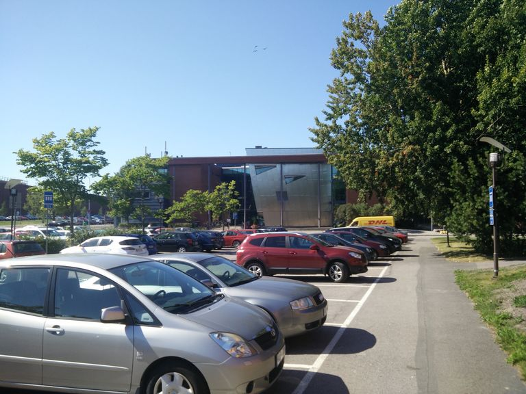
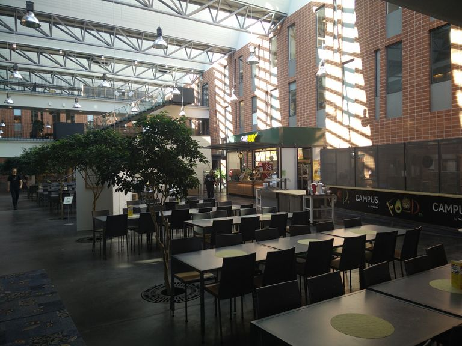
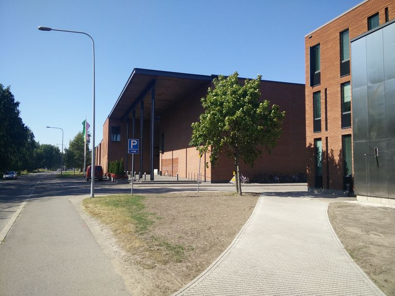
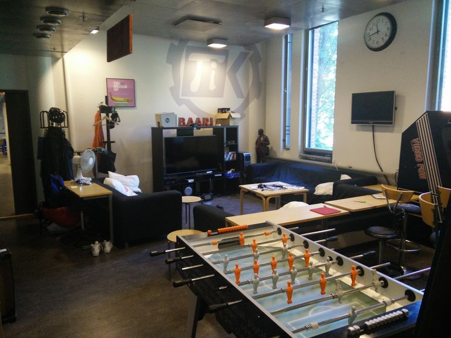
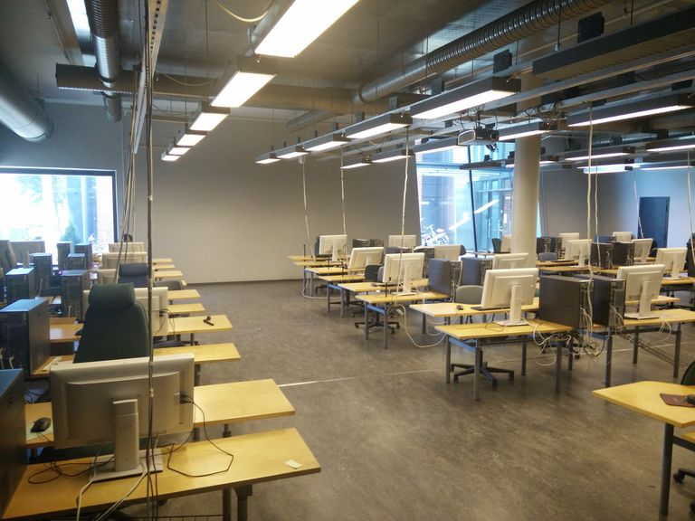
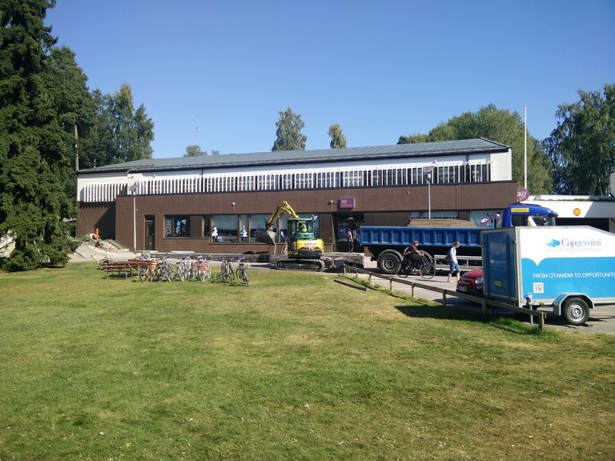
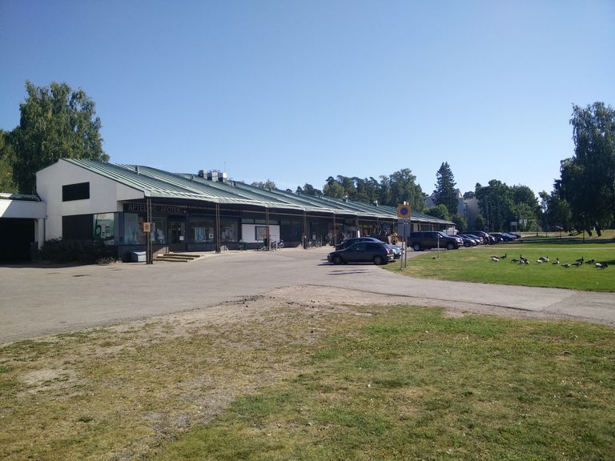
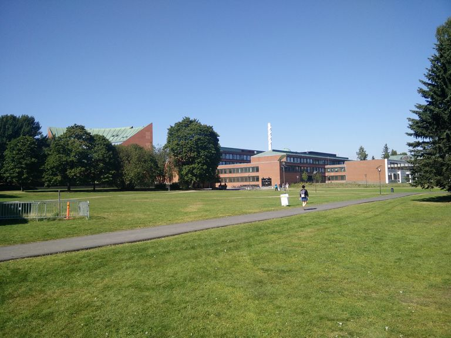
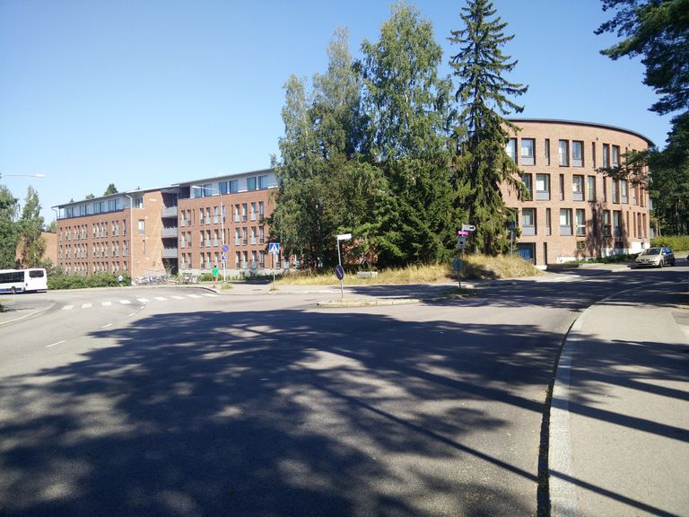
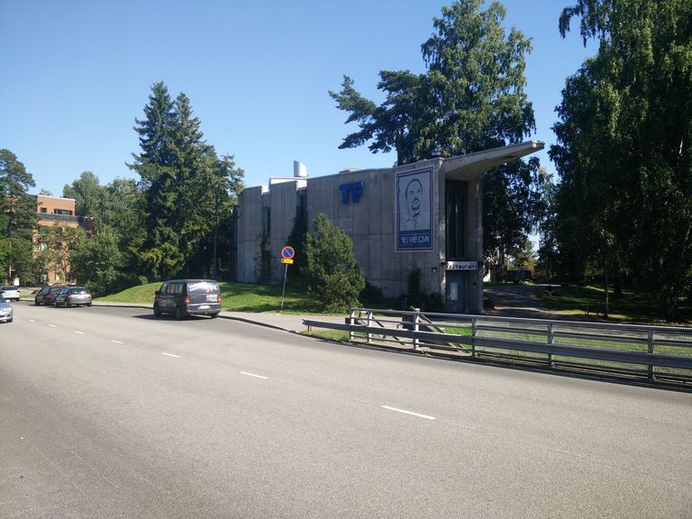

Title: Waarin viikkotiedote 0 - Eka postaus!
Date: 2015-08-25 12:00
Category: Fuksit
Meta: hah
Tags: fuksit, viikkotiedote

Moikka taas fuksit!  

Tänä lauantaina se varaslähtö sitten tapahtuu. Huhhuh, kesä on mennyt aika nopeasti!
Otaniemikin on kuin herännyt uudestaan henkiin. Tämän postauksen tarkoitus
on tutustuttaa teidät Otaniemeen vähän visuaalisemmalla tavalla. :)

Muutamat fuksit ovat jo ilmoittaneet varaslähdön ja ensimmäisen päivän
hätämajoitustarpeista, hyvä juttu! Jos siis et ole saamassa kämppää lähistöltä 
ennen 1.9., niin laita ihmeessä minulle viestiä osoitteeseen 
fuksiwaari@tietokilta.fi. Saamme varmasti järjestettyä sinulle yöpymispaikan 
ensimmäiseksi pariksi päiväksi.

Jos et vielä tiennyt, niin tämä on waarin blogi, jota päivitän säännöllisen epäsäännöllisesti, 
usein kuitenkin viikottain. Täältä löydät aina ajankohtaisen fuksi-infon ja tätä 
seuraamalla tiedät varmasti mitä killassa ja Aallossa tapahtuu! Blogin löytää myös osoitteesta waari.dy.fi.

Jos et vielä katsonut muistilistaa läpi, sen löytää edellisestä postauksesta alta! 
Selaa alas ja tsekkaa oletko muistanut kaiken ennen Varaslähtöä 29.8.

Opiskelijatarra ja matkakortin opiskelija-status
--------------------------------------------------

Telegramissa tuli keskusteltua opiskelijatarran hankkimisesta sekä matkakortin 
opiskelija-statuksen päivittämisestä. Seuraavasta linkistä
<http://ayy.fi/blog/2015/07/20/uudet-lukuvuositarrat-jaossa-naissa-paikoissa/>
löytyy tiedot, missä voit päivittää opiskelijastatuksesi helposti. Jos pystyt, 
niin tämä kannattaa tehdä heti, nimittäin muuten orientaatioviikolla on 
paljon ruuhkaa.

Psst! Pääset Telegram-ryhmään täältä: <http://tietokilta.fi/fuksit/telegram/>.

Otaniemi kuvina
---------------

Kävin tänään nappaamassa pari kuvaa Otaniemen muutamasta tärkeimmästä
paikasta. Katso kuvat läpi nähdäksesi missä oikein tulet pyörimään seuraavan
vuoden ajan!

<em>Tietotekniikan talo eli lyhyemmin T-talo, meidän toinen koti.</em>

<em>T-talon ruokala. Ainoana laitoksena Otaniemessä meillä on myös Subway opiskelijahinnoilla!</em>

<em>TUAS-talo, ilmoittautuminen täällä maanantaina klo 9:00!</em>

<em>Tietokillan kiltahuone eli kiltis. Löytyy pelit, keittiö sekä opiskelutarvikkeet.</em>

<em>Aivan kiltiksen vieressä sijaitseva tietokoneluokka Paniikki. Yleensä täynnä ihmisiä tenttien lähestyessä.</em>

<em>AYY:n keskustoimisto, tällä hetkellä vielä vähän remontin alla. Ykköskerroksesta voit ostaa esimerkiksi
    laulukirjoja ja kakkoskerroksessa saat hoidettua AYY:n asumisasiat kuntoon.</em>

<em>Otaniemen ostari, josta löytyy kaikki tarpeellinen apteekista yöruokaan.</em>

<em>Alvarin aukio, takana kohoaa päärakennuksen Amfiteatteri. Tänne varaslähtöön lauantaina klo 15:00!</em>

<em>Liikenteenjakaja Jämeräntaipaleen ja Otakaaren risteyksessä. LKJ-bileet tapahtuvat
varmasti tänäkin vuonna. Vasemmalla bussi Otaniemen päätepysäkillä.</em>

<em>Servin Maijan mökin eli Smökin löytää keskeltä Teekkarikylää. Hyvin suosittu juhlapaikka.</em>

<em>Teknologföreningenin eli TF:n oma rakennus. Sisällä on suosittu opiskelijaravintola Täffä, josta saa joka
keskiviikko maankuulua spagettia.</em>

Sijainnit kartalla:
--------------------------

<iframe src="https://www.google.com/maps/d/embed?mid=zA7vxTObZuHQ.kEJuVnbJbQ2I" width="640" height="480" style="height: 480px;"></iframe>

----------------

Iik, lauantaina nähdään!  
  
_Joonas_
