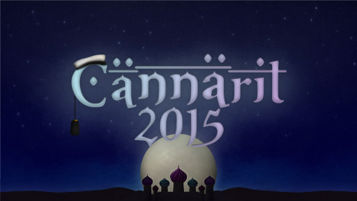

Title: Waarin viikkotiedote 9 - TiKin yö!
Date: 2015-10-28 22:00
Category: Fuksit
Meta: Viikkotiedote
Tags: fuksit, viikkotiedote, cännärit, juhlasitsit, edarivaalit, 
Status: published

Köh köh,

Mulle kävi nyt niin, että tiistaina mulle diagnosoitiin keuhkokuume. Nyt on äksy antibiootti- ja tulehduskipulääkekuuri käynnissä ja pää tukossa, senpä takia mailikin tulee taas kerran hieman houruisena ja myöhässä ulos. Ja sen takia mua ei ole nyt koululla näkynyt myöskään... :( Noh ei se mitään, onneksi Telegramissa huutelu toimii! 

Oli siistiä nähdä maanantain juhlasitsijonotuksessa top10:ssä kuusi TiKkifuksia! Mahtavaa, telttaileminen selvästi kannatti. ;) Vika lippu meni klo 6:40 jonotuksen aloittaneelle, joten aikaisessa on selvästi täytynyt olla.

Tiistaina oli myös siistiä nähdä Cännäreiden julkaisu. Ihan törkeän hienot sivu ja teema! Odotan innolla, että pääsen pukeutumaan Aladdiniksi ja seikkailemaan ba(saa)rissa jatkoille asti.

Lukekaa tärkeät viralliset hallitus- ja edustajistoasiat läpi, sen jälkeen skimmailkaa tapahtumat, että mitkä kiinnostaisi. Ja ainiin, ens viikolla on teekkariperinneviikko! WUU! :)

Hyvää loppuviikkoa,  
_<3 ultsi_

<h2>
&nbsp;
Sisällysluettelo</h2>

1. <a href="#tarkeaa">Tärkeää</a>
    1. Hallitus- ja toimihenkilöhaku
    2. AYY:n Edustajistovaalit
    3. Cännärit - ti 17.11.
2. <a href="#fktapahtumat">Fuksi- ja kiltatapahtumat</a>
    1. Lenskin Dynamon vakiovuoro - joka keskiviikko klo 20:00
    2. Koe Kampus - to 29.10.
    3. Tietokilta Dominanten 40v-juhlakonserttiin - la 14.11.
    4. Alkorytmin toimituksen kokous - pe 30.10.  
    5. Breakdance tanssitunti - pe 30.10.
    6. Tulossa: TiK vs. Inkubio Super Smash Bros. - su 15.11.
4. <a href="#ayylmao">AYY & Muu</a>
    1. Bordelli - pe 30.10
    2. Teekkariperinneviikko ENSI VIIKOLLA
    3. Ultrahack 2015 - pe-su 6.-8.11.
    4. Junction Hackathon - pe-su 6.-8.11.
    5. AYY tahtoo SINUT - vapaaehtoishaut ovat auki!
    6. Hae AYY:n vaihtostipendiä!
    7. Hae oppirahaa AYY:ltä!
5. <a href="#end">Lopetus</a>

<h2>
&nbsp;
TÄRKEÄÄ</h2>

<h4>
&nbsp;
1. Hallitus- ja toimihenkilöhaku</h4>

Jee! Olipas Powerkähmyillä hauskaa ja siistiä nähdä neljän hakevan hallitukseen! Vaikka hallitusvirka välillä on iso nakki, se myös antaa todella paljon ja en ole kuullut kenenkään katuneen hallitusvirkaan lähtemistä. Suosittelen sitä ehdottomasti kaikille ! :)

Kannattaa ehdottomasti hakea johonkin virkaan - sen lisäksi, että siitä saa leiman, saa siitä myös paljon kokemusta ja pääsee toimimaan ihmisten kanssa joita tulee varmasti näkemään myöhemmässäkin vaiheessa elämää, eli toisin sanoen pääsee verkostoitumaan. Itse olen ollut aktiivisena mukana fuksivuodesta asti ja en millään tavalla ole edes yrittänyt verkostoitua tai hankkia kontakteja, mutta yhtäkkiä olen huomannut niitä kontakteja olevan todella paljon. Plussana vielä se, että virassa pääsee toteuttamaan itseään ja toimihenkilöporukassa on aina hauskaa. Helpompaa ja kivempaa on myös hakea esim. kaverin kanssa! :)

Jos tiedät jo mihin virkaan haluaisit hakea, käy ilmiantamassa itsesi osoitteessa: 

<http://tietokilta.fi/tapahtumat/ilmot/hallitusjatoimarit16>

Toimihenkilöydestä leima kohtaan pisteet/kilta - Killan toimija!

Hallitusvirasta luvassa pisteet/vapaa - Lisäpiste/Valinnainen piste!

 

<h4>
&nbsp;
2. AYY:n edustajistovaalit</h4>

<em>Nyt äänestämään! Äänesi on koko ylioppilaskunnalle tärkeä!</em>

<strong>MIKÄ EDUSTAJISTO? MITKÄ VAALIT?</strong>  
Edustajisto on ylioppilaskunnan ylin päättävä elin – tavallaan siis ylioppilaskunnan eduskunta tai valtuusto. Tämä ”edari” koostuu puheenjohtajasta ja 45 varsinaisesta jäsenestä, ”edaattorista”, jotka Aallon opiskelijat valitsevat vaaleilla keskuudestaan. Edustajisto päättää mm. ylioppilaskunnan jäsenmaksusta, vuotuisesta budjetista ja nimittää vuosittain hallituksen johtamaan ylioppilaskunnan toimintaa. Kaikilla AYY:n jäsenillä on läsnäolo-oikeus sekä anottuna puheoikeus edustajiston kokouksissa. Uusi edustajisto valitaan vaaleilla loka-marraskuussa 2015. Uusi edustajisto aloittaa toimintansa jo tämän vuoden puolella valitsemalla hallituksen muodostajan ja hallituksen vuodelle 2016.

<strong>ÄÄNIOIKEUS</strong>  
Äänioikeutettuja ovat kaikki ne AYY:n jäsenet, jotka ovat maksaneet ylioppilaskunnan jäsenmaksun perjantaihin 16.10.2015 mennessä. 

<strong>ÄÄNESTÄMINEN</strong>
Äänestäminen tapahtuu sähköisen vaalijärjestelmän kautta ennakkoon ma 26.10. klo 12:00. - ma 2.11. klo 24:00 tai varsinaisina vaalipäivinä ti 3.11. klo 00:00 – ke 4.11.2015 klo 16:00. Vaalijärjestelmä löytyy osoitteesta: <http://vaalit.ayy.fi/>  

Sähköisessä vaalijärjestelmässä tunnistautuminen tapahtuu Aalto-yliopiston tunnuksilla. Mikäli Aalto-tunnuksesi eivät jostain syystä toimi, ole yhteydessä yliopiston IT Service Deskiin sähköpostitse servicedesk@aalto.fi, tai puhelimitse +358 50 513 2000. Muista käyttää ääntäsi! Ehdokaslistat, vaalikone ja lisätietoa vaaleista löytyy osoitteesta <http://ayy.fi/vaalit>.

Äänestämisestä saa leiman kohtaan pisteet/vapaa - Edarivaalit!

 

<h4>
&nbsp;
3. Cännärit - ti 17.11.</h4>

<strong>CÄNNÄRIT 2015 ON JULKISTETTU!</strong>

Tämän vuoden teema on Arabian Yö ja juhlat pidetään tiistaina 17.11! Olen todella huikeasti yllättynyt - kiireellä jouduitte tekemään, mutta nettisivut sekä julisteet ovat olleet täyttä priimaa. Ostan lipun heti kun pystyy!

Muistakaa, että vielä pääsee mukaan järjestämään Cännäreitä, jos ei mukana vielä ole. Se on yksi parhaista jutuista lähteä mukaan fuksivuonna sillä järjestäjäporukasta kehkeytyy tiivis kaveripiiri, jonka kanssa on hauskaa opiskella ja viettää seuraavat vuodet yliopistolla. Lisätietoja saa ottamalla yhteyttä pääjärjestäjään, Ilmari Tarpilaan. :)

Ahkerimmille tyypeille luvassa leima kohtaan pisteet/kilta/työ - Cännärit!

 

<h2>
&nbsp;
Fuksi- ja kiltatapahtumat</h2>

<h4>
&nbsp;
1. Lenskin Dynamon vakiovuoro - joka keskiviikko klo 20:00 @ Matlidens skola, Matinkylä 1</h4>

Lenskin Dynamo on killan oma liikuntaseura, joka pelaa matseja muita kiltoja ja yhdistyksiä vastaan niin sanotussa teekkarisarjassa Unisportilla. Matsien lisäksi LD:llä on oma vakiovuoro, jolla LD pelaa sählyä, futsalia ja korista. Kuka tahansa voi ilmoittautua mukaan kokeilemaan osoitteessa: <http://lenskindynamo.nimenhuuto.com/>

 

<h4>
&nbsp;
2. Koe Kampus - to 29.10.</h4>

<em>Ilmaisia leffalippuja! Plussana on mahdollisuus innostaa muita pyrkimään TiKille :) Itse olen puhumassa lukiolaisille siellä, tulkaa tekin mukaan!</em>

Torstaina 29.10. kandidaattikeskuksen (OK1) aulassa järjestetään perinteinen Koe Kampus -tapahtuma lukiolaisille. Tapahtumassa jokaisella päaineella on oma ständi, jonne pääaineesta kiinnostuneet lukiolaiset voivat tulla kyselemään mielessä pyöriviä asioita. Tietotekniikan ständille tarvittaisiin 6 opiskelijaa esittelemään pääainetta. Päivystysvuorot on jaettu kolmen 1,5-2 tunnin slottiin, ja ständillä seisoo kulloinkin 2 tyyppiä per kilta. Ständeillä päivystävät saavat palkkioksi leffaliput!

Ilmoittautuminen ständille: 
<https://docs.google.com/spreadsheets/d/1JhoD1splRG1WDSdcOHCPW6m4T_7dZQdjLLyJ8zpFKlM/edit>

<https://tietokilta.fi/tapahtumat/841>

 

<h4>
&nbsp;
3. Tietokilta Dominanten 40v-juhlakonserttiin - la 14.11.</h4>

<strong>Häpeilemätön promopostaus :D</strong>

Lähde mukaan Tietokillan kanssa kuulemaan huippukuoron musiikkia ja juhlistamaan samalla kuoron 40v-syntymäpäivää. Jos kiinnostaa kuulla hurrikaaneja, saatanaa tai natiivien musiikkia kuoron laulamana, tämä on se oikea juttu. Luvassa on siis todella huikeita teoksia, joita on harjoiteltu Kroatiassa korkeanpaikanleirillä ahkerasti 10 päivän ajan. Juuri samaiselta korkeanpaikanleiriltä palanneena voin kertoa, että keikka tulee todellakin olemaan kuulemisen sekä näkemisen arvoinen. Matkaa on voinut seurata hashtagilla #d40tour ja kuoron valmistautumista keikkaan voi seurata hashtagilla #dominantechoir.

Liput keikalle maksavat opiskelijalta erittäin huokeat 10 euroa. Diili on killalle spesiaali - näin halpoja lippuja keikalle et saa mistään muualta. :)

Ilmoittautuminen on sitova ja menee kiinni ensi viikon maanantaina 1.11.2015.

<https://tietokilta.fi/tapahtumat/840>

Luvassa leima kohtaan pisteet/kilta - Kulttuuri!

 

<h4>
&nbsp;
4. Alkorytmin toimituksen kokous - pe 30.10. klo 18:00 @ Kiltahuone</h4>

Tietokillan kiltalehden, Alkorytmin, toimitus kokoustaa seuraavan lehden suunnittelun merkeissä 30.10. klo 18 alkaen kiltahuoneella tai vapaan kokoustilan löytyessä T-talon kokoustiloissa. Jos paikka muuttuu, kiltahuoneelle tulee tästä näkyvä ilmoitus. Kokouksessa on tarjolla naposteltavaa ja virvoitusjuomia. Kaikki journalismista tai huumorista kiinnostuneet ovat tervetulleita.

<http://tietokilta.fi/tapahtumat/843>

 

<h4>
&nbsp;
5. Breakdance tanssitunti - pe 30.10. klo 21:00 @ Otahalli</h4>

Harva tietää, että Tietokillalla on liikuntatutor, mutta se on totta! Urheilumafian lopullisen ylivallan sinetöi nyt uusin liikuntatutor, koko Tietokillan sport-idoli, Hai Phan eli Haitek. Valmistaudu oppimaan alamaailman mahtavinta tanssia, nimittäin Breakdancea! Tule siis tunnille, opit mahtavia liikkeitä ja näet vielä mahtavampia liikeitä. Älä siis epäröi vaan ilmoittaudu heti!

Ilmoittautuminen: <http://tietokilta.fi/tapahtumat/ilmot/break15>

Luvassa leima kohtaan pisteet/kilta - Liikunta!

 

<h4>
&nbsp;
6. Tulossa: TiK vs. Inkubio Super Smash Bros. - su 15.11.</h4>

Murskaveljekset-turnaus kokoaa yhteen Aalto-yliopiston kaksi parasta Smash Bros. -skeneä taistelemaan Otaniemen herruudesta. Tietokilta ja Inkubio kohtaavat Super Smash Bros. for Wii U:n merkeissä Otakaari 5:n tiloissa sunnuntaina 15.11 klo 14:00. Sekä kokeneemmat pelaajat että aloittelijat ovat tervetulleita pelaamaan ja kannustamaan. Tapahtumaan osallistuminen ei maksa mitään.

Mitä: TiK vs. BIO Smash Bros. -turnaus  
Missä: Otakaari 5  
Milloin: 15.11 klo 14:00-20:00  
Hinta: 0€  

 
  
<h2>
&nbsp;
AYY & Muu</h2>

<h4>
&nbsp;
1. Bordelli - pe 30.10 klo 21:00 @ Smökki</h4> 

Bordelli: syksyn kuumin, kostein ja kohutuin...

Viimeiset liput Bordelliin myydään perjantaina Servin Mökin ovelta kello 18-21 välisenä aikana tai kunnes liput loppuvat.

Lippujen ostaminen ei ole mahdollista enää kello 21 jälkeen, joten ole ajoissa!!
Muistakaa myös Bordellin etkot kello 18 alkaen Rantasaunalla (Jämeräntaival 7), jossa voitte lämmitellä itsenne bilekuntoon.  
<https://www.facebook.com/events/1643039395977442/>

Milloin? 30.10. klo 21 -->  
Missä? Smökissä, Jämeräntaival 4  
Mitä maksaa? 10 € lippu  

What happens in Bordelli stays in Bordelli...

Tästä saa pisteen kohtaan pisteet/vapaa - Muu tapahtuma!

 

<h4>
&nbsp;
2. Teekkariperinneviikko ENSI VIIKOLLA</h4> 
 
Teekkariperinneviikkoa juhlitaan entisen TKY:n vuosijuhlaviikon jälkimainingeissa marraskuun alussa. Tänä vuonna ohjelmaan kuuluu laulamista ja laulukilpailua, approilua, tarinoita menneiltä vuosilta, sitsejä, hämyistä klubitunnelmaa sekä tietenkin viikon huipentava Teekkariperinnejuhla räiskyvine silliksineen! Mukaan humuun ovat tervetulleita kaikki fuksit, teekkarit, teekkarinmieliset ja muut kiinnostuneet!
 
Ohjelma:  
2.11. Klubi-ilta @Smökki, <https://www.facebook.com/events/900879653335609/>  
3.11. Fuksien juhlasitsit @Smökki, <https://www.facebook.com/events/1840569566169340/>  
3.11. Laulukilpailusitsit @OK20, <https://www.facebook.com/events/100816326942441/>  
4.11. Polin Appro @Helsinki, <https://www.facebook.com/events/1036052183082077/>  
5.11. Perinnepäivä @E-Sali, Kandikeskus, <https://www.facebook.com/events/1510641099257136/>  
6.11. Punaisen läpilaulanta @Rantasauna, <https://www.facebook.com/events/900481399987058/>  
7.11. Teekkariperinnejuhla @Koskenranta, <https://www.facebook.com/events/154919651520408/>  
8.11. Teekkarisillis @Smökki, <https://www.facebook.com/events/1631869213756161/>  
 
Ilmoittautuminen Teekkariperinnejuhlaan ja -sillikselle on nyt auki osoitteessa: <https://lomake.ayy.fi/teekkarijaosto/>  
Lisätietoja koko viikon ohjelmasta löydät osoitteesta: <http://teekkarius143.ayy.fi/>  
 
Kannattaa lukaista läpi myös Lehti 143, joka löytyy kiltahuoneilta, perinneviikon nettisivuilta ja sellaisen voi myös hakea omaksi AYY:n palvelupisteeltä!

Luvassa paljon pisteitä, esim. Polin Approsta saa leiman pisteet/teekkarikulttuuri - Appro!

 

<h4>
&nbsp;
3. UltraHack 2015 - pe-su 6.-8.11.</h4>

Ultrahack 2015 - part of the biggest hackathon in Europe - is an ultra long runway for the development of your ideas and software.

Ultrahack has top notch industry players to provide never-before-published APIs and tools.

You can join with your pre-existing software and get expert evaluation and coaching for that! Or you can start from the scratch in during pre-game period 1.9.-30.10. or in 48H hackathon 6.-8.11.

Ultrahack has a multitude of various prizes, rewards and traveling grants. When you join the Ultrahack, you have good chances of winning in an extraordinary hackathon experience!

<https://ultrahack.org>

pisteet/kilta - Lanit/Hackathon

 

<h4>
&nbsp;
4. Junction Hackathon - pe-su 6.-8.11. @ Kattilahalli, Suvilahti</h4>

Junction on 48 tunnin hackathon, joka tuo yhteen 500 koodaajaa ja designeria pohjoismaita. Osallistujat kilpailevat tiimeissä eri aihealueisiin keskittyviin träckeihin. Tavoitteena on ratkaista arkielämän ongelmia tai rakentaa siistejä ohjelmia yhdistämällä paikalla esillä olevia kuumimpia rajapintoja ja laitteita. Hackathon järjestetään kattilahallissa Suvilahdessa 6.-8.11. ja osallistuminen on maksutonta. Tapahtuman yhteistyökumppaneita ovat mm. Klarna, Uber, Shopify, If, Rails, Girls, Futurice, Reaktor ja Finnair.

Tapahtumaa järjestää Aalto Entrepreneurship Society.  
Rekisteröidy osoitteessa  
<http://www.hackjunction.com>

pisteet/kilta - Lanit/Hackathon

 

<h4>
&nbsp;
5. AYY tahtoo SINUT – vapaaehtoishaut ovat auki!</h4>

Jos haluaa päästä kiltaa pitemmälle vaikuttamaan, kannattaa hakea tänne!

Maailman paras ylioppilaskunta AYY hakee vapaaehtoisia! Kiinnostaako kulttuuri, kuntavaikuttaminen tai ylioppilaskunnan hallituksessa toimiminen? Erilaisia pestejä löytyy niin tapahtumien, koulutuspolitiikan, talouden kuin kansainvälisten asioidenkin parista. Tutustu aikatauluun, hakukohteisiin ja vapaaehtoisena toimineiden omiin tarinoihin kokemuksistaan osoitteessa <http://www.ayy.fi/stop>. Seuraa myös AYY:n tiedotusta FB:ssä!

 

<h4>
&nbsp;
6. Hae AYY:n vaihtostipendiä!</h4>
 
AYY jakaa syksyllä vaihtostipendejä tukeakseen vähävaraisten, aktiivisten yhteisön jäsenten kansainvälistymismahdollisuuksia.

Stipendejä voi hakea 15.11. klo 23.59 asti.

Lisätietoja stipendeistä ja hakulomakkeen löydät täältä: <http://ayy.fi/jasenille/palvelut/stipendit/>

 

<h4>
&nbsp;
7. Hae oppirahaa AYY:ltä!</h4>

Aalto-yliopisto ja sen ylioppilaskunta myöntävät yhteistyössä oppirahaa päräyttäville opiskelua ja oppimista edistäville projekteille. Voit hakea rahaa yksin, yhdessä tai yhdistyksenä – kunhan idea on hyvä me haluamme auttaa sen toteuttamisessa!

Haku on jatkuva ja hakemukset käsitellään kuukausittain, tarkoitus on että hyvä ideasi ei pääse happanemaan vaan pääset heti toteuttamisen makuun. Hakemukset käsittelee ja hyväksyy Aalto-yliopiston ylioppilaskunnan koulutuspoliittinen sektori ja Aalto-yliopiston opetuksesta vastaava vararehtori.

<https://lomake.ayy.fi/koulutuspolitiikka/2015/04/15/oppirahaa-kansalle/>

 

<h2>
&nbsp;
Lopetus</h2>

Vaihteeksi lyhyempi postaus. Onneksi. Opiskelkaa kunnolla ja muistakaa tulla ensi viikolla mukaan teekkariperinneviikon tapahtumiin! :)

<em>&lt;3 ultsi</em>

