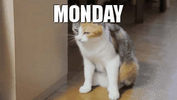

Title: Waarin wiikkowiesti 3/2018 - Työpisteitä tarjolla!
Date: 2018-01-22 23:00
Category: Fuksit
Meta: Wiikkowiesti
Tags: fuksit, wiikkoviesti, waarinwartit, muistinnollaus, laskiaisrieha, työvoima
Status: published

Hauskaa maanantaita,

viime viikolla vietettiin Talvipäivää, ja sen jälkeen koitti Otaniemeenkin ihan oikea talvi! Toivottavasti oot käynyt jo lumisotasilla ja rakentamassa lumiukkoja: pitää nauttia niin kauan kuin tätä riittää!

Tänään koittavat ensimmäiset Waarin wartit, varaa sinulle sopiva aika. Lisäksi tärkeää tietoa työpisteiden hankinnasta tulevasta Laskiaisriehasta, Muistinnollauksesta ja ystävänpäiväsitseiltä!

<em>&lt;3 Milla</em>

<h2>
&nbsp;
Sisällysluettelo</h2>

1. <a href="#tarkeaa">Tärkeää</a>
    1. Waarin wartit 22.1. alkaen
2. <a href="#fktapahtumat">Fuksi- ja kilta-asiat</a>
    1. M0-infotilaisuus ti 30.1. klo 16:15 @ T-talo
    2. Laskiaisriehan ajokin lähtolaukaus to 1.2. klo 16:15 @ T-talo
    3. Töihin TiK-FK-AS-ystävänpäiväsitseille 9.2.
3. <a href="#lopetus">Loppunurkkaus</a>

<h2>
&nbsp;
Tärkeää</h2>

<h4>
&nbsp;
1. Waarin wartit 22.1. alkaen</h4>

Waarin wartit käynnistyvät tällä viikolla! Waarin wartti on noin 15-30 minuutin pituinen rento jutustelutuokio fuksiwaarin kanssa. Ei tarvii jännittää :) Voit napata myös pistekorttisi mukaan Waarin warttiin, niin tsekataan puuttuvat pisteet läpi.

Varaa aika waarin warttiin kirjoittamalla nimesi tähän exceliin sinulle sopivan tyhjän ruudun kohdalle:
<https://docs.google.com/spreadsheets/d/1Ted1TtUfIlJE-cZI9JTd8FYVeKEXRAQOquqLAoxyKck/edit?usp=sharing>

Jos mikään aika ei sovi, ota yhteyttä Millaan!

Waarin wartissa käymisestä saat pisteen pisteet/master - Waarin wartti!

 

<h2>
&nbsp;
Fuksi- ja kilta-asiat</h2>

<h4>
&nbsp;
1. M0-infotilaisuus ti 30.1. klo 16:15 @ T-talo</h4>

Killan tapahtumista arvokkain, vuosijuhla Muistinnollaus lähestyy! 100000. Muistinnollaus vietetään 2.-3.3. Vuosijuhlien onnistumiseen tarvitaan kuitenkin monen vapaaehtoisen, kuten myös sinun, työpanosta! Tule tiistaina 30.1. kuulemaan, millaista vuosijuhlien järjestäminen todellisuudessa on, ja millaisia tehtäviä juuri sinulle voisi löytyä! Kaikille on jotain: koristelusta cocktail-paloihin, tekniikasta seuraavan päivän silliaamiaisen ruoanlaittoon.

Lisätietoja infotilaisuudessa tai Muistinnollaustirehtööreiltä (m0@tietokilta.fi)!

Muistinnollauksessa työskentelemisestä saat pisteen pisteet/teekkarikulttuuri/työ - Muistinnollaus!

 

<h4>
&nbsp;
2. Laskiaisriehan ajokin lähtölaukaus to 1.2. klo 16:15 @ T-talo</h4>

Otatarhan ajoissa nähdyn TiK-fuksien hienon suorituksen jälkeen on aika vaihtaa pyörien tilalle sukset: 13.2. järjestettävän Laskiaisriehan legendaarisin osa on Akateeminen mäenlaskukilpailu, jossa joukkueet kisaavat toinen toistaan kekseliäämmillä ja näyttävämmillä rakennelmilla Laskiaisen huikeimman mäenlaskuvälineen tittelistä. Lähdetään yhdessä voittamaan kisa Tietokillalle ja ennen kaikkea pitämään hauskaa!

Ajokin suunnittelu ja rakentelu aloitetaan to 1.2. klo 16:15 T-talolla. Älä huoli, vaikket pääsisi paikalle, mukaan meininkiin pääsee varmasti!

Laskiaisriehan ajokin rakentamiseen osallistumisesta saat pisteen pisteet/teekkarikulttuuri/työ - Työpiste!

Laskiaisriehaan osallistumisesta saat pisteen pisteet/teekkarikulttuuri - Laskiaisrieha!

 

<h4>
&nbsp;
3. Töihin TiK-FK-AS-ystävänpäiväsitseille 9.2.</h4>

Sinulla on ainutlaatuinen tilaisuus tienata puuttuvia työpisteitä Tietokillan, Fyysikkokillan ja AS:n yhteisillä ystävänpäiväsitseiltä 9.2. Lähde kokemaan sitsit kulissien toiselta puolelta ottamalla yhteyttä IE:hen Telegramissa (Lasse @Larshh tai Jussi @Impsa) tai sähköpostilla (ie@tietokilta.fi). He kertovat mielellään lisätietoja työtehtävistä! Sitsien järjestäminen on mielekästä puuhaa, joka jokaisen teekkarin olisi hyvä kokea ainakin kerran!

Killan sitseillä työskentelemisestä saat pisteen pisteet/teekkarikulttuuri/työ - Kilta!

 

<h2>
&nbsp;
Loppunurkkaus</h2>

Maanantai on kohta ohi! En oo varmaan ainoa, jolla on ollut koko päivän tällainen fiilis...

 

