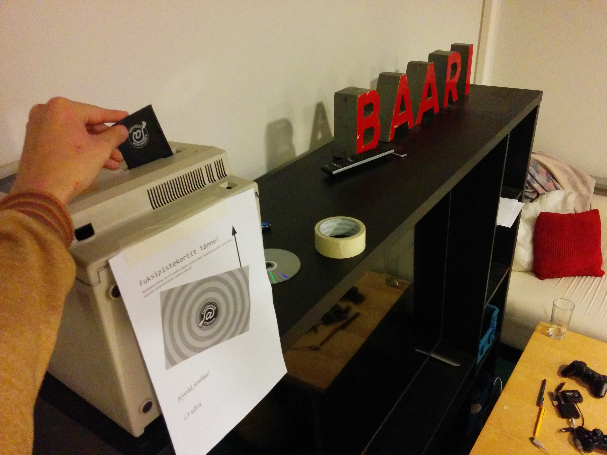

Title: Waarin vika viikkotiedote 2015 - menipäs vuosi nopeasti
Date: 2015-12-14 12:00
Category: Fuksit
Meta: Viikkotiedote
Tags: fuksit, viikkotiedote, waarin wartit, tenttiviikko
Status: published

Kulkuset soi ja vika viikkomaili tipahtaa laatikkoon!

Moikka moi ja erittäin hyvää viimeistä viikkoa. Onpas aika mennyt nopeasti! Nyt kun muistelee, mitä kaikkea onkaan puolen vuoden aikana ehtinyt tapahtua, niin ei millään meinaa uskoa kaiken menneen jo ohi... Orientaatioviikko, fuksisitsit, fuksiexcu, haalariseikkailu, huikea Otatarhan ajokki, fuksien juhlasitsit, fuksicruise ja mahtava fuksispeksi TiKkujouluissa... Puolet on jo mennyt, mutta onneksi on vielä puolet jäljellä! Keväästä on tulossa   e e p p i n e n!

Haluan kiittää kaikkia teitä fukseja kuluneesta syksystä. Minulla on ollut elämäni paras syksy teidän kanssanne, ja on ollut ilo nähdä niin monen olevan innolla mukana ja koulussa opiskelemassa välillä hurjankin ahkerasti. Olette olleet parhaimpia fukseja mitä fuksiwaarilla voi olla! Kiitos siitä. <3

Nyt vielä onnea vikoihin tentteihin, kuten TUTAan. Kannattaa katsella tenttiarkistosta <http://www.tenttiarkisto.fi> vanhoja tenttejä tärppejä löytääkseen. Sitten onkin aika rentoutua joululomalla, sen olette ansainneet.

Muistakaa palauttaa fuksipistekortti tämän viikon aikana! Nähdään tällä viikolla tai sitten ensi vuonna. Hyvää joulua ja uutta vuotta! :)

<em>&lt;3 ultsi</em>

<h2>
&nbsp;
Sisällysluettelo</h2>

1. <a href="#tarkeaa">Tärkeää</a>
    1. Fuksipistekorttien palautus 18.12. mennessä!
    2. Inttiin lähdöstä
    3. Tärkein työpiste - Muistinnollaus 12.2.
2. <a href="#fktapahtumat">Fuksi- ja kiltatapahtumat</a>
    1. Lenskin Dynamon vakiovuoro - joka keskiviikko klo 20:00
    2. Coding Factory - 29.1.
3. <a href="#ayylmao">AYY & Muu</a>
    1. Väre-rakennuksen työmaa käynnistyy
    2. Ainon lukijakysely – vastaa 21.12. mennessä
    3. Joulukonsertteja Otaniemen kappelissa
    4. Äänestä tietotekniikan vuoden opettajaa &amp; koulutusohjelman glögitilaisuus ke 16.12.
    5. Tee Otaniemestä parempi paikka kävellä!
    6. Asia Exchangen stipendit ovat nyt haettavissa syksylle 2016!
    7. Aallon perheelliset opiskelijat
4. <a href="#end">Lopetuskuva</a>

<h2>
&nbsp;
Tärkeää</h2>

<h4>
&nbsp;
1. Fuksipistekorttien palautus 18.12. mennessä!</h4>

Fuksipistekortit pitää palauttaa välitarkastusta varten viimeistään perjantaihin 18.12. mennessä. Mukaan kannattaa laittaa paperilappu, johon on kerätty ylös kaikki tapahtumat/asiat, joista haluaa leiman. Leimaan myös loman aikana puuttuvat työpisteet niiltä, jotka ovat töissä olleet.

Palautus tapahtuu kiltahuoneen kirjahyllyssä sijaitsevaan Mac-pönttöön, joka näkyy oheisessa kuvassa:

 

<h4>
&nbsp;
2. Inttiin lähdöstä</h4>

Jos olet lähdössä armeijaan nyt talvella, ota yhteyttä minuun. Sovitaan fuksipistekortin asiat erikseen. Minut löytää telegramista @ultsi, numerolla 0505523403 ja sähköpostilla fuksiwaari@tietokilta.fi. :)

 

<h4>
&nbsp;
3. Tärkein työpiste - Muistinnollaus 12.2.</h4>

Tietokilta täyttää 13.2. huikean pyöreät 30 vuotta, ja sitä juhlistetaan järjestämällä aivan mielettömät Muistinnollaus-vuosijuhlat! Vuosijuhlien järjestämiseen tarvitaan paljon apukäsiä ja juuri sinä voit olla suureksi avuksi 12.-13.2. viikonloppuna. :)

Työvoimaksi voi käydä ilmoittautumassa jo täällä: <https://tietokilta.fi/tapahtumat/ilmot/m0work2015>. Tekemistä riittää paljon, ja toivonkin, että kaikki teistä lähtevät tekemään yhteisiä vuosijuhlia! Lisäksi kaikille työntekijöille tarjotaan sillisaamiainen 13.2. ilmaiseksi. :)

Rennosta työstä luvassa leima kohtaan pisteet/kilta/työ - Muistinnollaus!

 

<h2>
&nbsp;
Fuksi- ja kiltatapahtumat</h2>

<h4>
&nbsp;
1. Lenskin Dynamon vakiovuoro - joka keskiviikko klo 20:00 @ Matlidens skola, Matinkylä 1</h4>

Lenskin Dynamo on killan oma liikuntaseura, joka pelaa matseja muita kiltoja ja yhdistyksiä vastaan niin sanotussa teekkarisarjassa Unisportilla. Matsien lisäksi LD:llä on oma vakiovuoro, jolla LD pelaa sählyä, futsalia ja korista. Kuka tahansa voi ilmoittautua mukaan kokeilemaan osoitteessa: <http://lenskindynamo.nimenhuuto.com/>

Pelaamalla Lenskin Dynamon pelissä voit saada leiman kohtaan pisteet/kilta - liikunta!

 

<h4>
&nbsp;
2. Coding Factory - 29.1.</h4>

Are you ready to kickstart your career in software development? Do you want to take your career to the next level? Well then, Welcome to the Coding Factory!

Coding Factory brings together a mixture of the most thrilling IT companies and promising young IT talents. Sharpen up your GitHub profile and get ready for some excitement!

At this exclusive event you get to showcase your talent directly to the great people of RELEX, Reaktor, Qvik, Futurice and CSC! You will get a rare sneak peek in the company cultures and even have a chance to be recruited on the spot.

This is not a job fair and we will not be handing out candy and pens. Our purpose is to help you to stand out! All attendees have a unique opportunity to really get to know the companies. Coding Factory offers interactive workshops, mini-interviews and laid back discussions with your potential future colleagues.

Sounds good but do you have what it takes? Are you the next IT super star in the making? Which of the companies is YOUR future employer? Apply below to join, and find out in January 29th, from 3PM onwards in Helsinki.

How to apply: Drop us a line, send us your profiles of choice (CV, LinkedIn, GitHub, Stackoverflow, other) by 18th of January 2016 and we will be in touch! Coding Factory only holds 50 spots, so tell us what you got!

Apply at <https://atalent.fi/members/apply.php?id=5x37914>

See you in January!

<https://atalent.fi/coding-factory/>

 

<h2>
&nbsp;
AYY &amp; Muu</h2>

<h4>
&nbsp;
1. Väre-rakennuksen työmaa käynnistyy</h4>

Otaniemen kampuksella on käynnissä useita mittavia rakennustöitä. Väreen rakennustyöt alkavat ensi viikolla Otakaari 1:n ja Tietotie 1:n välisellä alueella ja alue aidataan rakennustyömaaksi.

Väreen työmaan vuoksi liikenne Otaniementiellä katkaistaan perjantaina 18.12. Vuorimiehentien ja Tietotien välillä. Myös kaikki Otaniemen bussilinjat siirtyvät poikkeusreitille 18.12. alkaen. Poikkeusreitit ovat voimassa vuoden 2016 elokuuhun saakka, jolloin metro aloittaa liikennöinnin ja Espoon bussilinjasto uudistuu.

Lisätietoa ja -lukemista: <http://aaltocre.fi/vare-rakennuksen-tyomaa-kaynnistyy-otaniementie-katkaistaan/>

 

<h4>
&nbsp;
2. Ainon lukijakysely – vastaa 21.12. mennessä</h4>

Ainon toimitus vaihtuu vuodenvaihteessa ja nyt on palautteen aika.  Ensi vuonna lehti uudistuu kauttaaltaan. Kyselyyn vastaamalla pääset vaikuttamaan siihen, millaista Ainoa tehdään ensi vuonna. Kyselyn täyttämiseen menee aikaa noin 10 min. Kaikkien vastanneiden kesken arvomme Finnkinon leffalippuja. Muistathan, että palautetta voi aina lähettää myös osoitteeseen ainolehti@ayy.fi. Valtava kiitos vastauksestasi jo etukäteen!

<http://ainolehti.fi/aino/lukijakysely/>

 

<h4>
&nbsp;
3. Joulukonsertteja Otaniemen kappelissa</h4>

ti 1.12. klo 18.30 "Rauhaa päälle maan" - Espoon työväenopiston joululaulukonsertti  
la 5.12. klo 16 "Swengaavaa Joulua" - Lauluyhtye Drambuien joulukonsertti. Glögitarjoilu.  
la 12.12. klo 17 Tapiolan Laulun Joulukonsertti, joht. Uli Kontu-Korhonen. Joulukahvit.  
su 13.12. klo 18 Most Famous Christmas Carols - Kauneimmat Joululaulut. Yhteislaulutilaisuus suomeksi ja englanniksi. Mukana Otaniemen Kappelikuoro, joht. Katja Kangas  
ti 15.12. klo 18 Joulukonsertti - EMO:n lauluopiskelijat  
la 19.12. klo 18 Kamarikuoro Dissonanssin Joulukonsertti, joht. Yki Kortesniemi  

Kaikkiin tilaisuuksiin on vapaa pääsy. Vapaaehtoinen ohjelmamaksu menee hyväntekeväisyyteen, turvapaikanhakijoille.

 

<h4>
&nbsp;
4. Äänestä tietotekniikan vuoden opettajaa &amp; koulutusohjelman glögitilaisuus ke 16.12.</h4>

Äänestä tietotekniikan vuoden opettajaa! Anna äänesi osoitteessa <https://www.webropolsurveys.com/S/8774B11ABFC3743D.par>

Vuoden opettaja julistetaan ke 16.12. klo 13.00 T-talon kirjastossa, jossa on myös koulutusohjelman glögitilaisuus.

 

<h4>
&nbsp;
5. Tee Otaniemestä parempi paikka kävellä!</h4>

Otaniemessä on meneillään monia muutoksia, jotka näkyvät alueen rakenteessa ja kävelyolosuhteissa. Miltä Otaniemessä käveleminen tuntuu juuri sinusta? Ota osaa vuorovaikutteiseen kyselyyn ja voita leffalippu. Kyselyyn vastaamiseen menee noin 15 minuuttia ja vastaaminen on täysin anonyymiä. Kiitos vastauksestasi jo etukäteen!

Linkki kyselyyn: <http://maptionnaire.com/fi/1012/>

 

<h4>
&nbsp;
6. Asia Exchangen stipendit ovat nyt haettavissa syksylle 2016!</h4>

Myönnämme stipendejä kahdesti vuodessa opiskelijoille, jotka lähtevät kauttamme vaihtoon kohdeyliopistoihimme Aasiaan. Stipendin suuruus on 500 euroa.

<strong>MIHIN OPISKELEMAAN?</strong>

<strong>HANKUK UNIVERSITY OF FOREIGN STUDIES: ETELÄ-KOREA</strong>

Opiskele Korean kansainvälisimmässä yliopistossa pääkaupunki Soulin sydämessä. Tarjolla on runsaasti laadukkaita opintoja niin kandi- kuin maisteritasonkin opiskelijoille.

<strong>UDAYANA UNIVERSITY: INDONESIA</strong>

Opiskele liiketaloutta, matkailua ja kulttuuria Balin saarella. Nopeasti kehittyvä Indonesia on ainutlaatuinen kohde ulkomaanvaihdolle.

<strong>GUANGZHOU UNIVERSITY: KIINA</strong>

Opiskele kiinan kielen lisäksi taloutta ja kulttuuria 120 000 opiskelijan kampuskeskittymässä modernissa Guangzhoussa.

<strong>KASETSART UNIVERSITY: THAIMAA</strong>

Opiskele Bangkokissa 60 000 opiskelijan yliopistossa, joka kuuluu Thaimaan parhaimmistoon. Laaja kurssitarjonta sisältää muun muassa liiketalouden ja insinööritieteiden kursseja.

<strong>PRINCE OF SONGKLA UNIVERSITY: THAIMAA</strong>

Eteläisen Thaimaan ensimmäisen yliopiston opetus kerää lukukaudesta toiseen kiitosta. Tarjolla on kymmeniä kursseja erityisesti kaupan, hallinnon ja matkailun aloilta.

<strong>MITEN HAEN APURAHAA?</strong>

Tutustu kohteisiin ja täytä apuraha-hakemus nettisivuillamme osoitteessa <http://www.asiaexchange.org>.

 

<h4>
&nbsp;
7. Aallon perheelliset opiskelijat</h4>

Hei Aallon perheellinen opiskelija! Kerro meille, miten ylioppilaskunta voisi olla mukana edistämässä perheellisten opiskelijoidemme sujuvaa opiskelua. Liity myös facebook-ryhmään, jossa voit keskustella erityisesti perhearjen ja opintojen yhteensovittamisesta.

Linkki ryhmään:

<https://www.facebook.com/groups/1632326910390380/>

Linkki kyselyyn:

<http://lomake.ayy.fi/sosiaalipolitiikka/?p=287>

 

<h2>
&nbsp;
4. Lopetus</h2>

Tentteihin lukemisesta väsynein silmin toivotankin hyvää joulua kaikille teille fukseille! Ootte parhaita, enkä malta odottaa kevään juttuja. Levätkää kunnolla, olette sen ansainneet. :)

Nähdään ensi vuonna!

<em>&lt;3 ultsi</em>
