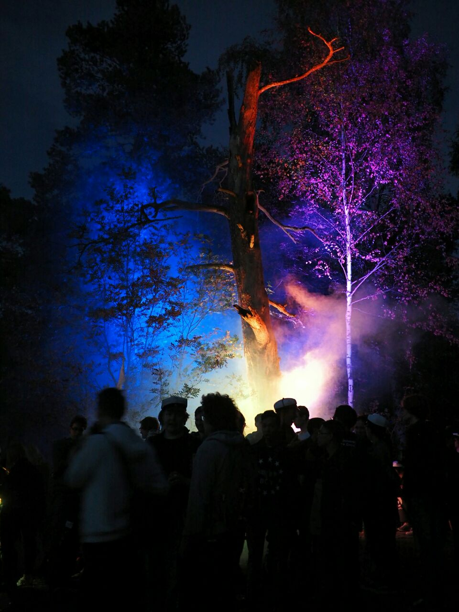

Title: Waarin viikkotiedote 1 - Orientaatioviikko woop!
Date: 2015-09-01 12:00
Category: Fuksit
Meta: hah
Tags: fuksit, viikkotiedote

*Nuotioilta, 5/5 meininki*

###WUUUUU!

Varaslähtö ja ensimmäinen päivä ovat nyt ohi ja minulla ainakin on ollut
törkeän hauskaa! Fuksiryhmien liput olivat todella hienoja ja on myös siistiä
ollut nähdä niitä tänään kulkemassa mukana. Mahtava meininki meneillään siis. :)

Varaslähdön ja Nuotioillan kuvia voi nyt fiilistellä Tietokillan kuvagalleriassa
osoitteessa <http://tietokilta.kuvat.fi>. Galleriaan tulee pitkin vuotta kuvia 
eri tapahtumista ja jos tykkäät kuvata, ota ihmeessä hallitukseen yhteys, niin 
voimme lisätä sinunkin kuvia galleriaan.

Alla on aikamoinen wall-of-text, mutta tärkeimmät on tässä heti ensimmäisenä! 
Lue ainakin ne huolella läpi. :) Ja ihan alhaalla on yllätys, tsekkaa sekin. Plöö!

<h2>
&nbsp;
TÄRKEÄÄ</h2>
####Fuksien ilmoittautuminen
Jos et ole jo ilmoittautunut Tietokillan sivuilla Fuksi-ilmoon, tee se nyt
osoitteessa <http://tietokilta.fi/tapahtumat/ilmot/fuksi2015>. Näin varmistat, 
että pysyt helposti perillä kaikista fukseja koskettavista asioista.

####Haalareiden sovitus
Haalarit 2015 ovat täällä! Ota ISOihisi yhteys ja sovi haalareiden sovittamisesta 
heidän kanssaan. Sovitushaalareita on Kiltahuoneella. Kun sopiva koko on löytynyt, 
ilmoita se tänne: <http://tietokilta.fi/tapahtumat/ilmot/haalarikokoilmo2015>.
Jos sopivia kokoja ei löydy, ilmoita "Muu" ja kirjoita minkä kokoisen arviolta
tarvitsisit.

####Ilmoittautuminen fuksisitseille on auki!
Eeppiset fuksisitsit tulevat ja niin pitäisi sinunkin tulla niille mukaan!  

Sitsit ovat akateeminen pöytäjuhla, jossa lauletaan, syödään ja juodaan hyvin, että 
myös kuullaan monenlaisia esityksiä ja päästään myös ehkä vähän tanssimaankin. 
Kolmen ruokalajin tarjoilu pitää huolen, että nälkä pysyy poissa koko sitsien ajan.

Sitsit ovat olennainen osa teekkarikulttuuria, niinpä opiskelijaelämästä jää 
kohtuuttoman suuri osa näkemättä, jollei yksillekään sitseille osallistu. Tule 
siis fuksisitseille kokemaan yksi opiskelijakulttuurin hienoimmista ilmiöistä 
sekä nauttimaan erinomaisista tarjoiluista.

Fuksisitsit juhlitaan maanantaina 14.9. klo 18:15 alkaen T-talossa. Pukukoodina
on tumma puku. Sitsit maksavat fukseille vain 10 euroa ja paikan päältä on myös 
mahdollista ostaa laulukirjoja 6.5 euron hintaan. 

Jatkot järjestetään Otaniemen Rantasaunalla, jossa odottaa lämmin sauna ja
palju. Sieltä on myös mahdollista ostaa ruokaa sekä virvokkeita, joten
muistakaa ottaa pyyhe sekä käteistä mukaan!

Ilmoittautuminen fuksisitseille tapahtuu killan sivuilta:
<https://tietokilta.fi/tapahtumat/ilmot/fuksisitsit2015>

Facebook-tapahtuma: <https://www.facebook.com/events/853996871315517/>

P.S. Jos jotain kysyttävää heräsi tai mietit kannattaako sinun tulla, ota
yhteys minuun! :)

<h2>
&nbsp;
Viikon fuksitapahtumat</h2>
####Leffailta ti 2.9. klo 20:00 @ Kiltahuone
Aalto Afterpartyn vaihtoehtojatkot!

Kokoonnutaan kiltahuoneelle katsomaan hyviä elokuvia ja syömään perus 
leffanaposteltavia. Jos Afterpartyn lippu jäi saamatta tai pitkän päivän jälkeen
tekee mieli vain rentoutua, niin tänne ehdottomasti kannattaa tulla. 
Leffailta alkaa heti Aalto Partyn jälkeen kello 20:00 ja jatkuu niin pitkään 
kuin leffoja riittää.

Leffalistaus: Brave, Aladdin, Liikkuva linna tai Kingsman, päätetään 
paikan päällä.

####Haalarigaala ke 2.9. klo 15:30 @ T2-luentosali, T-talo
Haalarigaalassa pääset tutustumaan teekkareiden haalarikulttuuriin, kuulemaan 
kuinka niitä täytyy hoitaa ja mitä kaikkea niihin voikaan kiinnittää. Huhujen 
mukaan muiden kiltojen fuksikapteenit ovat myöskin tulossa paikalle, jännittävää!

Gaalan lopuksi pääset ostamaan omat upouudet ja hienot haalarit. Huomaa, että 
haalareiden käyttöoikeus pitää ansaita ennen niiden käyttämistä julkisuudessa! 
Kuulemma sellaisen voi ansaita Kiltakasteessa...

Muista sovituttaa haalarisi fuksiryhmän kanssa ennakkoon ja merkitse ne tänne:
<https://tietokilta.fi/tapahtumat/ilmot/haalarikokoilmo2015>.

####Kiltakaste ke 2.9. klo 17:45 @ Paikka X, yhteislähtö T-talolta
Kiltakaste on ensimmäinen vilkaisusi kiltaelämään. Opit tapahtumassa mitä kaikkea 
hienoa Tietokillassa ja teekkarina pääsee tekemään sekä kokemaan ja pääset 
tutustumaan opiskelutovereihisi.

Lopuksi koittaa mystinen fuksin ensiaskel - mikä se on, selviää paikan päällä.

Yhteislähtö bussilla T-talon edestä klo 17.45. Ole ajoissa!
<https://tietokilta.fi/tapahtumat/766>

####Fuksiexcun ilmoittautuminen aukeaa torstaina klo 9:00
Fuksivuoden ensimmäinen tilaisuus tutustua Otaniemen ulkopuoliseen teekkarielämään 
sekä ohjelmistoyritys Futuriceen. Loppuillasta pääsemme tutustumaan paikalliseen 
TiTeen eli Tampereen tietoteekkareihin! Heillä on meille sauna varattuna sekä 
suunniteltuna muuta ilta-aktiviteettia. Reissu maksaa 16 euroa.
 
Lisätietoa ja ilmoittautuminen osoitteessa <http://tietokilta.fi/tapahtumat/777>

Waarin kommentti: <em>Excursiot ovat aina täyttyneet lähes heti, kannattaa siis olla nopea 
ilmoittautumisen kanssa! Ulkomatkat muita teekkareita tapaamaan ovat myös täynnä
yllätyksiä eikä ikinä tiedä mitä TiTeläiset ovat tällä kertaa keksineet. Minä
ainakin lähden innolla katsomaan mitä Tampereelle kuuluu. :)</em>

####Otasuunnistus torstaina klo 17:00 @ Amfi
Otasuunnistuksessa fuksit pääsevät tutustumaan Otaniemen eri yhdistyksiin ja 
toimijoihin mitä hullunkurisempien rastien muodossa sekä seikkailemaan pilke 
silmäkulmassa kunnon teekkarin tavoin. Suunnistuksen aikana fuksit keräävät 
rasteilta pisteitä, ja ilta huipentuu tapahtuman jatkoilla Servin mökissä (Smökki)
järjestettävään finaaliin, jonka voittajille on luvassa huimia palkintoja!

Alkupamaus kajahtaa kello 17.00 Amfilta. Älä myöhästy!

P.S. Tapahtumaan kannattaa muistaa varata käteistä rahaa esimerkiksi haalarimerkkejä varten.

Facebook-tapahtuma: <https://www.facebook.com/events/934849853224018/>
Tapahtuma killan sivuilla: <http://tietokilta.fi/tapahtumat/767>

####Kaukkarit perjantaina 4.9. klo 20:00 alkaen @ Smökki
Oiva orientaatioviikon lopetustapahtuma. Ennakkoliput ovat myyty loppuun, mutta
ovelta voi vielä saada lippuja. Myös Facebookissa voi kysellä lippujen perään.

Kaukkarit, koska miten muuten voisikaan taas uusi kouluvuosi paremmin alkaa!

SIK, KIK ja IK järjestävät jälleen fuksiviikon parhaat bileet Smökissä 
perjantaina 4.9. Paikalla, DJ, livemusaa ja tietty uudet fuksit! Tule siis 
tutustumaan uusiin ihmisiin ja tapaamaan vanhoja kavereita kesän jälkeen 
hyvän musiikin tahdittamana, josta Sosiaalifobia pitää huolen.

Liput maksavat ovelta 6€ ja lipun hintaan sisältyy haalarimerkki!

MITÄ? Kaukkarit!  
MISSÄ? Smökki  
MILLOIN? 4.9. klo 20 alkaen  
HINTA? 6€ (ovelta) sis. haalarimerkin  

Tapahtuma Facebookissa: <https://www.facebook.com/events/1102246739805089/>

<h2>
&nbsp;
Fuksit 2015 &lt;3</h2>

Tässä olette te ja mun mielestä ootte ihan huippu jengi! <3 On ilo olla juuri teidän fuksiwaari.  
Tehdään tästä yhdessä hyvä vuosi. :)

Hauskaa orientaatioviikkoa!
  
_Joonas_ (_ultsi_)
