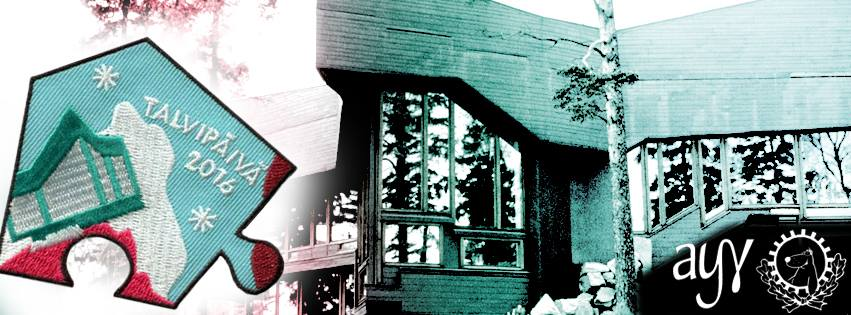

Title: Waarin viikkotiedote 3/2016 - 104...
Date: 2016-01-18 16:30
Category: Fuksit
Meta: Viikkotiedote
Tags: fuksit, viikkotiedote, waarin wartit, vappupokemon
Status: published

Morjesta!

Toivottavasti kaikki ovat jo päässeet jollain tavalla koulun makuun. Itsellä meni aikaa juuri tuo kaksi viikkoa toipua lomasta, ja nyt vihdoin voi sanoa opiskelevansa kunnolla taas. :D

Paljon tapahtumia tulossa, joista tärkein tässä heti ensimmäisenä. Lukekaas läpi! :)

<em>&lt;3 ultsi</em>

<h2>
&nbsp;
Sisällysluettelo</h2>

1. <a href="#tarkeaa">Tärkeää</a>
    1. Tarkastetut fuksipistekortit voi hakea kiltikseltä!
    2. Tempaus!
2. <a href="#fktapahtumat">Fuksi- ja kiltatapahtumat</a>
    1. Talvipäivä - ti 19.1. @ klo 14.00
    2. Abi-info - to 21.1. @ OK1
    3. UraTiKAS - to 21.1. - Pe 22.1.
    4. Curling to 3.3. - ilmo auki!
    5. Solita Th!nk Hackathon - Pe 22.1. - La 23.1.
    6. Procountor Excu - ma 25.1.
    7. Coding Factory - 29.1.
    8. Muistinnollaus 11110 - Pe 12.2. - La 13.2.
3. <a href="#ayylmao">AYY & Muu</a>
    1. Helsinki Business Symposium - To 21.1. - Pe 22.1.
    2. Finnish Game Jam Otaniemi - Pe 29.1. - La 31.1.
4. <a href="#ending">Vappupokemon!</a>

<h2>
&nbsp;
Tärkeää</h2>

<h4>
&nbsp;
1. Tarkastetut fuksipistekortit voi hakea kiltikseltä</h4>

Fuksipistekorttikasa on jo huvennut viime viikolta, mutta käykääs loputkin hakemassa korttinne kiltikseltä. Ne löytyvät harmaan Mac-pöntön sisältä. :)

 

<h4>
&nbsp;
2. Tempaus!</h4>

Pitkän hiljaiselon jälkeen on taas tulossa uusi Tempaus (isolla T:llä!). <http://www.tempaus.fi>

<strong>Mikä on Tempaus?</strong>

Tempaukset ovat opiskelijoiden tapa vaikuttaa ajankohtaisiin asioihin pilke silmäkulmassa, mutta kuitenkin tosissaan. Joukkovoimaa hyödyntäen tempauksissa herätetään suuren yleisön mielenkiinto johonkin yleiseen ongelmaan. Tempauksilla saatetaan myös kerätä rahaa johonkin yleishyödylliseen tarkoitukseen. Historia tuntee monia hyvin onnistuneita ja paljon julkisuutta saaneita tempauksia, mutta myös pienempiä, joka vuosi järjestettäviä tempauksia.

Viimeksi Tempaus järjestettiin Aalto-yliopiston syntyessä vuonna 2009, jolloin Tempauksen nimi oli “Mahtavaa! Ihanaa! Räjähtää!” (tuttavallisemmin MIR). Tällöin opiskelijat muodostivat ihmisketjun Otaniemestä aina Helsingin Arabiaan asti ja toivat uudelle yliopistolle positiivista näkyvyyttä Helsingissä.

Eräs kuuluisimmista Tempauksista järjestettiin vuonna 1966, kun korkeakoulu muutti viimein Helsingistä Otaniemeen - tapaus tunnettiin nimellä “Temppu-66”. Tapahtumaan sisältyi monia erilaisten pienempiä tapahtumasarjoja kuten Hajajäyniä, esityksiä ja karnevaaleja, mutta suurin näkyvyys saavutettiin massiivisella kulkueella Helsingin läpi kohti Otaniemeä. Video: <http://yle.fi/aihe/artikkeli/2006/11/08/opiskelijatempaus-korkeakoulu-otaniemeen>

Muita Tempauksia ovat esimerkiksi vuoden -79 “Tutki tai tutise!” (teknillisen tutkimiuksen edistämisen puolesta) ja -60 “Vienti turvaa tuotannon” (suomalaisen teollisen viennin puolestapuhuminen).

<strong>Miten minä voin vaikuttaa?</strong>

Kaikki tempaukset ovat vaatineet paljon tekijöitä, ja niin myös tälläkin kertaa. On äärimmäisen tärkeää, että myös fukseja lähtee tempaustoimikuntaan mukaan. Seuraava kerta temmata voi olla kaukana tulevaisuudessa, viime tempauksestakin on jo 7 vuotta aikaa. Voit nyt päästä osaksi historiaa vaikuttamalla Tempaukseen 2016 ilmoittautumalla vapaaehtoiseksi!

Töitä riittää pitkin kevättä, eivätkä ne myöskään lopu wappuun (mikäli sellainen päätetään järjestää). Tilaisuuteen kannattaa ehdottomasti tarttua, vaikka fuksikevät ja mahdollinen wappu on tulossa. Huomatkaa, että ilmoittautumislomakkeessa voi mainita aikataulurajoitteet. :)

Nyt mennään eikä meinata. Tästä vuodesta on tulossa ihan huikea, voin aistia sen jo tuntosarvillani. Muistakaa, että tämä tempaus ei ole pelkästään teekkarien juttu - tänä vuonna temmataan kauppatieteiden ja taiteiden opiskelijoiden kanssa! Siitä lisää myöhemmin...

Kaikki tulee selviämään aikanaan, sitä ennen kannattaa suunnata sivulle <http://www.tempaus.fi>.

<strong>Osallistumisesta luvassa KAKSI FUKSIPISTETTÄ:</strong>

pisteet/vapaa - Lisäpiste / valinnainen piste

pisteet/kilta/työ - Muu työ

 

<h2>
&nbsp;
Fuksi- ja kiltatapahtumat</h2>

<h4>
&nbsp;
1. Talvipäivä - ti 19.1.</h4>

Talvipäivä on taas täällä!

Uuden vuoden avaa mitä parhaimmin talvinen rastikiertely Otaniemen sydämessä, joten tervetuloa mukaan temmeltämään!

Lumisen rastikiertelyn alkupamaus kajahtaa Otakaari 1:n Amfilla klo 14:30, ja yhdistysten, kiltojen ja ISOhenkilöiden pitämiä rasteja voi kierrellä klo 17:30 asti.

Otaniemen moninaiset saunatilat aukeavat klo 17:00. Oletko koskaan aikaisemmin saunonut saman päivän aikana kaikissa Teekkarikylän saunoissa? Haaste on heitetty.

Talvipäivän jatkojuhlat alkavat Servin Mökissä klo 20:00. Jatkoilla palkitaan myös rastikiertelyn voittaja!

P.S. Myynnissä on myös FTMK:n tuottaman Suunnistus-merkkisarjan viimeinen haalarimerkki hintaan 2€! Etsi kippari käsiisi tai tule ostamaan se viimeistään jatkoilta klo 20:00 alkaen!

Facebook-tapahtuma: <https://www.facebook.com/events/905694309545733/>

Luvassa viimeinen suunnistusleima: pisteet/teekkarikulttuuri/suunnistus - Talvipäivä!

 

<h4>
&nbsp;
2. Abi-info - to 21.1. @ OK1</h4>

Vuosittainen Abi-info järjestetään taas torstaina 21.1. klo 12-15. Info pidetään Kandikeskuksen ala-aulassa ja sen ympäristössä. Lukiolaiset tulevat siis perinteiseen tapaan kiertelemään ständejä ja käymään esittelykierroksilla.

Tapahtumaa varten tarvitaan muutamia opiskelijoita tietotekniikan ständille kertomaan tietotekniikan opiskelusta Aalto-yliopistossa.

Mukaan voi ilmoittautua lisäämällä oman nimensä tänne: <https://docs.google.com/spreadsheets/d/1tcYAj3D_J5Qxcb7Rh93-X2f6r3TGvid5C8DYYziSgus/edit>

Paikka: Kandikeskuksen ala-aula (Otakaari 1)  
Aika: 21.1.2016 klo 12-15  

 

<h4>
&nbsp;
3. UraTiKAS - To 21.1. - Pe 22.1.</h4>

UraTiKAS saapuu taas, tänä vuonna kovempana kuin koskaan!

UraTikAS on Tietokillan ja Automaatio- ja Systeemiteknologian Killan yhteinen rekrytointitapahtuma. Tänä vuonna mukana on 12 yritystä, kuten esimerkiksi NVIDIA, GoFore, F-Secure, Eniram, ABB ja Dreambroker. Tarkka lista ja aikataulu julkaistaan myöhemmin!

Tilaisuus järjestetään 21. ja 22. tammikuuta TUAS-talon (Otaniementie 17) luentosalissa AS2. Jokainen yritys pitää noin 30 minuutin pituisen esitelmän itsestään, jonka aikana he kertovat uramahdollisuuksista ja kesätyöpaikoistaan ja jonka lisäksi kävijät pääsevät itse kyselemään firmoilta kysymyksiä. Vireystilan ylläpitämiseksi molempina päivinä järjestetään myös pieni välitarjoilu.

Perjantaina esitysten jälkeen järjestetään myös jatkot Rantasaunalla, jossa kävijät pääsevät keskustelemaan yritysten työntekijöiden kanssa rennossa ilmapiirissä (ja mahdollisesti neuvottelemaan itselleen duunipaikan!).

Tapahtuma alkaa torstaina klo 16.00 ja loppuu klo 19.30. Perjantaina esitykset jatkuvat kello 14.00 ja loppuvat klo 17.30, jonka jälkeen Rantasaunalla hauskanpito alkaa klo 18.00.

Älä jää tästä tilaisuudesta paitsi, vaan tule mukaan kipuamaan ylöspäin urallasi!

<http://tietokilta.fi/tapahtumat/876>

Ainutlaatuinen leima - UraTiKAS!

 

<h4>
&nbsp;
4. Curling 3.3.2016 - ilmo auki</h4>

Määris nänniin!

On vuosi 2006 ja talviolympialaiset, joissa suomalaisille täysin uusi laji, curling, nostaa päätään Suomen oman Messiaan, Markku Uusipaavalniemen, johdolla. Uusipaavalniemi (kavereiden kesken Uusis) nappaakin Suomelle hopeaa, ja kansa on haltioissaan. Valitettavasti siihen loppuukin suomalainen menestys curlingissa, ja Uusis katoaa maailmankartalta.

Tietokillan varapuheenjohtaja, tunnettu salapoliisi, on saanut kuitenkin selvitettyä, että mies lymyilee nykyään Oulunkylässä ja pyörittää edellä mainittuun lajiin sekä tietenkin henkilökulttiinsa perustuvaa liiketoimintaa, nimittäin curlinghallia. Tällaista tilaisuutta ei voi jättää käyttämättä, vaan pakkohan tuota mystistä lajia on testata.

2 tunnin setti sisältää lajiesittelyn, pakollisen opastuksen sekä peliaikaa muutamaan päätyyn. Hinnaksi tulee osallistujamäärästä riippuen noin 15-24€. Lajikokeilu on tarkoitus järjestää 3.3.2016 Oulunkylän curlinghallilla. Bonuksena kisapaikalle saa tuoda omia virvokkeita (myös alkoholipitoisia!) ja niitä saa juoda pelin lomassa.

Aika löytää sisäinen curlaajasi!

DISCLAIMER: Emme voi taata, että Uusipaavalniemi tulisi ohjastamaan meitä, hallilla on muitakin töissä.

MITÄ: Heitellään kiviä nänniin, kansankielisesti curlingia  
MISSÄ: Oulunkylän curlinghalli, Käskynhaltijantie 11 00640 Helsinki  
MILLOIN: 3.3.2016 klo 19-21  
PALJONKO: 15-24€, riippuu osallistujamäärästä  

Ilmottautuminen alkaa torstaina 14.1! Varmista paikkasi tästä ainutlaatuisesta tapahtumasta: <http://tietokilta.fi/tapahtumat/ilmot/curling16>

Luvassa leima kohtaan pisteet/kilta - Liikunta!

 

<h4>
&nbsp;
5. Solita Th!nk Hackathon - Pe 22.1. - La 23.1.</h4>

Case Lupapiste ja QLMA

Digitalisaatio muuttaa suomalaisten arkea. Yhä useampi julkinen palvelu tuotetaan kansalaisille ja yrityksille sähköisenä, mikä mullistaa myös palveluiden tuotannon ja mahdollistaa uudenlaiset palveluinnovaatiot. Myös kehitystavat muuttuvat. Kutsumme sinut tuulettamaan pölyttyneitä mielikuvia julkisten palvelujen suunnittelusta avoimuuteen, verkostoitumiseen ja innovaatiokulttuuriin perustuvaan Solita Th!nk Open Hackathoniin. Tapahtuma keskittyy kahden avoimen lähdekoodin ratkaisun, Lupapisteen ja QLMA:n, teemoihin. Tervetuloa mukaan inspiroitumaan!

Lisätiedot ja ilmoittautuminen 15.1. mennessä: <http://www.solita.fi/tapahtumat/solita-thnk-open-hackathon/>

pisteet/kilta - Lanit/Hackathon!

 

<h4>
&nbsp;
6. Procountor Excu - ma 25.1.</h4>

Oletko kiinnostunut kuulemaan, miltä taloushallinnon tulevaisuus näyttää? Taloushallintoala elää vahvaa murroskautta, jossa muun muassa automatisoinnin ja käyttäjäkokemuksen rooli kasvaa voimakkaasti. Procountor on tässä etunenässä: kehitämme sähköisen taloushallinnon ohjelmistoa, jolla tuomme lisäarvoa yritysten toimintaan. Tervetuloa kuulemaan aiheesta ja ratkomaan hands-on case Procountorin softasta!

Viime vuoden onnistuneen excun jälkeen tarjolla on entistäkin parempaa: syvempää näkemystä alaan, paikalla uusia kasvoja viimeisen kahden vuoden ajan aloittaneista opiskelijoista, ja lopulta päästään rentoutumaan saunan ja paljun merkeissä. Naisille on myös oma saunansa. Pyyhe mukaan!

Tarjolla hyvää ruokaa ja juomaa. Excu aloitetaan ruoalla, jatkoilla lisää.

Procountor etsii opiskelijoita ohjelmistokehitykseen ja -testaukseen, käyttäjäkokemukseen ja järjestelmäasiantuntijaksi. Illan aikana mahdollisuus jutella myös näistä paikoista. Täten excu on tarkoitettu ensisijaisesti 2. vuosikurssista eteenpäin, paikkoja 15 tikkiläiselle. Mukana myös 15 infolaista.

Ilmoittautumiseen (aukeaa ti 19.1. klo 12:00): <http://tietokilta.fi/tapahtumat/ilmot/procountorexcu>

pisteet/kilta - Yritysexcu!

 

<h4>
&nbsp;
7. Coding Factory - 29.1.</h4>

Are you ready to kickstart your career in software development? Do you want to take your career to the next level? Well then, Welcome to the Coding Factory!

Coding Factory brings together a mixture of the most thrilling IT companies and promising young IT talents. Sharpen up your GitHub profile and get ready for some excitement!

At this exclusive event you get to showcase your talent directly to the great people of RELEX, Reaktor, Qvik, Futurice and CSC! You will get a rare sneak peek in the company cultures and even have a chance to be recruited on the spot.

This is not a job fair and we will not be handing out candy and pens. Our purpose is to help you to stand out! All attendees have a unique opportunity to really get to know the companies. Coding Factory offers interactive workshops, mini-interviews and laid back discussions with your potential future colleagues.

Sounds good but do you have what it takes? Are you the next IT super star in the making? Which of the companies is YOUR future employer? Apply below to join, and find out in January 29th, from 3PM onwards in Helsinki.

How to apply: Drop us a line, send us your profiles of choice (CV, LinkedIn, GitHub, Stackoverflow, other) by 18th of January 2016 and we will be in touch! Coding Factory only holds 50 spots, so tell us what you got!

Apply at <https://atalent.fi/members/apply.php?id=5x37914>

See you in January!

<https://atalent.fi/coding-factory/>

Ilmoittaudu varasijoille: <http://tietokilta.fi/tapahtumat/ilmot/tikcodingfactory>

pisteet/kilta - Lanit/Hackathon!

 

<h4>
&nbsp;
8. Muistinnollaus 11110 - Pe 12.2. - La 13.2.</h4>

Juhlimme killan 30-vuotista taivalta ravintola Valopihalla. Luvassa on killan vuosikymmenen parhaat juhlat, joten tule juhlimaan muiden kiltalaisten kanssa! Lisätietoja löydät osoitteesta <http://tietokilta.fi/muistinnollaus/etusivu>

Työntekijänä saat pisteen pisteet/kilta/tyo - Muistinnollaus!

pisteet/kilta - Muistinnollaus - TiK 30v!

 

<h2>
&nbsp;
AYY &amp; Muu</h2>

<h4>
&nbsp;
1. Helsinki Business Symposium - To 21.1. - Pe 22.1.</h4>

On January 21st-22nd Helsinki Business Symposium will gather the most notable names in business under the same roof. The two-day seminar consists of inspirational speeches, thought-provoking panel discussions and workshops by corporate partners.

Helsinki Business Symposium culminates in a glorious evening gala held at Restaurant Bank on Friday 22nd of January.

The registration to the workshops is already on! Ensure your spot by signing up at <https://goo.gl/MjYs5m>. For people attending the workshops there will be no participation fee to other parts of the seminar.

Tickets to the seminar and evening gala can be purchased at <https://holvi.com/shop/KY-shop>.

More information about the event can be found at hbs2016.fi, <https://www.facebook.com/HelBizSymposium> and <https://www.facebook.com/events/184966595175893/>.

 

<h4>
&nbsp;
2. Finnish Game Jam Otaniemi - Pe 29.1. - La 31.1.</h4>

Interested in game development, design or concepting? Want to create awesome game project over a weekend with great people? DOT ry and Aaltoes are organizing a Finnish Game Jam site as part of the Global Game Jam.

A Game Jam brings together all types of game developers and designers, amateur, professional and students. Typically participants work in small teams, racing to produce as complete a game as possible with limited time and resources. Join with your friends or just by yourself, team formation will happen on the spot.

GET YOUR FREE TICKETS NOW:  
<https://www.eventbrite.com/e/fgj-otaniemi-tickets-19937661081>  
<https://www.facebook.com/events/457693784438615/>

pisteet/kilta - Lanit/Hackathon!

 

<h2>
&nbsp;
Vappupokemon!</h2>

Ja... päivän vappupokemon on numero 104, Cubone!

Enää 104 päivää vappuun! :)

<em>&lt;3 ultsi</em>
