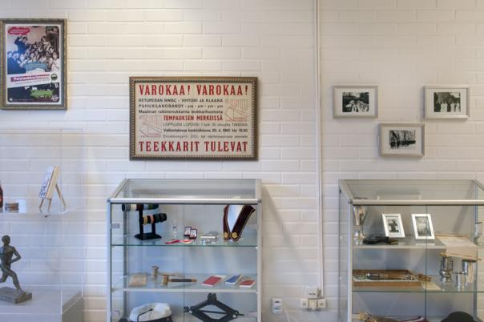

Title: Waarin viikkotiedote 6/2016 - Laskiaisrieha ja M0-viikko! (ja ruotsi!)
Date: 2016-02-08 13:00
Category: Fuksit
Meta: Viikkotiedote
Tags: fuksit, viikkotiedote, waarin wartit, vappupokemon, laskiaisrieha
Status: published

Moikka moi!

Tällä viikolla on kolme tärkeää asiaa: HUOMINEN laskiaisrieha, johon meillä on ihan sikahieno ajokki tulossa, Muistinnollaus (työpisteitä, glamouria, rahaa palaa!) ja wouwouwou, ilmoittautuminen TiKin ruotsin kursseille!

Laskiaisriehan laskuvälineen teema meillä on Mario Kart, ja tarkoituksena on kisata neljällä Double Dash -pulkalla mäki alas. Kisaajia tarvitaan paljon (8 kappaletta), ja kisaajana ei tarvitse tehdä mitään muuta, kuin saapua paikalle! Tule messiin! :)

Muistinnollaus on perjantaina ja sinne tarvitaan vielä lisäkäsiä eritoten sillikselle ja jatkoille! Lähde mukaan ja hae työpiste! Siitä lisää alempana. Jos olet mukana, lue silti.

Ilmoittautuminen TiKin ruotsin kursseille on auki! Kannattaa ehdottomasti mennä ruotsin kurssille fuksina, kun ruotsi on lukiosta hyvin vielä mielessä. Kursseille on paljon vaikeampaa myös päästä vanhempana opiskelijana, joten nyt kannattaa käyttää tilaisuus hyväksi! Alla olevasta kahdesta linkistä pääset kurssin Oodi- ja MyCourses-sivuille. 

<https://oodi.aalto.fi/a/opettaptied.jsp?MD5avain=&Kieli=1&OpetTap=1122623351&haettuOrg=&sortJarj=&haettuOrg=&Kieli=1&NimiTunniste=&AlkPvm=&PaatPvm=&Selite=&Sivu=&haettuOpas=&haettuOppAin=&haettuLk=&haettuOpetKiel=&&haeOpintJaks=&takaisin=opintjakstied.jsp&OpinKohd=1113631943&takaisin2=ilmsuor.jsp?MD5avain=&Kieli=1&Tunniste=LC-5411&AlkPvm=&PaatPvm=&Nimi=&haeOpintJaks=haeopintojaksot&haeVainIlmKelp=&haeMyosAlemOrg=&eHOPSpaluu=0&eHOPSpaluusivu=&Org=>

<https://mycourses.aalto.fi/course/info.php?id=7165>

Lukekaas läpi, paljon on myös muuta!

<em>&lt;3 ultsi</em>

<h2>
&nbsp;
Sisällysluettelo</h2>

1. <a href="#tarkeaa">Tärkeää</a>
    1. Viimeiset hetket lähteä työvoimaksi Muistinnollaukseen!
2. <a href="#fktapahtumat">Fuksi- ja kilta-asiat</a>
    1. Vuosijuhlaviikon Otaniemipeli - ma 8.2.
    2. Laskiaisrieha - ti 9.2.
    3. Gravitaatio - ti 9.2.
    4. Seuraava Polyteekkarimuseovierailu - ke 10.2.
    5. Muistinnollaus 11110 - Pe 12.2. - La 13.2.
    6. Ystävänpäiväsitsit - to 18.2.
    7. ISOinfo 2016 - ti 23.2.
    8. Teekkarispeksi 2016: Atlantis 1860 - 18.4.
    9. Helsingin Appron yhteislipputilaus - to 14.4.
    10. Kilta-avustus
3. <a href="#ayylmao">AYY & Muut</a>
    1. Kouluttaudu järjestyksenvalvojaksi AYY:n piikkiin!
    2. Haluaisitko suorittaa siviilipalveluksen, mutta paikka puuttuu? AYY etsii kiinteistöapulaista
    3. OtaKopin pesäpallojoukkueiden kasaussaunat
    4. TF Valentinsitz - la 13.2.
    5. Talviaalto - Ti 1.3.
    6. Teekkariristeily 2016 - to 3.3
    7. YTHS tiedottaa
    8. Code collaboration - Museum Exhibition Project
    9. Hae Teekkarin Työkirjan päätoimittajaksi
    10. Ota osaa energiatehokkuuskilpailuun!
    11. Hae avustusta Aasia-aiheisen opiskelijatapahtuman järjestämiseksi!
    12. Vastaa tutkimukseen auringon vaikutuksesta melanoomaan! 
4. <a href="#ending">Vappupokemon!</a>

<h2>
&nbsp;
Tärkeää</h2>

<h4>
&nbsp;
1. Viimeiset hetket lähteä työvoimaksi Muistinnollaukseen!</h4>

Tule työvoimaksi Tietokillan 30-vuotisjuhlaan, Muistinnollaukseen! Jo 30 on ilmoittautunut, ja vielä riittää töitä. Juhlien valmistelu alkaa olemaan loppusuoralla ja voin sanoa, niistä tulee huikeat. Niiden onnistumiseen tarvitaan kuitenkin paljon työläisiä.

NYT JOS ET OLE VARMA TYÖTEHTÄVÄSTÄSI, LAITA MINULLE VIESTIÄ. Selvitetään se, että kaikki menee hyvin.

Työvoimaksi ilmoittautuminen: <http://tietokilta.fi/tapahtumat/ilmot/m0work2015>

Työntekijänä saat pisteen pisteet/kilta/tyo - Muistinnollaus!

Sekä pisteen pisteet/kilta - Muistinnollaus - TiK 30v!

 

<h2>
&nbsp;
Fuksi- ja kilta-asiat</h2>

<h4>
&nbsp;
1. Vuosijuhlaviikon Otaniemipeli</h4>

Vuosijuhlaviikko koittaa, ja sen kunniaksi on aika pelata Otaniemipeliä!

Tietokilta järjestää vuosijuhliensa johdosta Otaniemipeli-illan, jossa kaikilla kiltalaisilla on mahdollisuus päästä pelaamaan Tietokillan omaa seurapeliä, Otaniemipeliä! Tässä kiltaakin vanhemmassa pelissä kolmesta viiteen kolmihenkistä joukkuetta etenevät pelilaudalla läpi Otaniemen kiltahuoneiden ja muiden tärkeiden lokaatioiden läpi, suoriutuen suurista koettelemuksista ja saapuen lopulta kaikkein pyhimpään, Tietokillan Kiltahuoneelle!

Illan aikana tullaan pelaamaan kaksi peliä, jotka ovat hieman tavanomaista kevyempiä: tämä mahdollistaa nopeamman suoriutumisen lisäksi vasta-alkajille miellyttävämmän pelikokemuksen. Tällä kertaa ei pelissä ole myöskään mukana perinteisiä joukkuekokoonpanoja, joten kaikenlaiset joukkueet ovat tervetulleita!

Olit sitten vanha mouho tai puhtoinen fuksi, on tämä tapahtuma juuri sinulle, sillä pelin tarkemmat säännöt tullaan kyllä käymään tapahtumassa läpi. Tilaisuudessa on tarjolla on herkullista ruokaa, joka on kaikille pelaajille ilmaista, minkä lisäksi Gorsun sauna lämmitetään optimilämpöön täydellistä saunakokemusta varten.

Tämä on loistava mahdollisuus juhlistaa 30-vuotiasta Tietokiltaa mahtavan pelin ääressä!

- Luvassa leima pisteet/kilta - Muu tapahtuma!

 

<h4>
&nbsp;
2. Laskiaisrieha - ti 9.2.</h4>

<http://laskiaisrieha.fi/>

Laskiaistiistaina 9.2.2016 koittaa Helsingin Kaivopuistossa opiskelijoiden kevättalven piristys, Ullanlinnanmäen Laskiaisrieha! Lystikkään, lumisen ja vauhdikkaan iltapäivän ajan mäki täyttyy kelkoista, pulkista, liukureista ja niitä ohjastavista iloisista opiskelijoista pääkaupunkiseudulta ja kauempaa. Pulkka kainaloon ja eikun mukaan mäkeen!

Vapaan laskemisen ja lystinpidon ohella tiedossa on musiikkia, kilpailuja ja päheätä ohjelmaa. Päivän kruunaa legendaarinen ABB:n Akateeminen mäenlaskukilpailu, jossa joukkueet kisaavat toinen toistaan kekseliäämmillä ja näyttävämmillä rakennelmilla Laskiaisen huikeimman mäenlaskuvälineen tittelistä. Aikaisempina vuosina rinteessä on nähty junia, autoja, hävittäjiä, tankkeja sekä Lohikäärmeen kuolema ja onpa mäki laskettu myös alhaalta ylöskin; tule mukaan seuraamaan kuka vie skaban tällä kertaa!

Jos taas vasara pysyy kädessä ja kelkka ohjaksissa, kokoa oma joukkue suunnittelupöydän ääreen ja ilmoittaudu mukaan. Hurmaa yleisö sekä vie palkinnot kotiin, ja ennen kaikkea pidä hauskaa! Säännöt ja ilmoittautumisohjeet löytyvät osoitteesta <http://www.laskiaisrieha.fi>

Paras tunnelma mäessä on klo 13-17 välillä ja meininki jatkuu vahvana Helsingin yöelämässä Gravitaatio-bileissä The Circuksessa! Tsekkaa <http://gravitaatio.fi/>

Riehassa mukana ABB, TEK, Sonera X, Tikkurila Festivaali, ED, Sweco, Posti ja AYY!

Jos yhdistyksesi haluaa mukaan tai käyttää telttapaikkaa Laskiaisriehassa (mikä on siis erittäin suotavaa!), otathan meihin yhteyttä sähköpostilla: info@laskiaisrieha.fi

PS. Parannetaan maailmaa ja laitetaan Ulliksella roskat roskikseen. Kiitos!

Laskiaisriehan tapahtumaan (9.2.) osallistumisesta pisteet/teekkarikulttuuri - Otatarhan ajot/Laskiaisrieha!

 

<h4>
&nbsp;
3. Gravitaatio - 9.2.</h4>

Facebook: [https://www.facebook.com/events/216815505325545/](https://www.facebook.com/events/216815505325545/)

Gravitaatio laskeutuu keskuuteemme! Alkuvuoden suurimmat poikkitieteelliset pippalot juhlitaan laskiaistiistaina 9.2.!

The Circuksessa järjestettävä Gravitaatio toimii Ullanlinnanmäen Laskiaisriehan [https://www.facebook.com/events/891389037634920/](https://www.facebook.com/events/891389037634920/) virallisina jatkoina. Saavu siis päivällä pulkka kainalossa ja mieli raikkaana Ullikselle! Laskujen jälkeen lämpö jäseniin palaa nopeiten The Circuksessa, jossa laskiaiskansan tanssittamisesta huolehtivat:

TIISU   
UNIKLUBI  

Bileiden menossa mukana myös Julkku, Jäynä, VT ja RWBK!

Mitä: Gravitaatio 2016  
Missä: The Circus  
Milloin: Laskiaistiistaina 9.2.  
Miten: Lippu etukäteen 13€. Ovelta 15€  
Miksi: Alkuvuoden suurimmat opiskelijabileet, riehakas meno, loistavat esiintyjät ja helmikuun kovin juhlapäivä!  

HUOM! Tapahtuma on K-18

Alustavat lipunmyyntiajat:  
@Kandidaattikeskus, Alvarin aulassa 1.2., 3.2., 5.2. klo 10-14, sekä 9.2. klo 10-12  
@Laskiaisrieha (Ullanlinnanmäki) 9.2. klo 13-16  
sekä korttimaksulla AYY:n Otaniemen palvelupisteellä 1.2.-9.2. sen aukioloaikoina  

Yöllä viimeinen 102T klo 1:50 Otaniemeen kulkee kahden auton voimin (toinen lähtee linjan 103 laiturilta). The Circukselta lähtee myös yöllä ilmaisia bussikuljteuksia Otaniemeen. Niiden lähtöajat varmistuvat myöhemmin

Katso myös:  
[http://www.laskiaisrieha.fi](http://www.laskiaisrieha.fi)  
[http://www.gravitaatio.fi](http://www.gravitaatio.fi)  

Leima kohtaan pisteet/teekkarikulttuuri/bileet - Gravitaatio!

 

<h4>
&nbsp;
4. Seuraava Polyteekkarimuseovierailu - ke 10.2.</h4>

Keskiviikkona 10.2. on seuraava vierailu Polyteekkarimuseolla! Osoitteessa Jämeräntaival 3 sijaitseva Polyteekkarimuseo on Suomen ainoa opiskelijakulttuuria esittelevä museo, ja siellä ohjatun kierroksen käyminen on yksi pakollinen osa lakinsaantia. Museovierailulla pääset kuulemaan teekkarien yli 140 vuotiaasta historiasta ja näkemään mm. teekkarilakin yli 110-vuotisen kehityksen. Teekkarin on hyvä tietää historiansa, ja museo on mitä parhain paikka sen opetteluun.

Jotta kierros voidaan järjestää, täytyy sinne ilmoittautua etukäteen, jotta opas ei tule turhaan paikalle. Kierroksilla on vapaana 15 paikkaa. Kierros kestää noin tunnin ja siellä on hyvä olla paikalla noin 5 minuuttia etukäteen. Ilmoittaudu nyt!

Ajat:
Ke 10.2. klo 18:00 - <http://tietokilta.fi/tapahtumat/ilmot/museokierros3>

Käymällä Polyteekkarimuseossa saat pakollisen pisteen pisteet/master - Museokierros!

 

<h4>
&nbsp;
5. Muistinnollaus 11110 - Pe 12.2. - La 13.2.</h4>

Juhlimme killan 30-vuotista taivalta ravintola Valopihalla. Luvassa on killan vuosikymmenen parhaat juhlat, joten tule juhlimaan muiden kiltalaisten kanssa! Lisätietoja löydät osoitteesta <http://tietokilta.fi/muistinnollaus/etusivu>

Työntekijänä saat pisteen pisteet/kilta/tyo - Muistinnollaus!

pisteet/kilta - Osallistumalla (myös työntekijänä) saat leiman Muistinnollaus - TiK 30v!

 

<h4>
&nbsp;
6. Ystävänpäiväsitsit - to 18.2.</h4>

On taas pian aika juhlia niitä tärkeimpiä ihmisiä elämässä eli ystäviä ja mitä parhain tapa osoittaa ystävälle, parille tai puolisolle rakkautta on tietenkin sitsien kautta!

Tervetuloa siis Automaatio- ja Systeemitekniikan killan, Tietokillan sekä Fyysikkokillan yhteisille ystävänpäiväsitseille to 18.2.!

Ystävienjuhlinta alkaa cocktailtilaisuudella klo 18:30 Smökissä ja gongi kumahtaa klo 19:00.

Sitsien jälkeen jatkot alkavat OK20 isolla puolella, jossa sauna on lämmin ja tunnelma on korvia huumaava. Muista siis ottaa pyyhkeesi mukaan!

Hintaa sitseille tulee ennakkoon maksettuna 18e/hlö ja ovelta 20e. Ilmoittautuminen on sitova ja se koskee vain yhtä henkilöä, eli mahdollinen, ja sydämellisesti tervetullut, avec on ilmoitettava erikseen.

Tuo siis rakkaimpasi nauttimaan ystävänpäivästä Smökkiin tai tule paikalle pitämään mitä mahtavin ilta ihanien AS-, TiK- ja FK-ystäviesi kanssa!

Mitä: Ystävänpäiväsitsit  
Missä: Smökki, jatkot OK20  
Milloin: Torstaina 18.2.2016 klo 18.30  
Hinta: 18e etukäteen maksettuna / 20e ovella maksettuna (ilmoittautuminen silti pakollinen!)  
Pukukoodi: Miehille tumma puku ja naisille cocktailmekko    
Ilmoittautuminen on sitova, joten mikäli et pääse, on sinun vastuullasi ilmoittaa siitä järjestäjille!  

Ilmoittautumiseen: <http://tietokilta.fi/tapahtumat/ilmot/ypsitsit2016>

Luvassa leima pisteet/teekkarikulttuuri - Muut sitsit!

 

<h4>
&nbsp;
7. ISOinfo 2016 - ti 23.2. klo 16:00</h4>

Pohditko mitä tekisit ensi vuonna? Haluatko seurata uusien fuksien temmellystä aitiopaikalta? Vai olisiko kansainvälinen toiminta sittenkin juttusi? ISOilu voi hyvinkin olla vastauksesi!

On tullut taas aika valita uudet ISOhenkilöt seuraaville fukseille ja kansainvälisille opiskelijoille, ja juuri sinä voit olla yksi heistä! Tule siis kuulemaan, mitä kaikkea siistiä ISOn hommiin kuuluu, mikä ihme on ISOpomo tai ITMK, ja miksi juuri sinua tarvitaan.

Jos et pääse osallistumaan infoon, ei hätää! Kaikki voivat ilmoittautua ISOiksi alla olevalla ilmolla 23.2. lähtien.

Lisätietoja: <http://tietokilta.fi/tapahtumat/915>

ISOhenkilöksi lähtemisestä saat pisteen pisteet/teekkarikulttuuri - ISOhenkilö!

 

<h4>
&nbsp;
8. Teekkarispeksi 2016: Atlantis 1860 - 18.4.</h4>

Killan tukema yhteistilaus 18.4. näytökseen.

Lähde Teekkarispeksin mukana Britannian rannikolle 1860-luvulle. Eristyneellä saarella asuvassa kyläyhteisössä pelätään Jumalaa, haaveillaan Lontoosta ja rakennetaan rautatiesiltaa mantereelle. Kyläyhteisön rauha alkaa rakoilla, kun mystisiin oppeihin vihkiytynyt madame Blavatsky saapuu saarelle ja nostattaa Atlantis-hurmoksen. Kenen usko on oikea? Kuka jää ja kuka lähtee? Löytyykö myyttinen Atlantis?

Milloin: 18.4.2016 klo 18.30  
Missä: Aleksanterin teatterissa, Albertinkatu 32  
Hinta: 10€  

Lisätietoja: <http://teekkarispeksi.fi>  
Facebook: <http://www.facebook.com/teekkarispeksi/>  

Ilmoittautumiseen: <https://tietokilta.fi/tapahtumat/ilmot/teekkarispeksi16>

 

<h4>
&nbsp;
9. Helsingin Appron yhteislipputilaus - to 14.4.</h4>

Helsinginkadun appro on pian taas käsillä!

Appro järjestetään sekä keskiviikkona 13. että torstaina 14.4., joistä jälkimmäiselle päivälle Tietokilta hankkii yhteystilauksessa lippuja. Tilatessasi yhteistilauksessa varmistat saavasi liput, koska yhteistilaukset prosessoidaan ennen lipunmyynnin avautumista kaikelle kansalle.

Lippuja voi myös ostaa omatoimisesti molemmille päiville 4.3. klo 9 alkaen Bailataan.fi-palvelun kautta, mutta silloin kannattaa pitää kiirettä ostostensa kanssa.

Yhteistilaus toteutuu, jos ilmoittautuneita on yli 20. Yhteistilaus koskee vain torstain 14.4. lippuja. Lipun hinta on 15€ per approilija, ja ilmoittautuminen on sitova. Ilmottautuminen sulkeutuu 4.2.!

Ilmottautuminen: <http://tietokilta.fi/tapahtumat/ilmot/hesari16>

Luvassa leima pisteet/teekkarikulttuuri - Appro!

 

<h4>
&nbsp;
10. Kilta-avustus</h4>

Hae kilta-avustusta!

Kilta-avustus on nimi budjettisummalle, jota käytetään erinäisten tuotteiden ostamiseen kiltahuoneelle tai erinäisten tapahtumien tai projektien tukemiseen, jotka hyödyttävät tai vaikuttavat kiltaa tai sen toimintaa. Kilta voi hankkia kiltahuoneelle tuotteen / tavaran / esineen / panssarivaunun tai tukea jotain tapahtumaa tai projektia osittain tai kokonaan.

Kilta-avustusrahan käyttö vaatii killan hallituksen myöntämän päätöksen rahan käytölle. Päätös käsitellään maanantaisin hallituksen kokouksissa. Raha käytetään kiltalaisten ehdottamiin tuotteisiin.

Jos Sinulla on jokin idea, mihin haluaisit kilta-avustusta, lähetä hallitukselle sähköpostia osoitteeseen hallitus@tietokilta.fi, jossa esittelet hankinnan perusteluineen, lisäät vielä linkin tuotteen sivulle ja ilmoitat tuotteen summan tai esittelet, mikä projekti on kyseessä ja mihin kuluihin tarvitset killalta taloudellista tukea.

 

<h2>
&nbsp;
AYY & Muu</h2>

<h4>
&nbsp;
1. Kouluttaudu järjestyksenvalvojaksi AYY:n piikkiin!</h4>

AYY järjestää järjestyksenvalvojakurssin maaliskuun alussa 4.-7.3.2016. Koulutuksen saa maksutta lupautuessaan toimimaan neljässä (4) AYY:n tapahtumassa järjestyksenvalvojana vuoden 2017 loppuun mennessä.

Kurssille mahtuu alustavasti kymmenen osallistujaa ja se järjestetään AYY:n tiloissa Otaniemessä.

Ilmoittautuminen on auki ja sulkeutuu 22.2.2016.

Kurssi pidetään suomeksi.

Lisätiedot ja ilmoittautuminen: <https://lomake.ayy.f/vapaaehtoiset/kouluttaudu-jarjestyksenvalvojaksi/>

 

<h4>
&nbsp;
2. Haluaisitko suorittaa siviilipalveluksen, mutta paikka puuttuu? AYY etsii kiinteistöapulaista</h4>

Tiesitkö, että ylioppilaskuntasi toimii siviilipalveluslain (1446/2007) mukaisena siviilipalveluspaikkana. Tällä hetkellä ylioppilaskunta tarjoaa kerrallaan kolmea (3) työpalvelutehtävää: kiinteistöapulainen, graafinen suunnittelija (AD), IT-tukihenkilö.

Aloitusajat kuhunkin tehtävään löytyvät siviilipalveluskeskuksen paikkahakemistosta (<https://vipa.mol.fi/sivariweb_public/pages/institute_query.jsf>). Ylioppilaskunta ei valitettavasti pysty ottamaan uutta siviilipalvelusvelvollista merkittävästi aiemmin kuin edeltävän velvollisen työpalvelus päättyy. Tällä hetkellä haemme kiinteistöapulaista vuodelle 2016 siten, että aloitusaika olisi helmikuussa.

Arvostamme luovuutta, tarkkuutta ja yhteistyökykyä. AYY tarjoaa siviilipalvelusmiehelle viihtyisän työympäristön Espoon Otaniemessä, veikeät ja mukavat työkaverit, asunnon työpaikan läheisyydestä sekä muut lakisääteiset etuisuudet.

Kiinteistöapulaisen tehtävänä on huolehtia ylioppilaskunnan järjestötilojen ja asuinkohteiden kunnossapidosta ja kehityksestä yhdessä järjestö- ja asuntosektoreiden sekä rakennusmestarin kanssa.

Työnkuvaan kuuluvat vuokrattavien tilojen ja Teekkarikylän asuinkohteiden kunnon ja varusteiden tarkastaminen, sekä näihin liittyvät pienet korjaustyöt. Kiinteistöapulaisen työhön sisältyy ajoittain toimistotöitä ja juoksevien asioiden hoitoa ylioppilaskunnan toimistolla. Hakijalta toivotaan kokemusta rakennusalalta sekä kunnossapidosta. Vähintäänkin B-ajokortti on välttämätön. Lyhyesti sanottuna haemme talonmiestä vastaavaa henkilöä.

Mikäli olet kiinnostunut ylioppilaskunnasta siviilipalveluspaikkana, ota yhteyttä ylioppilaskunnan pääsihteeriin (paasihteeri(at)ayy.fi / 050 520 9415).

 

<h4>
&nbsp;
3. OtaKopin pesäpallojoukkueiden kasaussaunat</h4>

Aallon pesäpalloyhdistys OtaKoppi kasaa jälleen joukkueita ensi kesäksi. Joukkueet pelaavat miesten maakuntasarjaa, naisten aluesarjaa ja miesten kuntopesistä.

Kuntopesis on mukava tapa liikkua ja pitää kuntoa yllä pesäpallon parissa. Otteluita on ennen juhannusta ja elo-syyskuussa yhteensä noin 10, riippuen sarjaan osallistuvien joukkueiden määrästä. Jos olet kiinnostunut pelaamaan, niin ilmoittaudu alustavasti mukaan sähköpostitse (otakoppi-hallitus@list.ayy.fi) ja saat lisätietoa kevättalven aikana. Joukkue kokoontuu huhti-toukokuussa muutaman kerran harjoitusten merkeissä. Tervetuloa mukaan!

Miesten maakuntasarjan ja naisten aluesarjan joukkueet järjestävät sauna/hengailuillat, joissa kootaan porukkaa ja ajatuksia yhteen kunkin joukkueen osalta. Tervetuloa tutustumaan joukkueisiin! Mikäli et pääse paikalle, mutta olet kiinnostunut toiminnasta, laita viestiä osoitteeseen otakoppi-hallitus@list.ayy.fi.

Miesten maakuntasarja: tiistai 9.2. klo 18, Rovio-sauna
Naisten aluesarja: maanantai 22.2. klo 18, Ossinkulman kerhotila (Otakaari 18A)

Luvassa leima pisteet/teekkarikulttuuri - Yhdistykseen tutustuminen!

 

<h4>
&nbsp;
4. TF Valentinsitz - la 13.2.</h4>

Teknologföreningen järjestää 13.2 jo perinteeksi muodostuneet ystävänpäiväsitsit kaikille pääkaupunkiseudun opiskelijoille. Illan aikana on tarjolla hyvää ruokaa, huikeaa ohjelmaa, ja mitä mainiompaa seuraa. Sitsien jälkeen alkaa huikeat avoimet jatkot, mitkä jatkuvat illan pikkutunneille asti.

Lisäinfoa sekä ilmo löytyy Facebookista:  
<https://www.facebook.com/events/148761262162741/>

Mitä? Valentinsitz ja avoimet jatkot.  
Milloin? 13.2., coccarit klo 18, jatkot klo 23.  
Missä? TF  
Mitä maksaa? sitsit 17€/13€, vain jatkot 3€ etukäteen, 5€ ovelta.  

Luvassa leima pisteet/vapaa - Toisen killan tapahtuma!

Luvassa leima pisteet/teekkarikulttuuri - Muut sitsit!

 

<h4>
&nbsp;
5. Talviaalto - ti 1.3.</h4>

TALVIAALTO TULEE 1.3.!

Loskaa, arktista pakkasta ja harmaata kaikissa sävyissään - onko sinunkin talvesi ollut tätä? Nyt on aika nostaa Suomen kansallisvuodenaika uuteen kukoistukseen, sillä Talviaalto on täällä!

Talviaalto on yhteisöjaosto Aavan ensimmäistä kertaa järjestämä kaikille Aallon opiskelijoille tarkoitettu energiapiikki, johon osallistuaksesi tarvitset vain avoimen mielen. Tiistaina 1.3. tiedossa on arvaamattoman sään mukaisesti enemmän tai vähemmän talvista liikuntaa, joka sopii kaikille sohvaperunoista olympiatason urheilijoihin. Lisäksi luvassa on jälkilöylyt, lajiesittelyjä ja yllätysohjelmaa, joista tarkempaa tietoa on luvassa myöhemmin. Varaa päivä kuitenkin jo nyt kalenteristasi!

MITÄ: Talviaalto!  
MILLOIN: Tiistaina 1.3.2016 klo 16 alkaen  
MISSÄ: Otaniemen Otarannan urheilukentän lähistössä, tarkentuu myöhemmin  
MIKSI: Wappukeho kuntoon 2016  
KENELLE: Juuri sinulle!  
MITÄ MAKSAA: Ei mitään  

Luvassa leima pisteet/kilta - Liikunta!

 

<h4>
&nbsp;
6. Teekkariristeily 2016 - to 3.3.</h4>

Teekkariristeily 2016 on pian täällä!

Teekkariristeily on - yllätys, yllätys - koko Suomen teekkareille suunnattu yhteinen reissu eeppiseen. Risteily starttaa Turun satamasta 3.3.2016 klo 20.15 ja palaa seuraavana päivänä klo 19.15.

Hyttien varaus matkaajille aukeaa perjantaina 15.1. klo 14.00, ja tie ilmoittautumiseen löytyy risteilyn nettisivuilla osoitteessa: <http://www.teekkariristeily.net/> Ilmoittautuminen on mahdollista 2.2. asti, mutta pidä kiirettä, sillä paikkoja on rajoitetusti hyttiluokittain!

Tarkempaa infoa on tarjolla nettisivujen lisäksi tapahtuman Facebook-eventissä: <https://www.facebook.com/events/891783140936629/>

Varaaminen tapahtuu hyteittän ja jokaisen matkaajan on hyttipaikan lisäksi varattava vähintään yksi ruokailu etukäteen. Risteilyyn sisältyy lisäksi extra-ohjelmaa sekä uniikki haalarimerkki! Tarkkaile tiedotusta sekä lähde mukaan kohti eeppistä ja sen yli!

PS. Mikäli askarruttaa se, lähteekö omalta paikkakunnalta riittävästi tuttuja matkaan, niin ei huolta! TEK-akatemia järjestetään tänä vuonna Turussa, ja sieltä kiltojen PJ:t, fuksivastaavat ja KYHit jatkavat myöskin kyseiselle risteilylle.

Ystävällisin terveisin,

Matias Virta

Puheenjohtaja, Teekkarivaliokunta

Luvassa leima pisteet/kilta - Ulkoexcu!

Luvassa leima pisteet/vapaa - Muu tapahtuma!

 

<h4>
&nbsp;
7. YTHS Tiedottaa</h4>

YTHS:n terveyden edistämisen teemapäivä eli Opiskelijan omppupäivä lähestyy.

Päivää vietettiin ensimmäistä kertaa 13.2.2012. Sen tarkoituksena on kannustaa opiskelijoita kylmän talven ja tenttikiireiden keskellä terveellisiin elämäntapoihin. Päivä on samalla säätiön säädekirjan allekirjoituspäivä (1954). Tänä vuonna päivän viestinnällinen teema on opiskelijoiden mielenterveyden edistäminen.

Käy tutustumassa YTHS:n hyvinvointisivustoon <http://www.yths.fi/i_love_arki> ja Headstedin verkko-ohjelmiin, joiden avulla voit saada lisätietoa mm. hyvän mielen löytämisestä ja stressinhallinnasta. Itsehoito-ohjelmat ovat ilmaisia korkeakouluopiskelijoille, rekisteröinti mahdollistuu yliopiston sähköpostiosoitteen kautta. Omppupäivän aattona perjantaina 12.2.2016 Otaniemen toimipisteessä jaetaan tietoa mielenterveyden edistämisestä.

Pidetään huolta itsestämme ja toisistamme!

 

<h4>
&nbsp;
8. Code collaboration - Museum Exhibition Project</h4>

I’m designing a museum exhibition for Department of Computer Science as my masters thesis work. I study product and spatial design in Aalto Arts.

I’m looking for a Computer Science student to collaborate with me to create a program or a game to show the evolution of computer devices. This is a cross disciplinary project and there is a possibility to get credits.

The exhibition space is located in the 3.rd floors terrace on the bridge right in the middle of the Computer Science building!

Please contact me to elisa.luoto@aalto.fi

Looking forward to collaborate with YOU!

 

<h4>
&nbsp;
9. Hae Teekkarin Työkirjan päätoimittajaksi</h4>

Teekkarin työkirja hakee uutta päätoimittajaa! Teekkarin työkirja on työnhakuopas tekniikan ja matemaattis-luonnontieteellisen alan opiskelijoille ympäri Suomen. Se on auttanut kymmeniä tuhansia opiskelijoita työnhaussa jo vuodesta 1994. Työkirjassa on konkreettisia vinkkejä ja ideoita työnhaun eri vaiheisiin sekä tietoa työmahdollisuuksista. Vuosittain julkaistavan Työkirjan toteuttaa Tekniikan akateemiset TEK yhdessä teknillisten yliopistojen ja tiedekuntien kanssa. Työkirjan painosmäärä on noin 11 000 ja se näkyy myös verkossa ja eri sosiaalisen median kanavissa.

Lisätietoja ja hakuohjeet löytyvät täältä  
<http://teekkari.fi/fi/teekkarin-ty%C3%B6kirjan-p%C3%A4%C3%A4toimittajan-haku-p%C3%A4%C3%A4ll%C3%A4>  
ja täältä  
<http://www.teekkarintyokirja.fi/fi/content/haemme-teekkarin-ty%C3%B6kirjalle-p%C3%A4%C3%A4toimittajaa>

 

<h4>
&nbsp;
10. Ota osaa energiatehokkuuskilpailuun!</h4>

Onko sinulla idea kampuksen tai muun arkiympäristön energiatehokkuuden parantamiseen? Ota osaa energiatehokkuuskilpailuun!

Kilpailuehdotusten takarajaa on jatkettu perjantaihin 19. helmikuuta. Palkintoina 5 000 euroa kehitysrahaa ja tuotepalkintoja.

Kilpailu on avoin kaikille Aalto-yliopiston opiskelijoille, henkilökunnalle ja tutkijoille. Lue lisää kilpailun verkkosivuilta <http://energy.aalto.fi/fi/energy_efficiency_competition/>.

 

<h4>
&nbsp;
11. Hae avustusta Aasia-aiheisen opiskelijatapahtuman järjestämiseksi!</h4>

Yliopistojen Aasia-verkosto täyttää 20 vuotta vuonna 2016!

Juhlavuoden kunniaksi jaamme kolme 500€ avustusta Aasiaan liittyvän opiskelijatapahtuman järjestämiseksi.

- Tapahtuma voi olla esimerkiksi elokuvanäytös, ruoka-, musiikki-, K-pop-, manga- tai pelitapahtuma. Vain mielikuvitus on rajana!
- Tapahtuma tulee lisätä kiinnostusta Aasia-opintoja kohtaan yliopisto-opiskelijoiden keskuudessa.
- Tapahtuma tulee järjestää vuoden 2016 aikana.
- Avustusta voivat hakea Yliopistojen Aasia-verkoston jäsenyliopistojen aine- ja opiskelijajärjestöt (Aalto-yliopisto, Jyväskylän yliopisto, Lappeenrannan teknillinen yliopisto, Oulun yliopisto, Tampereen yliopisto, Turun yliopisto, Vaasan yliopisto ja Åbo Akademi).
- Hakuaika päättyy 7. helmikuuta, 2016.

Täytä hakulomake täällä: <https://www.webropolsurveys.com/S/F3331CFBE6540CC1.par>

<http://www.asianet.fi/event-grant/>

Terveisin,  
Yliopistojen Aasia-verkosto

 

<h4>
&nbsp;
12. Vastaa tutkimukseen auringon vaikutuksesta melanoomaan! </h4>

Moikka!

Olen kuudennen vuoden lääkisopiskelija Latvian yliopistossa Riiassa. Arvostaisin suuresti, jos jeesaisitte mun graduprojektissa vastaamalla lyhyehköön kyselyyn, niin pääsen pois täältä itäblokin harmaan tehtaanpiipun varjosta. Vastaaminen kestää noin 2 min. ja on toki nimetön. Suuret kiitokset kaikille!
Yt. Nur Alkara

Linkki kyselyyn:

<https://docs.google.com/forms/d/1nDN54DDZ6M72YToNV9fzZxy5iqsNsyFSNF4lTL2ymf8/viewform>

 

<h2>
&nbsp;
Vappupokemon!</h2>

Ja... päivän vappupokemon on numero 82, Magneton!

Alle kolme kuukautta! 8)

<em>&lt;3 ultsi</em>
