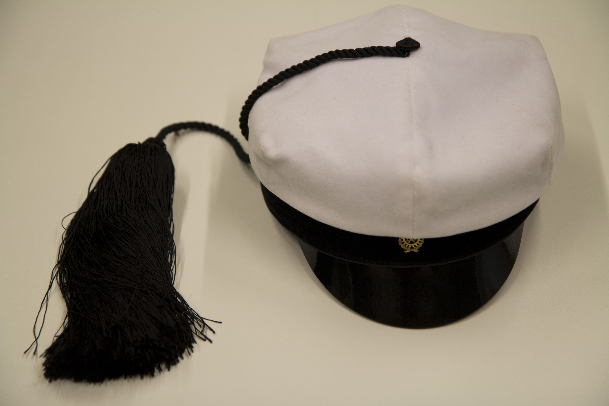

Title: Waarin viikkotiedote 9/2016 - kevättä rinnassa
Date: 2016-02-29 12:00
Category: Fuksit
Meta: Viikkotiedote
Tags: fuksit, viikkotiedote, vappupokemon
Status: published

Moikka,

ja wau, miten makee sää alkaa olla! Alkaa jo vähän wapututtamaan... :P Itsellä on kiire monien projektien kanssa, mutta silti menee erittäin hyvin! Mites teillä?

Tällä viikolla ei ole paljoa erikoista. Huomenna on leffailta kiltiksellä sekä Talviaalto Alvarin aukiolla. Loppuviikosta kannattaa erityisesti mennä torstain Jäynäsaunaan, siellä opittuja asioita tulette ehkä tarvitsemaan kevään aikana... Who knows! 

Ilmoittautumisia on myös paljon excujen ja sitsien muodossa, kannattaa tsekata läpi pääseekö tapahtumiin! Tärkeimpänä mainitsen ensi viikon Otaniemipäivän, joka on juuri teille fukseille tehty tapahtuma! Iltapäivällä pääsee kiertämään Teekkarikylää oppien sen saloista ja illalla pääsee halvoille sitseille, joissa keskitytään teekkarilaulukulttuurin historiasta. Kannattaa ehdottomasti tulla paikalle!  

Nähdään!  
<em>&lt;3 ultsi</em>

<h2>
&nbsp;
Sisällysluettelo</h2>

1. <a href="#tarkeaa">Tärkeää</a>
    1. Teekkarilakkitilaus!
    2. Otaniemipäivä - to 10.3.
    3. Waarin päivystysaika
2. <a href="#fktapahtumat">Fuksi- ja kilta-asiat</a>
    1. Ilmoittaudu ISOhenkilöksi!
    2. Ghibli&Disney-leffailta - ti 1.3.
    3. Jäynäsauna - to 3.3.
    4. Leadin excu - ti 8.3.
    5. Otaniemipäivä - to 10.3.
    6. Basketball - Lenskin Dynamo vs. NDU - pe 11.3. klo 22:10
    7. Futurice Space Tyckiting Hackathon - ma 14.3. klo 15:00
    8. SIIRRETTY: TiK-jäynä - ti 15.3. klo 17:30
    9. Profit Software excu - to 17.3. klo 17:00
    10. Ilmoittaudu mukaan taistelemaan Titeeneille - Titeenien taistot 2016 pe - 18.-20.3.
    11. Terry Pratchett's GUARDS! GUARDS! - to 24.3.
3. <a href="#ayylmao">AYY & Muut</a>
    1. Talviaalto - Ti 1.3.
    2. Apply for the Humans vs. Zombies committee 2016!
    3. Hae KV-tutoriksi!
    4. Kertun Kepittäjäiset - to 3.3.
    5. KY Economics & Aaltoes: Start Up Your Career - to 3.3.
    6. TeamUp Bootcamp 3.-6.3.2016
    7. Opintotuesta leikataan! Opintotukimielenosoitus Helsingissä - ke 9.3.
    8. SELL-kisat Tampereella 13.-15.5.2016, ilmoittautuminen käynnissä
    9. YTHS:n kevään ryhmät ovat käynnissä!
4. <a href="#ending">Vappupokemon!</a>

<h2>
&nbsp;
Tärkeää</h2>

<h4>
&nbsp;
1. Teekkarilakkitilaus!</h4>

<b>Fuksimajurin tervehdys</b>

Arwon fuksit.

Olen saanut ilolla seurata edesottamuksianne läpi syksyn. Tähänastisessa toiminnassanne olette osoittaneet erinomaista teekkarihenkisyyttä ja reipasta tekemisen meininkiä. Puhun koko fuksitoimikunnan puolesta, kun sanon, että olemme teistä kaikista erittäin ylpeitä. En ole kuitenkaan vielä täysin vakuuttunut siitä, kannattaako teille Wappua järjestää. Tulevat tekonne sen ratkaiskoot.

Mikäli tulen myöhemmin päätöksen Wapun järjestämisestä tekemään, on kuitenkin täysin selvää, että tulevat teekkarit tarvitsevat puhtaanvalkoiset tupsulakit juhlapäivää ja sen jälkeistä teekkarielämää varten. Tästä syystä olen päättänyt antaa teille jo nyt mahdollisuuden tilata teekkarilakin. Lakin tilataksenne suorittakaa seuraavat toimenpiteet:

<em>
1)   Suuntaa AYY:n Otaniemen palvelupisteelle lakkia sovittamaan. Älä tilaa teekkarilakkia ylioppilaslakin koon perusteella. Vaikka tupsu veikeä onkin, saattaa se lakkia kummasti kallistaa, siksi onkin tärkeää, että löydät juuri sinulle sopivan lakin.

2)   Päätä, kumman valmistajan lakin haluat: Velmard vai Wahlman? Älä tee päätöstä kokeilematta ensin!

3)   Suuntaa osoitteeseen <https://lakkitilaus.ayy.fi> ja tilaa lakki. **Lomake aukeaa tiistaina 23.2. klo 12:00**. Tilaaminen vaatii sisäänkirjautumisen Aalto-tunnuksilla. **HUOM!** Tilaus on sitova, joten ole huolellinen sitä tehdessäsi!

4)   Huomioi lakkien saatavuus! Velmardin lakkeja on tilattavissa yhteensä 350 kappaletta, Wahlmanin lakkeja riittää kaikille sen halajaville. Jos Velmardin lakit loppuvat, lomake ohjeistaa sinua tilaamaan Wahlmanin lakin.

5)   Huomioi tilausajat! Mitä aikaisemmin Wahlmanin lakin tilaat, sitä halvempi lakki on. Velmardin lakki on samanhintainen koko tilausjakson ajan.

6)   Lakkien tilausajat ja hinnat ovat seuraavat:  
a.   **Wahlman:** Tilausjakso 1: 23.2.-11.3. Hinta: 103,00€ / TF-malli: 116,00€  
b.   **Wahlman:** Tilausjakso 2: 12.3.-31.3. Hinta: 118,00€ / TF-malli: 135,00€  
c.   **Velmard:** Tilausjakso: 23.2.-31.3. Hinta: 50,00€  

7)   Tilaamisen jälkeen saat sähköpostitse vahvistuksen tilauksestasi. Lakin maksuohjeet lähetetään myöhemmin Oodissa ilmoittamaasi kotiosoitteeseen.

</em>

---

Tekniikan kehdossa,  
<em>Tuomas Ranta-aho  
Fuksimajuri</em>

"Suomessa kaikki hullut saavat valkolakin. Häiriintyneimmät heistä merkitään tupsulla."
 
<b>Teekkarilakista:</b>  
Teekkarilakki eli teekkarien tupsulakki on tekniikan opiskelijoiden ylin ja arvokkain tunnus. Lakilla on pitkä historia, ja nykymuotoinen teekkarilakki juontaa juurensa vuoteen 1893. Lakin ulkomuoto on mallisuojattu ja sen valmistusta valvotaan lisensseillä.
 
Teekkarilakki on kesälakki ja sen käyttöaika on 1.5.-30.9. Talvisaikaan teekkarilakin käyttöoikeutta voi anoa Teekkarijaostolta lakin arvolle sopiviin tilaisuuksiin kuten yritysexcursioille tai teekkarihäihin. Sitsit tai illanistujaiset eivät ole tälläisiä tapahtumia.
 
Kanna teekkarilakkia aina ylpeydellä ja muista käyttäytyä lakki päässä teekkarilakin arvolle kuuluvalla tavalla. Muuten paha sinut periköön ja fuksimajuri tupsulakkisi vieköön!

Teekkarilakin hankkimisesta luvassa teekkarilakki.

 

<h4>
&nbsp;
2. Otaniemipäivä - to 10.3.</h4>

Päivän aikana päästään kiertelemään Teekkarikylää ja oppimaan kylän sekä teekkareiden historiasta paljon. Lukitut ovet aukeavat ja salaisuudet paljastuvat. Mukana menossa on Otaniemessä vaikuttavia yhdistyksiä ja killan toimihenkilöitä.

Illalla klo 19:30 eteenpäin pääsemme sitsaamaan OK20 isolla puolella ja oppimaan samalla teekkarilaulujen historiasta ja niiden taustoista hyvin johdetuilla sitseillä. Samalla voi suorittaa laulupisteen, jos sitä ei vielä ole suoritettu!

Tapahtuman alkupamaus lähtee Amfilta klo 16:30! Älä myöhästy!

Jos haluat osallistua sitseille, ilmoittaudu alla olevalla linkillä. Sitsit kustantavat 5 euroa. Tule sellaisena kuin olet opettelamaan teekkarilauluja! Laulupiste luvassa fukseille.

<https://tietokilta.fi/tapahtumat/ilmot/telakusi>

Luvassa pisteet/kilta - Muu tapahtuma!

Luvassa pisteet/master - Laulukoe! 

 

<h4>
&nbsp;
3. Waarin päivystysaika</h4>

Minut löytää tästä lähtien vakioaikaan maanantaina klo 10:00-14:00 Tietokillan kiltahuoneelta päivystämästä. Tule rohkeasti vain juttelemaan, hakemaan fuksipisteitä, tai suoraan Waarin warttiin! Tai vaikka vaikuttamaan viikkomailiin. ;)

 

<h2>
&nbsp;
Fuksi- ja kilta-asiat</h2>

<h4>
&nbsp;
1. Ilmoittaudu ISOhenkilöksi!</h4>

Pohditko mitä tekisit ensi vuonna? Haluatko seurata uusien fuksien temmellystä aitiopaikalta? Vai olisiko kansainvälinen toiminta sittenkin juttusi? ISOilu voi hyvinkin olla vastauksesi!

On tullut taas aika valita uudet ISOhenkilöt seuraaville fukseille ja kansainvälisille opiskelijoille, ja juuri sinä voit olla yksi heistä! Kaikki voivat ilmoittautua ISOiksi alla olevalla ilmolla 23.2. lähtien. Jos haluat ansaita ISOnopan (1op), täytyy ISOhenkilöksi ilmoittautua 4.3. mennessä. Sen jälkeen voi ja kannattaa myös lähteä ISOilemaan, jos mieli vaihtuu. :)

<http://tietokilta.fi/tapahtumat/ilmot/isoilmo16>

Luvassa leima pisteet/teekkarikulttuuri - ISOhenkilö!

 

<h4>
&nbsp;
2. Ghibli&Disney-leffailta - ti 1.3.</h4>

Killan Ghibli&Disney-leffaillat jatkuvat! Seuraavaksi leffoja katsellaan ensi tiistaina 1.3. klo 18 alkaen kiltahuoneella. Saattaapa paikalta jotain pientä leffaevästäkin löytyä. Illan Ghibliksi on jo toivottu Laputa - linna taivaalla, illan Disney-leffaksi voi heitellä toiveita minulle vaikkapa Telegramin kautta. Nähdään siellä! 

Terveisin Laura Sirola, laura.sirola@aalto.fi

Luvassa leima pisteet/kilta - Kulttuuri

 

<h4>
&nbsp;
3. Jäynäsauna - to 3.3.</h4>

Saunassa se Kekkonenkin jäyniä suunnitteli. Vai miten se jäynän lyhyt oppimäärä menikään?

Ota selvää ja saavu Rantsulle torstaina 3.3. klo 18:00 kuulemaan kevään kuumimmat päivitykset jäynäkilpailuun osallistumisesta ja nautiskelemaan ilmaisesta ruoasta. Suosittelemme tulemaan ajoissa paikalle, sillä tarjolla olevaa pizzaa ei välttämättä riitä myöhemmin paikalle saapuville. Mutustelun ohessa kerrataan jäynäyksen lyhyt oppimäärä sekä esitellään tämän vuoden jäynäkilpailun kuviot ja palkintoja.

Paikalla esiintymässä myös viime vuoden voittajajoukkue BANG!, joka voitti myös TEK:n viimeisimmän valtakunnallisen jäynäkilpailun.

MITÄ: Jäynäsauna  
MISSÄ: Rantsulla  
MILLOIN: 3.3.2016 klo 18:00  
MIKSI: Kuumimmat vinkit jäynäämiseen, parempia löylyjä ja ilmaista pizzaa!  
KUKA: SINÄ!  

Lisätietoja FB eventissä <https://facebook.com/events/1672201139727320/> tai sähköpostitse ylituomari@jayna.fi.

Osallistumisesta luvassa pisteet/vapaa - Muu tapahtuma

 

<h4>
&nbsp;
4. Leadin excu - ti 8.3.</h4>

Oletko miettinyt mitä käyttäjälähtöisen suunnittelun ammattilaiset tekee työkseen? Käyttöliittymäsuunnittelua, koodausta tai palvelumuotoilua. Kyllä, mutta mitä se tarkoittaa käytännössä?

Meillä Leadinilla on yli 45 palvelumuotoilun, käyttäjäkokemuksen ja ohjelmistotuotannon ammattilaista. Toimistomme sijaitsevat Helsingissä, Tampereella ja Walesissa. Olemme kasvaneet koko olemassaolomme ajan ja sama suunta jatkuu.

Tule exculle tsekkamaan, mitä Leadinilla tehdään ja miten. Saat fiilistä siitä, minkälaista on luoda uraa käyttäjälähtöisen ohjelmistotuotannon parissa. Paikalla on sekä raudanlujia koodareita että UX ammattilaisia (ja ruokaa ja juomaa). Tervetuloa!

Ilmoittautuminen on auki!

<http://tietokilta.fi/tapahtumat/ilmot/leadin-2016>

Luvassa leima pisteet/kilta - Yritysexcu!

 

<h4>
&nbsp;
5. Otaniemipäivä - to 10.3.</h4>

Päivän aikana päästään kiertelemään Teekkarikylää ja oppimaan kylän sekä teekkareiden historiasta paljon. Lukitut ovet aukeavat ja salaisuudet paljastuvat. Mukana menossa on Otaniemessä vaikuttavia yhdistyksiä ja killan toimihenkilöitä.

Illalla klo 19:30 eteenpäin pääsemme sitsaamaan OK20 isolla puolella ja oppimaan samalla teekkarilaulujen historiasta ja niiden taustoista hyvin johdetuilla sitseillä. Samalla voi suorittaa laulupisteen, jos sitä ei vielä ole suoritettu!

Tapahtuman alkupamaus lähtee Amfilta klo 16:30! Älä myöhästy!

Jos haluat osallistua sitseille, ilmoittaudu alla olevalla linkillä. Sitsit kustantavat 5 euroa. Tule sellaisena kuin olet opettelamaan teekkarilauluja! Laulupiste luvassa fukseille.

<https://tietokilta.fi/tapahtumat/ilmot/telakusi>

Luvassa pisteet/kilta - Muu tapahtuma!

Luvassa pisteet/master - Laulukoe! 

 

<h4>
&nbsp;
6. Basketball - Lenskin Dynamo vs. NDU - pe 11.3. klo 22:10</h4>

Tietokillan oman urheiluseuran Lenskin Dynamon koripallomatsi NDU:ta vastaan. Kaikki ovat tervetulleita pelaamaan! Matsi pelataan Otahallilla.

Ilmoittautuminen: <http://lenskindynamo.nimenhuuto.com/events/7589925>

Luvassa leima kohtaan pisteet/kilta - Liikunta

 

<h4>
&nbsp;
7. Futurice Space Tyckiting Hackathon - ma 14.3. klo 15:00</h4>

More information:

<http://futurice.com/events/space-tykiting-helsinki>

Registeration:

<http://spacetyckiting.futurice.com/>

Futurice calls for 40 eager programmers to battle for the mastery of Space Tyckiting!

This year, regional hackathon winners from Tampere, Helsinki, Turku, Berlin and London will meet each other in the final event in Berlin organised and sponsored by us. Be ready to travel!

Space Tyckiting is a hexagonal grid based 2D shooter game in which teams battle against each other by developing artificial intelligence bots. Each team has multiple ships. The ships can either move, shoot or scan the battlefield to reveal enemy ships.

Choose your tactics! You can do more in advance and focus on testing and optimization in the battle. There may also be some surprises at the event...

The main focus of the competition is to test your problem solving and logical reasoning skills, not in-depth technology proficiency. You don’t need to be a coder level wizard, but a little more than “Hello world!” skills are required. The participants form teams which will fight against each other.

The game supports clients programmed in JavaScript, Clojure, F#, Haskell, Python, Ruby, Rust, Scala and Swift.

<http://tietokilta.fi/tapahtumat/928>

Luvassa leima kohtaan pisteet/kilta - Lanit/hackathon!

 

<h4>
&nbsp;
8. SIIRRETTY: TiK-jäynä - ti 15.3. klo 17:30</h4>

Fuksi! Merkitse päivä jo kalenteriisi. Jäynätään yhdessä. Yhteislähtö kiltahuoneelta klo 18:00, ota matkakortti mukaan!

Osallistumisesta luvassa pisteet/teekkarikulttuuri - Jäynä.

 

<h4>
&nbsp;
9. Profit Software excu - to 17.3. klo 17:00</h4>

Prodekon ja Tietokillan yhteinen excursio Profit Softwarelle. Paikkoja on vähän, joten ilmoittaudu nopeasti!

Ilmoittautuminen aukeaa keskiviikkona 2.3. klo 12:00.

<http://tietokilta.fi/tapahtumat/ilmot/profit2016>

Luvassa leima pisteet/kilta - Yritysexcu!

 

<h4>
&nbsp;
10. Ilmoittaudu mukaan taistelemaan Titeeneille - Titeenien taistot 2016 pe - 18.-20.3.</h4>

On taas vuoden hurjimman taistelun aika, kun Tietokilta lähtee Turkuun puolustamaan viime vuoden voittoaan Titeenien Taistoista. Taistot tapahtuvat tänä vuonna 18.-20.3. Lähde mukaan tutustumaan Suomen muihin tietoteekkareihin ja pitämään hauskaa hyvässä seurassa leikkimielisissä lajeissa kisaillen!

Perjantain ohjelma alkaa klo 18 majoituksen ovien juhlallisella aukeamisella, jonka jälkeen suunnataan keskustaan TiTeeniGaalaan. Gaalassa julistetaan rauhan kohtalo ja hupsutellaan poikain kanssa kunnes seuraavana päivänä pistetään sotakirveet töihin.

Tietokillan bussi lähtee Otaniemestä perjantaina 18.3. iltapäivällä ja paluu tapahtuu sunnuntaina 20.3. keskipäivän aikoihin (kellonajat tarkentuvat myöhemmin). Kuljetuksille tulee hintaa yhteensä noin 20e mikäli bussi saadaan täyteen.

Ilmoittautuminen on sitova.

<http://tietokilta.fi/tapahtumat/ilmot/titeenit16>

Luvassa leima pisteet/kilta - Titeenit!

luvassa leima pisteet/kilta - Ulkoexcu!

 

<h4>
&nbsp;
11. Terry Pratchett's GUARDS! GUARDS! - to 24.3.</h4>

Stevari mestoille!

Englanninkielinen amatööriteatteri Thespians Anonymous on adaptoinut Terry Pratchettin fantasiaa ja komediaa sekoittavan teoksen GUARDS! GUARDS! teatterinäytelmäksi ja kiltahan sitä silloin menee myös katsomaan. Tilaus järjestetään 24.03. järjestettävään näytökseen ja näyttämönä toimii kulttuuriareena Gloria, Pieni Roobertinkatu 12. Lipun hinta opiskelijalle on 11€ ja normaali lippu kustantaa 13€.

MITÄ: Terry Pratchett's® GUARDS! GUARDS! by Thespians Anonymous  
MISSÄ: Kulttuuriareena Gloria, Pieni Roobertinkatu 12  
MILLOIN: 24.03.2016  
PALJONKO: 11€ opiskelijalle / 13€ ihmiselle  

Ilmoittautuminen aukeaa keskiviikkona 24.2. klo 12:00.

<http://tietokilta.fi/tapahtumat/ilmot/guardsguards>

Luvassa leima kohtaan pisteet/kilta - Kulttuuri!

 

<h2>
&nbsp;
AYY & Muu</h2>

<h4>
&nbsp;
1. Talviaalto - ti 1.3.</h4>

TALVIAALTO TULEE 1.3.!

Loskaa, arktista pakkasta ja harmaata kaikissa sävyissään - onko sinunkin talvesi ollut tätä? Nyt on aika nostaa Suomen kansallisvuodenaika uuteen kukoistukseen, sillä Talviaalto on täällä!

Talviaalto on yhteisöjaosto Aavan ensimmäistä kertaa järjestämä kaikille Aallon opiskelijoille tarkoitettu energiapiikki, johon osallistuaksesi tarvitset vain avoimen mielen. Tiistaina 1.3. tiedossa on arvaamattoman sään mukaisesti enemmän tai vähemmän talvista liikuntaa, joka sopii kaikille sohvaperunoista olympiatason urheilijoihin. Lisäksi luvassa on jälkilöylyt, lajiesittelyjä ja yllätysohjelmaa, joista tarkempaa tietoa on luvassa myöhemmin. Varaa päivä kuitenkin jo nyt kalenteristasi.

MITÄ: Talviaalto!  
MILLOIN: Tiistaina 1.3.2016 klo 16 alkaen  
MISSÄ: Otaniemen Otarannan urheilukentän lähistössä, tarkentuu myöhemmin  
MIKSI: Wappukeho kuntoon 2016  
KENELLE: Juuri sinulle!  
MITÄ MAKSAA: Ei mitään  

Luvassa leima pisteet/kilta - Liikunta!

 

<h4>
&nbsp;
2. Apply for the Humans vs. Zombies committee 2016!</h4>

Ever felt the need to feel the real thrill of survival? Or better yet, felt like it would be cool to have other people run for their lives as the zombie apocalypse endangers the future of humankind? Just say yes, and join the gamemaster force of the Humans vs. Zombies committee!

Humans vs. Zombies is an extremely intensive role-playing experience organized twice a year, which calls for hundreds of Otaniemi students to join forces fighting the brain-hungry parasite-ridden zombies in the brink of the apocalypse! We are now looking for recruits to be the game masters of this year's games. The committee plans the course of the gameplay and organizes the game during the playdays in this April and autumn. More importantly, the committee will have a great time planning events and get-togethers, which will improve your game-organizing skills and lets you do stuff with other fun-and-action-loving people! Please join now, and tell all the important facts about yourself right here: <http://ayy.fi/stop/en/culture-events/humans-vs-zombies/>

If you ever felt like playing the puppet master, now is your chance! Sign up closes on 6.3..

If you missed it, here's the link: <http://ayy.fi/stop/en/culture-events/humans-vs-zombies/>

 

<h4>
&nbsp;
3. Hae KV-tutoriksi!</h4>

Haluatko auttaa Aallon uusia kansainvälisiä opiskelijoita saamaan hyvän startin uudessa kulttuurissa ja treenata samalla kulttuurienvälistä kommunikaatiota? Hae kv-tutoriksi!

Kansainvälisten opiskelijoiden tutoreilla on erinomaisen tärkeä tehtävä toimia uusien kansainvälisten opiskelijoiden (sekä vaihto-opiskelijoita että tutkinto-opiskelijoita) ryhmän johtajana, tutustuttaa heidät kampuksen ja suomalaisen opiskelijakulttuurin saloihin. Kv-tutorit pääsevät tutustumaan uusiin kulttuureihin, tutustuvat opiskelijoihin ympäri maailmaa ja oppivat työelämässäkin tärkeinä pidettyjä kv-taitoja. Kv-tutorit voivat saada opintopisteen, todistuksen tutoroinnista ja kulukorvauksen.

Uusia kv-tutoreita rekrytoidaan alkukeväisin. Opiskelijayhdistykset koordinoivat hakuja ja Aallon korkeakoulujen (CHEM, ELEC, ENG ja SCI, BIZ ja ARTS) kanssa yhteistyössä. Lisää tietoa kv-tutoroinnista ja linkit hakulomakkeeseen <http://ayy.fi/jasenille/uudet-opiskelijat/tutorointi/kv-tuutorointi/>. Lomake aukeaa huomenna 24.2.!

Luvassa leima pisteet/vapaa - KV-piste!

 

<h4>
&nbsp;
4. Kertun Kepittäjäiset - To 3.3.</h4>

KERTTU ON SAAPUNUT JÄÄDÄKSEEN!

Värikkääseen Kallion maailmaan sijoittuva Pykälä ry:n oma perinteinen appro koittaa suurempana, monipuolisempana ja poikkitieteellisempänä kuin ikinä aikaisemmin. Himoitut tittelit ovat jaossa. Kallio odottaa villinä. Koe vuoden yllättävin appro!

Lähtö tapahtuu torstaina 3.3. klo 16 alkaen klo 20 asti Pykälän kerhotiloista (Suvilahdenkatu 10B 5krs.), josta siirrytään Kallion ravitsemusliikkeisiin. Viralliset jatkot Apollossa klo 22 alkaen.

Approilu tapahtuu 3-6 hengen joukkueissa. Lippuja ostaessa tulee ilmoittaa joukkueen nimi, koko ja kapteeni ja tämän yhteystiedot (nimi & puhelinnumero). Ilmoittautuessa suoritetaan kaikkien joukkueen jäsenten osallistumismaksu. Seikkailun hinta on 5 euroa / osallistuja! Netissä 6€.

Lippuja myydän Otaniemen päälafkalla Ma 22.2. klo 11.30-12.30, jonka lisäksi lippuja saa myös bailataan.fi-palvelusta. Muut lipunmyyntiajat ja tarkemmat tiedot: <http://www.facebook.com/events/586473928172788/>

MITÄ: Kertun Kepittäjäiset - appro  
MISSÄ: Kalliossa, jatkot Apollossa  
MILLOIN: To 3.3. klo 16   
MIKSI? Turha kysymys.

- Luvassa leima kohtaan pisteet/teekkarikulttuuri - Appro!

 

<h4>
&nbsp;
5. KY Economics & Aaltoes: Start Up Your Career - to 3.3.</h4>

Start Up Your Career -tapahtuma järjestetään 3.3. klo 19.00-21.00 KY-talon 3. kerroksessa Yläkertsillä, osoitteessa Pohjoinen Rautatienkatu 21b. Luvassa on kattava kokonaisuus työnhausta, uramahdollisuuksista, yrittäjyydestä sekä opintojen suunnittelusta. KY Economics järjestää tapahtuman yhteistyössä Aaltoesin, Euroopan suurimman opiskelijavetoisen yrittäjyysjärjestön kanssa. Mukana myös Ulkoministeriö sekä aTalent. 

Ohjelma KY-talon Yläkertsillä alkaa ruoka- ja juomatarjoilulla. Lavaohjelma alkaa Aaltoesin sekä Smartly.io:n perustaja Kristo Ovaskan puheenvuorolla urapolustaan ja jatkuu värikkäällä paneelikeskustelulla persoonallisuuden merkityksestä työnhaussa. Lavaohjelman jälkeen vuorossa on vielä kiertelyä yhteistyökumppaneidemme ständeillä, jossa mahdollisuus muun muassa osallistua aTalentin CV/Linkedin-klinikkaan. Tapahtuma on suunnattu taloustieteen opiskelijoille, mutta on avoin kaikille kiinnostuneille!

MITÄ: Start Up Your Career -ura- ja opintotapahtuma  
MISSÄ: KY-talon Yläkertsi, Pohjoinen Rautatienkatu 21b, 3. krs  
HINTA: Ilmainen  
MILLOIN: 3.3. klo 19.00-21.00  
KENELLE: Tapahtuma on kaikille avoin  

FB-event: <https://www.facebook.com/events/1066682613399185/>

 

<h4>
&nbsp;
6. TeamUp Bootcamp 3.-6.3.2016</h4>

Oletko miettinyt oman yrityksen perustamista? 

Tule mukaan TeamUp:iin, jossa eritaustaiset opiskelijat pystyvät löytämään tiimin, jonka kanssa lähteä suunnittelemaan aloittavaa yritystä. Aaltoes tarjoaa ohjelman ajan tilat, työkalut ja maailmanluokan coachauksen. 

Jos kiinnostuit, käy nettisivuillamme <http://teamup.aaltoes.com> ja hae mukaan ohjelman aloittavaan Bootcamp-viikonloppuun!

 

<h4>
&nbsp;
7. Opintotuesta leikataan! Opintotukimielenosoitus Helsingissä 9.3.</h4>

Hallitus kaavailee merkittäviä leikkauksia opintotukeen. Tuesta halutaan vähentää 70 miljoonaa kolmen vuoden sisällä ja 150 miljoonaa pitkällä aikavälillä. Tämä tarkoittaa noin neljänneksen siivua nykytasosta.

Ennen vaaleja luvattiin, että koulutuksesta ei leikata. Niin vaan leikattiin, ja tuloksena syntynyt kiristystarve yliopistoissa näkyy myös Aallossa. Erikseen luvattiin, että opintotukea ei heikennetä, mutta nyt on luvassa merkittäviä muutoksia. 

Tämä on saatava loppumaan. Opintotuki on opiskelijan perusturva, ei koulutuspoliittisen ohjaamisen väline.

Mitä siis tehdä? Näytä, että opiskelijat eivät tätä purematta niele. Suomen ylioppilaskuntien liitto SYL järjestää opintotukimielenosoituksen koulutusleikkauksia vastaan Helsingissä keskiviikkona 9.3. ja AYY on menossa mukana. Mukaan kaivataan yhdistyksiä, lippuja, banderolleja, härpäkkeitä, menoa ja meininkiä! 

Facebook-event löytyy täältä: https://www.facebook.com/events/983431838405738/. Tietoja päivitetään sitä mukaan kuin niitä saadaan. Tule näyttämään päättäjille, että näin ei voi jatkua!

PS: Hämmentääkö, mistä oikein on kyse? Edunvalvonta-asiantuntijamme Elli valottaa taustoja blogissa: <http://ayy.fi/blogi/2016/02/25/opintotukileikkaukset-uhkaavat/>

 

<h4>
&nbsp;
8. SELL-kisat Tampereella 13.-15.5.2016, ilmoittautuminen käynnissä</h4>

SELL Student Games -tapahtuma on yksi suurimmista ja kansainvälisimmistä opiskelijaliikuntatapahtumista Baltian maissa ja Suomessa. Lajit: Frisbeegolf, Futsal, Jalkapallo 7vs7, Judo, Lentopallo, Koripallo, Paini (kreikkalais-roomalainen), Painonnosto, Pöytätennis, Rugby 7vs7, Salibandy, Shakki, Sulkapallo, Suunnistus, Ultimate (frisbee), Voimanosto, Yleisurheilu.
Aallon opiskelijoiden ilmoittautumisia tapahtumaan hoitaa Unisport, lisätietoa ja ilmoittautuminen: <https://unisport.fi/news/fi/3979734/sell-kisat-13-15-5-2016-tampereella-ilmoittautuminen-on>

 

<h4>
&nbsp;
9. YTHS:n kevään ryhmät ovat käynnissä!</h4>

YTHS:n kevään ryhmät ovat käynnissä. Ryhmät järjestetään Töölön YTHS:llä. Vielä mahtuu mukaan!

Elämäntaitokurssi  
Haluatko oppia jokaiselle hyödyllisiä elämäntaitoja sekä hyvän mielen ja arjen ylläpitämistä? Haluatko oppia hallitsemaan arkeasi ja ajankäyttöäsi paremmin? Kurssilla käsittelet omaan elämääsi liittyviä asioita ja harjoittelet ongelmien ratkaisemista. Opit tunnistamaan tunteita ja ajatuksia sekä työskentelemään ajatusten kanssa. Saat itsellesi työkalupakin, jonka avulla voit vaalia hyvinvointiasi, mielialaasi ja elämänhallintaasi.
Lääkäri tai terveydenhoitaja voi laittaa sinut ehdolle ryhmään ja Paula Aarnio-Tervo tai Minna Pohjolainen on yhteydessä sinuun vielä ennen ryhmän alkua. Voit myös itse olla yhteydessä, jos haluat lisätietoja kurssista. (Puhelinaika tai soittopyyntö numerosta 046 710 1027)

Fysioterapiaryhmät:  
Sitovat ilmoittautumiset 1.12.2015 alkaen fysioterapeutin puhelinajalle, jonka voi varata ajanvarauspuhelimesta 046 710 1027. Ilmoittautuminen lukukaudessa vain yhteen ryhmään kerrallaan. Peruutukset puhelinautomaattiin 046 7101028 tai sähköisesti <www.yths.fi>

NISKA-SELKÄKUNTOSALIRYHMÄ  
Ryhtiä tukevien lihasten vahvistamista, liikkuvuusharjoittelua sekä venyttelyä. Vinkkejä, miten käyttää kuntosalilaitteita niska- ja selkävaivojen ennaltaehkäisemiseksi sekä avuksi lieviin oireisiin. Huom! Ryhmä toteutuu pääosin 6. kerroksen kuntosalilla.

 Vkot 9-11 (4.3. – 18.3.) + vko 16 (22.4.)  Pe 13.30 4x60min
 
RYHTIRYHMÄ  
Harjoitteita hyvän ryhdin saavuttamiseksi ja niska-selkävaivojen ennaltaehkäisemiseksi.
 
Vkot 7-11 (17.2. - 16.3.) Ke   9.30 5x60min  
Vkot 10-14 (8.3. - 5.4.) Ti   8.30 5x60min  
 
ALASELKÄRYHMÄ  -> HUOM! Ajankohta siirretty alkamaan 2.5.!  
Keskivartalon lihaksia vahvistavia ja alaselän hallintaa tukevia harjoitteita. Alaselkäryhmä sopii ennaltaehkäisevänä tai lievästi oireileville. Ei akuuteille selkäkipuisille!
 
Vkot 18 -21 (2.5 - 23.5.)  Ma 14.45 4x45min

POLVIRYHMÄ  
Linjauksen, askelluksen, vahvistavien harjoitteiden ja venyttelyjen läpikäyntiä. Sopii lievästi polvioireiselle, jolla polvi oireilee rasituksessa tai sen jälkeen. 

Vko 13+ vko 15 (sisältää kaksi ryhmäkertaa 1.4. ja 15.4.)     Pe 13.30   2x60min
 
RENTOUSRYHMÄ  
Eri rentousmenetelmiin tutustumista.

Vkot  13-17 (30.3. - 27.4.) Ke  14.30 5x60min

HENGITELLEN RENNOKSI -RYHMÄ  
Venyttäviä ja rentouttavia hengitys- ja liikeharjoituksia rentouttamaan jännittynyttä kehoa ja mieltä.

Vkot 8-11 (24.2. - 16.3.)  Ke   14.30 4x60min

 

<h2>
&nbsp;
Vappupokemon!</h2>

Ja... päivän vappupokemon on numero 61, Poliwhirl! Tarkoittaako tämä...? Kyllä, kaksi kuukautta enää! :))

Alle kolme kuukautta! 8)

<em>&lt;3 ultsi</em>
