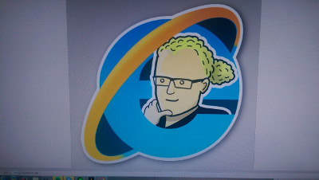

Title: Waarin viikkotiedote 3 - Asettumista
Date: 2015-09-14 12:00
Category: Fuksit
Meta: Viikkotiedote,
Tags: fuksit, viikkotiedote
Status: published

Tänään sitsataan! Jea!

Toivon että koulu on alkanut hyvin ja että opinnot sujuvat kaikilla. Siltä ainakin näyttää TG-ryhmän perusteella, on ollut kivaa nähdä hyvää tsemppausta toisiltanne. :) Muistakaa, että aina voi kysyä, jos jokin mietityttää tai on vaikkapa vaikea laskuharjoitus.

Tässä viikkotiedotteessa on koottuna viime viikon asioita ja tulevia tapahtumia. Ei mitään sen kummoisempaa. 

Opiskeluintoa kaikille! :)

_<3 ultsi_

<h2>
&nbsp;
Sisällysluettelo</h2>

1. <a href="#tarkeaa">Tärkeää</a>
    1. Fuksipistekortti
    2. Haalaritilanne
    3. Otatarhan ajot
2. <a href="#fktapahtumat">Fuksi- ja kiltatapahtumat</a>
    1. Fuksisitsit ma 14.9. klo 18:15
    2. Fuksiexcu to 17.9. klo 15:00
    3. IE:n terveiset: sisätoimikunnan virkistys- ja rekrysauna 22.9.
3. <a href="#ayylmao">AYY</a>
    1. Lähde juoksemaan Akateeminen Wartti 16.9.
    2. Tule mukaan ParaUniSportDay:hin 24.9.!
    3. Edustajistovaalit tulevat!
  
<h2>
&nbsp;
TÄRKEÄÄ</h2>
####Fuksipistekortti
Fuksipistekortti on avaimesi teekkarilakin saamiseksi. Jos et vielä omista Tietokillan fuksipistekorttia, ota välittömästi yhteys minuun, niin saat pistekorttisi leimaamista varten. Fuksipistekortin tarkoituksena on tutustuttaa teekkarikulttuuriin laaja-alaisesti sekä opettaa teekkarikulttuurin historiaa niin, että mahdollisesti järjestettävänä Wappuna 2016 ansaitsee laittaa keskiyöllä upouuden valkoisen teekkarilakin päähänsä. Tulen tiedottamaan jokaisen tapahtuman yhteydessä ansaittavista fuksipisteistä erikseen. Muista, että pistekortti on hauskanpitoa varten ja tapahtumissa kannattaa käydä, vaikka leimaa ei sieltä tulisikaan! :)

####Haalaritilanne

Keissi haalareiden kanssa on vihdoin lutviutunut paikoilleen. Saatte haalarit myöhemmin järjestettävässä tapahtumassa. Tiedotusta tapahtumasta tulee myöhemmin. Mutta lainatakseni kuuluisaa TV-sarjaa: brace yourselves, overalls are coming.

Sitten heti kirjastojäbä kiinni haalareihin!

####Otatarhan ajot
Torstaina klo 16:15 oli Otatarhan ajoista kokoontuminen, jossa tiimi jaettiin suunnittelijoihin, rakentajiin sekä kisavoimaan eli ajajiin. Mahtava aloitus koko ajokin suunnittelulle! Otatarhan ajokille on oma Telegram-ryhmänsä, jonne pääsee tästä linkistä: <https://telegram.me/joinchat/05a2f7dd00e952b0806ba6abb52e4ea2>. Siellä on ollut jo hyvää keskustelua ajokin rakenteesta sekä ilmeestä. Liity mukaan tekemään!

Nyt tärkeintä on etsiä vanhoja pyöriä, renkaita ja oikeastaan mitä tahansa ajokissa käytettävää materiaalia. Otaniemen roskalavat ovat hyvä paikka etsiä matskua, mutta hyvää ajokkimateriaalia voi löytää yllättävistäkin paikoista. 

Ahkerimmille tyypeille luvassa leima kohtaan pisteet/kilta/työ - Muu työ. Ei vaadi paljoa!

<h2>
&nbsp;
Fuksi- ja kiltatapahtumat</h2>

<h4>
&nbsp;
Fuksisitsit ma 14.9. klo 18:15 @ T-talon aula / Jatkot Rantasaunalla (JMT5 takana)</h4>

/hype!

Maanantaina tapahtuu suuria! T-talo muuttuu juhlavaksi tilaksi, jonka täyttävät pöytäseurueiden iloinen pulina sekä lukkareiden vetämät sitsilaulut. Tapahtuma alkaa fuksien osalta klo 18:15, jolloin fuksit perehdytetään sitsikulttuuriin. Muille tapahtuma alkaa klo 18:30 Cocktail-tilaisuudella ja itse sitsit alkavat klo 19:00 gongin kumahduksesta. Illan dresscode on tumma puku. Pukeutumisesta ei kuitenkaan kannata ottaa paineita!

Sitsit ovat olennainen osa teekkarikulttuuria, ja sitseihin liittyy paljon erilaisia tapoja ja käytäntöjä. Opiskelijaelämästä jää kohtuuttoman suuri osa näkemättä, jollei yksillekään sitseille osallistu. Tule siis fuksisitseille kokemaan yksi opiskelijakulttuurin hienoimmista ilmiöistä sekä nauttimaan erinomaisista tarjoiluista.

Jos et jostain syystä ilmoittautunut sitseille, saa niitä toki tulla katsomaan sivusta ilmoittautumalla fuksisitsien työvoimaksi! Työnkuvaan kuuluu
tarjoilua sekä pöytien koristelua, eikä se ole suuri homma. Työvoimaksi voi ilmoittautua täällä: <http://tietokilta.fi/tapahtumat/ilmot/fuksisitsittyovoima2015>. Työvoima pukeutuu valkoiseen kauluspaitaan ja mustiin housuihin.

Muistakaa ottaa käteistä mukaan. Sitseille osallistuminen pitää maksaa käteisellä ja se maksaa fukseilta 10 euroa ja muilta 17 euroa. Sitseillä on myös myynnissä Teekkarien punaisia laulukirjoja hintaan 6.5 euroa/kpl. Laulukirja kannattaa ehdottomasti ostaa mikäli laulukulttuuri kiinnostaa. Myös käytäntönä on kerätä laulukirjaan jokaisilta sitseiltä pöytäseurueen kommentteja ja piirrustuksia.

Nähdään ja lauletaan maanantaina!

pisteet/kilta - Fuksisitsit(<strong>Vain tästä tapahtumasta!</strong>)

 

<h4>
&nbsp;
Fuksiexcu to 17.9., lähtö klo 15:00 @ T-talo</h4>

Torstaina T-talon edestä klo 15:00 lähtee bussi kohti Tampereen ihmeellistä maailmaa sekä siellä majailevaa yritystä, Futuricea! Siellä kuulemme noin kaksi tuntia yrityksen toiminnasta sekä pääsemme näkemään mitä oikeasti tietotyöläisen työ on (oma mielipide: aika mahtavaa :)). Yritysvierailun jälkeen menemme tapaamaan serkkuamme TiTeä, eli Tampereen TietoTeekkareita! He järjestävät meille vapaata iltaohjelmaa. Palaamme Otaniemeen noin kello kahden aikaan yöllä.

Kaikki ilmoittautuneet fuksit mahtuivat mukaan bussiin, mahtavaa! Muistakaa tulla ajoissa paikalle, bussi ei välttämättä odota!

pisteet/kilta - Yritysexcu

 

<h4>
&nbsp;
IE:n terveiset: sisätoimikunnan virkistys- ja rekrysauna 22.9.</h4>

Tervetuloa sisätoimikunnan virkistys- ja rekrysaunaan 22.09! Sisätoimikunta on yksi Tietokillan alaisista toimikunnista, joka järjestää killan tapahtumia Isännän ja Emännän (IE) rautaisen otteen alla. Saunalla kerromme lisää sisiksen toiminnasta sekä käymme lävitse syksyn tapahtumia. Paikalla myös nykyisiä sisiksen jäseniä kertomassa meiningistä tiskin takana. IE tarjoaa nykyisille ja toiminnasta kiinnostuneille ilmaista ruokaa sekä virvokkeita sopuhintaan.

<strong>Ilmoita itsesi </strong>tapahtumaan täällä niin <strong>ilmaista</strong> ruokaa riittää tarpeeksi: <http://tietokilta.fi/tapahtumat/ilmot/sisissauna2015s>

<em>Waarin kommentti: olin itse mukana fuksivuonna sisätoimikunnassa ja se on kyllä hauskaa hommaa! Tapahtumien järjestely on helppoa kivalla isolla porukalla ja keittiössä on aina parhaat bileet. Lisäksi yleensä saa ilmaista safkaa ja muita ylijäämiä tapahtumista mukaan, mikä on aina välillä opiskelijabudjetille iso plussa. Mukaan vaan ainakin tsekkaamaan meininki! :)</em>

Seuraavan vuoden sisätoimikuntaan mukaan lähteville jaossa leima kohtaan <strong>pisteet/kilta - Killan toimija!</strong>

 

<h2>
&nbsp;
AYY</h2>

<h4>
&nbsp;
Lähde juoksemaan Akateeminen Wartti 16.9.</h4>
Kaiva lenkkarisi esiin ja kerää joukkue kasaan! METKA sekä AYY järjestävät yhdessä 65. Akateemisen Wartin Helsingin Olympiastadionilla 16.9.2015 MetroSport-tapahtuman yhteydessä.
 
Akateeminen Wartti on korkeakouluopiskelijoiden rento ja vauhdikas viestijuoksu, jossa 15 minuutin aikana joukkueet pyrkivät etenemään mahdollisimman pitkälle. Pisimmälle pinkonut henkilö tai joukkue on voittaja. Kilpailu kuitenkin järjestetään tutulla Akateemisen Wartin hengellä, eli myös hyvästä joukkuehengestä ja -ilmeestä on luvassa palkintoja. Voit siis kerätä joukkueen esimerkiksi oman kiltasi, ainejärjestösi, ammattikorkeakoulusi tai yliopistosi kaveriporukasta. Viimevuotisista Warteista poiketen tänä vuonna ohjelmassa on myös yksilösarjat sekä miehille että naisille. Uutuudet eivät kuitenkaan lopu tähän, sillä tämän vuoden kisailut järjestetään Color Run -teeman mukaisesti!
 
Alkulämpät juoksijoille tarjoaa UniSport! UniSport lahjoittaa voittajille myös kuukauden ilmaiset treenit kaikilla UniSportin kuudella kampuksella! www.unisport.fi
 
Tsekkaa lisätietoja ja ilmoittaudu <https://www.facebook.com/events/958005717576600/>

pisteet/vapaa - Muu tapahtuma

 

<h4>
&nbsp;
Tule mukaan ParaUniSportDay:hin 24.9.!</h4>
Haluatko kokeilla, miltä tuntuu lentopallo pyörätuolissa? Entä miten sujuisi pallon koppaaminen silmät sidottuna?
 
Nyt sinulla on tähän loistava mahdollisuus korkeakouluopiskelijoille suunnatun paralajipäivän aikana. ParaUniSportDay järjestetään 24.9.2015 klo 9.00–16.00 UniSport Meilahden tiloissa, Meilahden liikuntakeskuksessa Helsingissä. Lajeina on muun muassa pyörätuolilentopallo, tarkkuuspeli boccia sekä maalipallo. Kokoa mukaasi oma järjestö, tutor- tai kaveriporukka. Tulkaa rohkeasti kokeilemaan!
Paralajien lisäksi päivän aikana on tiedossa mm. paneelikeskustelu aiheesta esteetön yliopisto. Paneelikeskusteluun osallistuu Aallon oma Esa-Pekka Mattila!
OLL ja UniSport järjestävät tapahtumapäivän yhteistyössä Paralympiakomitean kanssa.
 
Katso tapahtuma Facebookissa: <https://www.facebook.com/events/846731708767754/>
 

pisteet/vapaa - Muu tapahtuma

 

<h4>
&nbsp;
AYY:n edustajistovaalit tulevat – asetu ehdolle ke 30.9. mennessä</h4> 

AYY:n jäsenillä on tänä syksynä jälleen mahdollisuus asettua ehdolle ja äänestää edustajiston kokoonpanosta. Edustajistovaaleissa valitaan AYY:n 45-henkinen edustajisto seuraavalle kaksivuotiskaudelle. Edustajisto käyttää AYY:n ylintä päätösvaltaa ja päättää muun muassa sinun jäsenmaksustasi ja ylioppilaskunnan säännöistä. Edustajisto valitaan aina kahdeksi vuodeksi kerrallaan.

Vaalien ehdokasasettelu päättyy keskiviikkona 30.9. klo 12:00. Kerää listasi ja lähde mukaan! Lisätietoa ehdolle asettumisesta täältä: <http://ayy.fi/vaalit/ehdokkaalle/>

AYY:n edustajistovaalit järjestetään 3.-4.11.2015 ja ennakkoon voi äänestää ma 26.10 – ma 2.11. Lisätietoa vaaleista löytyy osoitteesta ayy.fi/vaalit ja edustajiston pöytäkirjoja ja esityslistoja voit lukea osoitteesta inside.ayy.fi.

Alla näkyvää edarivaalit-leimaa varten ei tarvitse asettua ehdolle, vaan sen saa äänestämällä edarivaaleissa! Muista siis äänestää lokakuussa! :)

pisteet/vapaa - Edarivaalit

 
