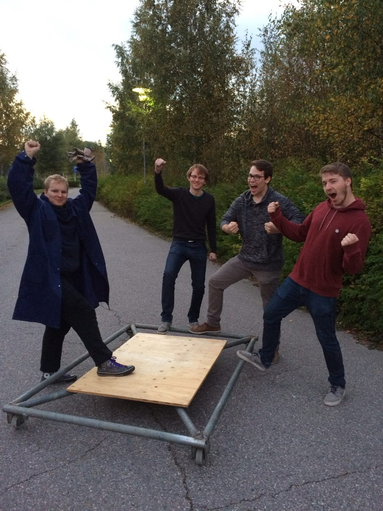

Title: Waarin viikkotiedote 5 - isoja asioita tapahtuu!
Date: 2015-09-27 19:00
Category: Fuksit
Meta: Viikkotiedote
Tags: fuksit, viikkotiedote, haalarit
Status: published

Morjes!

Uusi viikko alkaa taas. Itse hankin taas energiaa käymällä Jämeräntaival 6:sessa sijaitsevan soluyhteisö Bratislawa Youghurtin 35-vuotisjuhlissa! Oli hulppeat juhlat, nyt jaksaa opiskella ja duunailla seuraavan viikon.

Tässä postauksessa on kolme tärkeää asiaa:  
<strong>HAALARIT</strong>  
<strong>OTATARHAN AJOT</strong>  
ja  
<strong>CÄNNÄRIT!!</strong>

Nämä kolme asiaa tulee ensimmäisenä vastaan, sen jälkeen on myös normaali tapahtumajaottelu. Lukekaa huolella läpi!

Odotellen tiistaita! Ja Otatarhan ajokkia!

_<3 ultsi_

<h2>
&nbsp;
Sisällysluettelo</h2>

1. <a href="#tarkeaa">Tärkeää</a>
    1. Haalarit
    2. Otatarhan ajot
    3. Cännärit
2. <a href="#fktapahtumat">Fuksi- ja kiltatapahtumat</a>
    1. Fuksien haalariompeluilta ti 29.9.
    2. VIELÄ MAHTUU: SCI-FI Sitsit - Episode II, Star Files: The New Generation 2.10.
    3. Fyysikkospeksiä katsomaan 26.10.
    4. Kilta-t-paidan suunnittelukilpailu
    5. Reaktor excu (ilmo aukeaa 30.9.)
3. <a href="#ayylmao">AYY</a>
    1. PELMUn treenisjamit 29.9.
    2. Otatarhan ajot ke 30.9.
    3. Lakinlaskijaiset ke 30.9.
    4. Edustajistovaalit tulevat!
    5. Esittele Aaltoa lukioissa!
    6. TF-disco 17.10
4. <a href="#end">Hassu kuva</a>
  
<h2>
&nbsp;
TÄRKEÄÄ</h2>

<h4>
&nbsp;
1. Haalarit</h4>
HAALARIT OVAT TÄÄLLÄ. 

Lyhyesti: olkaa paikalla tiistaina klo 18-21 T-talon aulassa. Lisäohjeita alla linkissä sekä tässä tapahtumajaottelussa.

<http://tietokilta.fi/tapahtumat/820>

 

<h4>
&nbsp;
2. Otatarhan ajot</h4>

Meidän ajokki liikkuu jo pyörillä! Yllä todiste. :)

Maanantaina ja tiistaina pyritään saamaan ajokki valmiiksi! Tämä tarkoittaa tällä hetkellä poljettavien pyörien hitsaamista kiinni ja sen jälkeen teeman viimeistelemistä! Isoimmat hommat alkaa olla jo takana. Olen itse mukana rakentamassa molempana päivänä.

Keskiviikkona mennään sitten täysiä ja voitetaan koko kisa! :)

Ahkerimmille tyypeille luvassa leima kohtaan pisteet/kilta/työ - Muu työ. Ei vaadi paljoa!

 

<h4>
&nbsp;
3. Cännärit</h4>

Maanantaina 5.10. pärähtää teidän oma projekti nimeltä CÄNNÄRIT käyntiin. Saapukaa klo 16:00 T-taloon myöhemmin ilmoitettavaan luentosaliin kuulemaan mistä todella on kyse ja pääsette aloittamaan järjestämisen kunnolla.

Cännärit ovat Tietokillan fuksien järjestämät bileet, jotka ovat joka vuosi vetäneet satoja ihmisiä mukaan! Tässä hommassa pääsee tekemään isosti!

Ahkerimmille tyypeille luvassa leima kohtaan pisteet/kilta/työ - Cännärit!

 

<h2>
&nbsp;
Fuksi- ja kiltatapahtumat</h2>

<h4>
&nbsp;
1. Fuksien haalariompeluilta ti 29.9. klo 18:00 @ T-talon aula</h4>
Kaikki fuksit ehdottomasti tänne. HAALARIT SAAPUVAT!

Tule hakemaan omasi ja ompelemaan niihin paljon merkkejä juuri ennen Otatarhan ajoja! Haalareiden saaminen juuri tiistai-iltana edellyttää vähintään 2 tunnin paikallaoloa klo 18:00 eteenpäin. Ompelutarvikkeita on tulossa killan puolesta. Luvassa myös muuta ohjelmaa ennen ompelua.

Haalareita aletaan luovuttamaan klo 18:00 eteenpäin T-talon aulassa, ja ne maksavat 25 euroa kappale. Ottakaa mielellään myös tasaraha mukaan, vaihtokassasta ei välttämättä loppuvaiheessa löydy kuin viissenttisiä takaisin. Haalareita ei saa laittaa päällensä ennen fuksiwaarin lupaa. Muistakaa myös ottaa vaatetta mukaan sateen varalta, jos menee myöhään ja haluaa kotiin kuivana - fuksiwaari kun on onnistunut jo usein tilaamaan sateen tapahtumiin.

Haalariompeluillalla on jatkot myöhemmin ilmoitettavassa paikassa klo 20:00 eteenpäin.

MITÄ: HAALARIT  
MISSÄ: T-TALO  
MILLOIN: 29.9. klo 18:00-20:00, jatkot 20:00->  
MIKSI: KOSKA HAALARIT  

Sama juttu Tietokillan sivuilla: <http://tietokilta.fi/tapahtumat/820>

 

<h4>
&nbsp;
2. SCI-FI Sitsit - Episode II, Star Files: The New Generation 2.10.</h4>

<strong>HUOM: Varasijoille mahtuu vielä! :)</strong>

In a distant galaxy, in another dimension the dark forces raised their head. To combat them You, our 200 brave heroes need to sitsit like there is no tomorrow. Rendezvous is in the mother ship Smökki, in the darkness of Fall at 11100100110. Bring your best space-faring suits, all the necessary equipment to combat the forces of evil (or light, if that’s what rocks your spaceship). The journey will take 5 light years, after which we will arrive at planet Rantsu, where the enemy lies in wait.

Champions of the following virtues/vices are called for, although in this battle quantity is more called for then quality:  
Charity / Greed (Prodeko)  
Chastity / Lust (TiK)  
Diligence / Sloth (FK)  
Humility / Pride (Athene)  

Registration starts on 23.9. at 12:00 at the following address: <http://ilmo.prodeko.org/en/302>

So all in all:  
WHAT: Sitsit (in English)  
DRESSCODE: SCI-FI  
WHEN: 2.10. cocktail party starts at 18:30  
WHERE: Servin mökki, after-party at Rantasauna  
FOR WHO: Everybody from the School of Science  
HOW MUCH: 15 €  

Tapahtuma: <https://www.facebook.com/events/428732687314749/>

pisteet/teekkarikulttuuri - Muut sitsit

 
 
<h4>
&nbsp;
3. Fyysikkospeksiä katsomaan 26.10.!</h4>
Harva tietää, että maailman kaikki esiintyjät maksavat aina leijonanosan palkkioistaan enigmaattiselle Ruotsin mafialle. Viihdemafian lopullisen ylivallan sinetöi nyt uusin sensaatio, koko maailman pop-idoli, Antero Alanko eli Antares A.

Suomalainen illusionistiryhmä The Mindblowers valmistautuu vuosisadan keikkaan. Tällä kertaa panoksena on kuitenkin paljon enemmän kuin yleisön taputukset. He aikovat taistella epäreilua viihdetyranniaa vastaan Robin Hoodin opein, viemällä rikkailta ja antamalla köyhille, eli itselleen.

Mitä Ruotsin mafia aikoo? Onnistuuko uhkarohkea ryöstösuunnitelma? Onko nuoriso lopullisesti pilalla? Voiko musiikki todella muuttaa maailmaa? Näihin ja aivan kaikkeen muuhunkin antaa vastaukset Fyysikkospeksi. Se puhaltaa mielenne, se  ajatuksenne, Antares A:n sanoin: “se bouncaa, flexaa ja krebaa teidän äässit off!”

Lähde killan mukaan katsomaan tämän vuoden Fyysikkospeksiä Mielenpuhaltajat Kulttuuriareena Gloriaan maanantaina 26.10. klo 19! Kiltalaiset saavat lipun hieman tavallista halvemmalla: hinta on opiskelijoille 13€ ja muille 16.5€. Killalle on varattu 20 paikkaa ja ilmo on auki!

Ilmoittautuminen: <http://tietokilta.fi/tapahtumat/ilmot/fyysikkospeksi15>

pisteet/teekkarikulttuuri - Speksi

 

<h4>
&nbsp;
4. Kilta-t-paidan suunnittelukilpailu</h4>
Tietokilta on päättänyt tänä vuonna lisätä kiltatuotevalikoimaansa oman t-paidan. Koska kuitenkin haluaisimme paidan kuvitukseksi jotain hieman mielikuvituksellisempaa kuin pelkän killan logon, julistamme suunnittelukilpailun avatuksi! 

Vain taivas on rajana: ehdotuksessa voi käyttää hyväksi joko killan virallista tai epävirallista logoa tai sitten keksiä jotain aivan muuta. Valitun ehdotuksen suunnittelija saa oman kiltapaitansa ilmaiseksi, sekä tietenkin loputtomasti mainetta ja kunniaa. (Hallitus pidättää oikeuden olla valitsematta voittajaa, jos sopivaa ehdokasta ei löydy.)

Ehdotuksia voi lähettää syyskuun loppuun eli 30.9. asti osoitteeseen hallitus@tietokilta.fi.

 
 
<h4>
&nbsp;
5. Reaktor excu (ilmo aukeaa 30.9.)</h4>

Syksyn Reaktor-excu on täällä!

Exculla kuulet, minkälaista on olla töissä Reaktorilla. Pääset kurkistamaan todelliseen asiakkuuteen ja tapaat tikkiläisiä reaktorilaisia. ”Virallisen osuuden” jälkeen mehukkaat keskustelut jatkuvat <strong>ruoan, juoman ja saunan</strong> merkeissä (et tarvitse mukaan omaa pyyhettä).

Reaktor on kasvava ja kansainvälistyvä ohjelmistoalan konsulttiyritys. Meillä on töissä noin 330 huippuasiantuntijaa eli huippista Helsingissä, New Yorkissa ja Tokiossa. Asiakkaamme vaihtelevat aina start-up -yrityksistä suuriin kansainvälisiin yrityksiin kuten Finnairiin ja HBO:hon ja alustat mobiilista suuriin monen näytön kosketusseiniin. Käytössämme on siis kaikki teknologiat aina sulautetusta C:stä seuraavan sukupolven JavaScriptiin.

Devaajien kanssa tiimeissämme työskentelee esimerkiksi käyttöliittymäsuunnittelijoita, visuaalisia suunnittelijoita, data analyytikkoja ja konseptoijia. Ainakin osaa näistä pääset tapaamaan exculla, ja kerromme niistä ja muista rooleista mielellämme lisää paikan päällä.

Meidät tunnetaan laadusta, nopeista toimituksista ja siitä, että meidän kanssamme on kiva tehdä töitä. Reaktor palkittu useita kertoja Suomen parhaana työpaikkana ja kesällä 2014 myös vastuullisimpana kesätyönantajana.

Tule sellaisena kuin olet!

Käytännön infoa:   
Excu järjestetään suomeksi ja paikkoja exculle on 20.    
Excu alkaa 5.10. kello 17:00, sisäänkäynti Mannerheimintie 2 ovesta 16:40 alkaen.   
Toimisto sijaitsee kuudennessa kerroksessa. 

Lisäinfoa Reaktorista, asiakkaistamme ja työpaikoistamme löydät osoitteesta <http://www.reaktor.com> tai voit tutustua meihin Twitterissä <http://reaktor.com/twitter> ja Facebookissa <http://reaktor.com/facebook>.

pisteet/kilta - Yritysexcu

    

<h2>
&nbsp;
AYY</h2>

<h4>
&nbsp;
1. PELMUn treenisjamit 29.9.</h4>

Rok!

Kauan odotetut treenisjamit pärähtävät käyntiin PELMUn ja Helsingin yliopistossa vaikuttavan sisaryhdistyksemme Helmutin yhteisvoimin! Jamittelun ohessa loistotsäänssi tutustua muihin muusikoihin ja löytää uusia bändikavereita! Varaa siis kalenteristasi aikaa musisoinnille ti 29.9. klo 18-21! Tapahtuma on avoin kaikille musiikista kiinnostuneille AYY:n ja Helmutin jäsenille.

Ilmoittautumisohjeet Facebookissa: <https://www.facebook.com/events/738716136240445/>

 

<h4>
&nbsp;
2. Otatarhan ajot ke 30.9. klo 15:00 @ Alvarin aukio</h4>

Vauhdin hurmaa ja yhdessä tekemisen meininkiä!

Otatarhan ajot, kilpailu, jota et halua missata! Parhaat joukkueet palkitaan! Pisteitä kukin ryhmä saa sekä ajoneuvon nopeudesta ja tyylikkyydestä, että tiimin meiningistä. Mukana kisaamassa myös Tietokillan oma ajokki.

Varsinaisten ajojen lisäksi muita aktiviteetteja ovat muun muassa neppisautokisailu, kolmipyörärata-ajo, hanhenmetsästys, minikroketti sekä köydenveto.

pisteet/teekkarikulttuuri - Otatarhan ajot/Laskiaisrieha!

 

<h4>
&nbsp;
3. Lakinlaskijaiset ke 30.9. klo 21:00 @ Apollo </h4>
Ikävä lokakuu lähestyy ja syksyn suurimmat opiskelijapippalot ovat pian taas täällä, riehakkaampina kuin koskaan! Lakinlaskijaiset 2015 järjestetään 30.9. Helsingin Apollossa! Illan aikana lavalle nousevat Hausmylly, Stig sekä Anssi Kela!

Keskiyöllä on perinteisten juhlallisuuksien aika, kun lakit lasketaan ranskalaisen torvimusiikin soidessa. Vaikkei lakissasi olisikaan tupsua, näitä bileitä ei kannata missään nimessä jättää väliin!

Mitä: Lakinlaskijaiset 2015  
Missä: Apollo Live Club, Mannerheimintie 16, Helsinki  
Milloin: 30.9. klo 21-04  
FB: <https://www.facebook.com/events/736798739799814/>  

OHJELMA  
21:00 ovet  
21:30 Hausmylly  
22:45 Stig  
00:00 RWBK  
00:30 Anssi Kela  
03:30 pilkku  

Mukana bilehuumassa ovat myös Jäynä sekä wappulehti Julkku!

Liput ennakkoon myyntipisteiltä tai osoitteesta Bailataan.fi 13 €.  
Liput ovelta 15 €.  

Tapahtuman ikäraja on 18 vuotta.

Tapahtuma: <http://tietokilta.fi/tapahtumat/782>

pisteet/teekkarikulttuuri/bileet - Lakinlaskijaiset

 

<h4>
&nbsp;
4. AYY:n edustajistovaalit tulevat – asetu ehdolle ke 30.9. mennessä</h4> 

AYY:n jäsenillä on tänä syksynä jälleen mahdollisuus asettua ehdolle ja äänestää edustajiston kokoonpanosta. Edustajistovaaleissa valitaan AYY:n 45-henkinen edustajisto seuraavalle kaksivuotiskaudelle. Edustajisto käyttää AYY:n ylintä päätösvaltaa ja päättää muun muassa sinun jäsenmaksustasi ja ylioppilaskunnan säännöistä. Edustajisto valitaan aina kahdeksi vuodeksi kerrallaan.

Vaalien ehdokasasettelu päättyy keskiviikkona 30.9. klo 12:00. Kerää listasi ja lähde mukaan! Lisätietoa ehdolle asettumisesta täältä: <http://ayy.fi/vaalit/ehdokkaalle/>

AYY:n edustajistovaalit järjestetään 3.-4.11.2015 ja ennakkoon voi äänestää ma 26.10 – ma 2.11. Lisätietoa vaaleista löytyy osoitteesta ayy.fi/vaalit ja edustajiston pöytäkirjoja ja esityslistoja voit lukea osoitteesta inside.ayy.fi.

Alla näkyvää edarivaalit-leimaa varten ei tarvitse asettua ehdolle, vaan sen saa äänestämällä edarivaaleissa! Muista siis äänestää lokakuussa! :)

pisteet/vapaa - Edarivaalit

 

<h4>
&nbsp;
5. Esittele Aaltoa lukioissa!</h4> 
 
Joka lukuvuosi Aalto-yliopiston opiskelijat kiertävät lukioissa, messuilla ja varuskunnissa kertomassa yliopisto-opiskelusta mahdollisille tuleville fukseille ja mursuille. Hakijapalvelut järjestää kaikille abimarkkinoinnista ja lukiovierailuista kiinnostuneille infoilijakoulutuksen. Koulutuksen käyneet opiskelijat saavat korvauksen pitämistään infoista, ja heille korvataan tietyin ehdoin myös matkat lukioon ja takaisin.

Koulutuksessa käydään läpi perustiedot kaikista Aalto-yliopiston korkeakouluista ja perusteet Aallon hakumenettelyistä. Myöskään itse esiintymistä ei ole unohdettu, sillä paikalla on vieraileva esiintymistaitokouluttaja!
 
Koulutukset järjestetään Otaniemen kampuksella, Otakaari 1:ssä lokakuussa, ja koulutukset on painotettu hieman eri tavalla koulutusalan perusteella:
 
5.10. Teknik (På svenska) klo 14–17.30  
13.10. Tekniikka klo 14 - 17  
14.10. Kauppatieteet klo 15 - 18  
15.10. Tekniikka klo 14 - 17  
 
Lisätietoa koulutuksista sekä ilmoittautumislomake löytyvät abimarkkinoinnin Into-sivulta: <https://into.aalto.fi/display/fiaalto/Abimarkkinointi>.

<em>Waarin kommentti: Olen itse käynyt jo kaksi kertaa omassa lukiossa esittelemässä Aalto-yliopistoa, ja se on ollut hauskaa hommaa (sekä matkat sai ilmaiseksi!) Kannattaa siis lähteä, helpottaa ainakin pitemmältä tulleille kotona käymistä. :)</em>

 

<h4>
&nbsp;
6. TF-disco 17.10.</h4>

Päästä irti sisäinen diskohemmosi kun TF:n osakuntatalo muuttuu illaksi 70-luvun diskoksi! 

Täffällä oli aikoinaan Suomen ensimmäinen disko. Tule muistelemaan - taikka ensi kertaa kokemaan - tuo paljettien, diskotanssin ja leveiden lahkeiden aikaa. 

MITÄ? TF-DISCO!!!  
MISSÄ? Otakaari 22  
MILLOIN? 17.10, ovet aukeaa 21:00  
HINTA? 5€ ennakko/7€ ovelta  

Lipunmyyntipisteet ja -ajankohdat ilmoitetaan myöhemmin!

FB: <https://www.facebook.com/events/1077003565643943/>

 

<h2>
&nbsp;
Hassu kuva</h2>

 

Tätä odotellessa.

<em>&lt;3 ultsi</em>