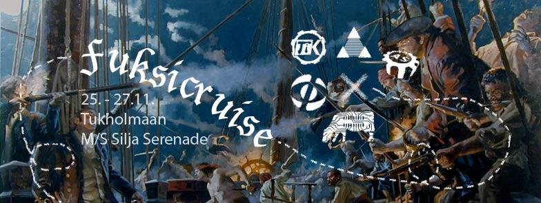
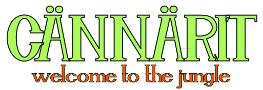
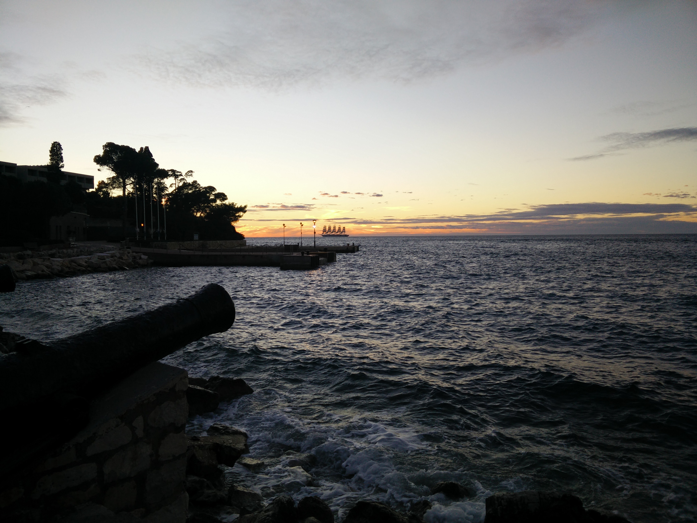

Title: Waarin viikkotiedote 7 - terkut Kroatiasta!
Date: 2015-10-13 18:00
Category: Fuksit
Meta: Viikkotiedote
Tags: fuksit, viikkotiedote, cännärit, fuksicruise, juhlasitsit
Status: published

Hiiohoi!

Terveisiä etelän lämmöstä! Täällä on ollut superkiireistä koulukurssien sekä kuoroharkkojen että -keikkojen kanssa, mutta on sitä välillä onneksi kerennyt lomailemaankin. Lämpötila oli rannikolla mukava 20 astetta ja nyt ollaan sisämaassa Zagrebissa 8 asteessa sateessa. Ihanku Suomeen ois palannut!

Fuksicruisen ilmoittautuminen avautui sunnuntaina ja on auki maanantaihin 26.10. saakka. Mahtavaa nähdä siellä jo 37 kpl teistä! Tulkaa loputkin mukaan merirosvoilemaan Tukholmaan. Cruisella pääsee mm. tutustumaan opiskeluun Tukholman kuninkaallisessa teknillisessä korkeakoulussa (KTH, Kungliga Tekniska Högskolan) sekä osallistumaan legendaariseen hyttisuunnistukseen! Fuksicruisesta löydät lisää tietoa alempaa.

Fuksicruisen lisäksi tässä tiedotteessa supertärkeinä asioina ovat hallitus- ja toimihenkilöhaku sekä juhlasitsit! Lukekaas niistä ainakin, tulevat taas ensimmäisenä vastaan. ;)

_<3 ultsi_

<h2>
&nbsp;
Sisällysluettelo</h2>

1. <a href="#tarkeaa">Tärkeää</a>
    1. Fuksicruise
    2. Hallitus- ja toimihenkilöhaku
    3. Fuksien juhlasitsit ti 3.11.
    4. Cännärit
2. <a href="#fktapahtumat">Fuksi- ja kiltatapahtumat</a>
    1. Ylimääräinen kiltakokous ke 14.10.
    2. Amazing race - Aalto edition to 15.10.
    3. Killan leffailta to 15.10.
    4. Työntekijäksi Teekkariperinnejuhlaan
3. <a href="#ayylmao">Muut yhdistykset & AYY</a>
    1. TF-disco 17.10
    2. Vanhan speksin katseluilta ti 20.10. @ Gorsu
    3. Neon Rave pe 23.10. @ Smökki
	4. Teekkariperinneviikko 2.-8.11.2015
	5. Kopedan Syyssitsit la 7.11 @ Alina-sali
	6. Ultrahack 2015 - pe-su 6.-8.11.
	7. Junction Hackathon - pe-su 6.-8.11.
	8. AYY tahtoo SINUT – vapaaehtoishaut ovat auki!
	9. Hae oppirahaa AYYltä!
	10. Kysely kieli- ja viestintäopinnoista
4. <a href="#end">Lopetus</a>
  
<h2>
&nbsp;
TÄRKEÄÄ</h2>

<h4>
&nbsp;
1. Fuksicruise</h4>

<strong>Yarrr!</strong>

Fuksicruise tulee taas ja M/S Silja Serenade täyttyy toinen toistaan hurjemmista merirosvoista! Rosvojoukko kootaan AS:n, FK:n, Inkubion, MK:n ja TiK:n viekkaimmista ja pelottomimmista fukseista. Paatin keula suunnataan kohti läntisen naapurimme koreaa pääkaupunkia keskiviikkona 25.11.

Pukeudu haalareidesi lisäksi seikkailuun sopivalla tavalla ja nouse kanssamme kannelle! Menomatkalla retken kohteeseen pääset virittäytymään tunnelmaan ja hiomaan merirosvon vaistojasi eeppisessä hyttisuunnistuksessa! Tukholmassa vierailemme hengenheimolaistemme luona Kungliga Tekniska Högskolanilla ja hämmennämme paikallisia maakrapuja ympäri kaupunkia.

Cruiselta palataan mahdollisen ryöstösaaliin kanssa perjantaina 27.11. Reissu kustantaa 40 euroa, sisältäen paikan neljän hengen B-hytissä sekä aamiaisen laivalla Tukholmaan saavuttaessa. Ilmoittautuminen vain ja ainoastaan FUKSEILLE avautuu osoitteessa <http://fuksicruise.dy.fi/> sunnuntaina 11.10. kello 16:00 ja päättyy 27.10. kello 23:59. Kokoa mieluisesi neljän (4) hengen hyttiporukka etukäteen, sillä ilmomasiinassa voit ilmoittautua hyteittäin. Voit ilmoittautua myös ilman hyttiporukkaa, jolloin järjestäjät osoittavat sinulle paikan hytistä, jossa on vielä tilaa. Vanhemmat merille pyrkijät varaavat risteilynsä omatoimisesti.

Liity siis miehistöömme ja kohtaa syksyn jännittävin ja huikein meriseikkailu kohti tuntemattomia maita! Ilmosivulta <http://fuksicruise.dy.fi/> löydät myös matkan ohjelman sekä aikataulun ja maksuohjeet. Lue ne huolella!

“Jos merirosvon vasen jalka on puujalka, on oikea jalka oikea jalka.”

tl;dr

Mitä? Fuksicruise  
Kenelle? AS, FK, Inkubio, MK sekä TiK -fuksit. Vanhemmat ryökäleet ovat myös tervetulleita, mutta varaavat risteilynsä omatoimisesti.  
Milloin? Lähtö M/S Silja Serenadella ke 25.11. kello 17. Paluu pe 27.11.  
Mitä maksaa? 40 e per matruusi.  
Miten mukaan? Ilmoittaudu hyttiporukkasi kanssa tai ilman osoitteessa <http://fuksicruise.dy.fi/>!

Laivalta saa leiman kohtaan pisteet/kilta - Fuksicruise!

 

<h4>
&nbsp;
2. Hallitus- ja toimihenkilöhaku</h4>

Vuosi alkaa pikkuhiljaa olla jo lopuillaan ja vanhan hallituksen hanskat tippua, joten on aika kähmiä uusia kiltatoimijoita ensi vuodelle. Jos hallitus- tai toimihenkilöhommat kiinnostavat, osallistu Tietokillan Powerkähmyille lauantaina 24.10 klo 13:00 lähtien Kiltahuoneella. Luvassa on hallitus- ja toimihenkilövirkojen esittelyä, yleistä mouhoa ja kaiken pönötyksen ja virallisen ohjelman jälkeen siirrymme Arkkitehtikillan majalle viettämään iltaa, jossa meille on luvassa kaikille ilmoittautuneille ilmaiset sitsit ja loppuillasta saunomista. Jos siis kiltatoiminta ja ilmaiset sitsit kiinnostavat, ilmoittaudu Powerkähmyille alla olevasta linkistä.

<http://tietokilta.fi/tapahtumat/ilmot/powerkähmyt15>

Jos tiedät jo mihin virkaan haluaisit hakea, käy ilmiantamassa itsesi osoitteessa: 

<http://tietokilta.fi/tapahtumat/ilmot/hallitusjatoimarit16>

<em>Waarin kommentti:  
	Kannattaa ehdottomasti hakea johonkin virkaan - sen lisäksi, että siitä saa leiman, saa siitä myös paljon kokemusta ja pääsee toimimaan ihmisten kanssa joita tulee varmasti näkemään myöhemmässäkin vaiheessa elämää, eli toisin sanoen pääsee verkostoitumaan. Itse olen ollut aktiivisena mukana fuksivuodesta asti ja en millään tavalla ole edes yrittänyt verkostoitua tai hankkia kontakteja, mutta yhtäkkiä olen huomannut niitä kontakteja olevan todella paljon. Plus, virassa pääsee toteuttamaan itseään ja toimihenkilöporukassa on aina hauskaa. Helpompaa ja kivempaa myös hakea esim. kaverin kanssa! :)</em>

Toimihenkilöydestä leima kohtaan pisteet/kilta - Killan toimija!

 

<h4>
&nbsp;
3. Fuksien juhlasitsit 3.11.</h4>

Vuoden upeimmat pöytäjuhlat järjestetään Servin Mökissä Teekkariperinneviikon tiistaina. Fuksien juhlasitseillä luvassa on vanhanajan glamouria ja ennenäkemätöntä loistoa. 

Juhlat alkavat cocktail-tilaisuudella Polyteekkarimuseolla, josta siirrytään Servin Mökkiin varsinaiseen iltajuhlaan. Sitsit on tarkoitettu ainoastaan fukseille ja moni vanhempi tieteenharjoittaja muisteleekin kaiholla sitsien suussa sulavaa ruokaa ja inspiroivaa ohjelmaa. Lippuja myydään <strong>vain ja ainoastaan maanantaina 26.10. klo 8:00</strong> ja liput tulevat olemaan tänäkin vuonna äärimmäisen haluttuja. 

Aika: 3.11.2015 klo 18:00 (sitsit 19:00)  
Paikka: Cocktail-tilaisuus Polyteekkarimuseolla & Sitsit Servin Mökissä  
Hinta: 25 € / 20 €  
Lipunmyynti: Maanantaina 26.10. klo 8:00 Kandidaattikeskuksen aulassa.  
FB: <https://www.facebook.com/events/1840569566169340/>

UNIIKKI LEIMA - tätä et saa muualta: pisteet/teekkarikulttuuri - Fuksien juhlasitsit

 

<h4>
&nbsp;
4. Cännärit</h4>

Cännärit laitettiin eilen käyntiin, ja nyt on pääjärkkäri, sihteeri sekä rahis jo valittuna! Onnittelut siis Ilmari Tarpiselle, Riku Laukkaselle sekä Aatos Saariselle!

Cännärit ovat fuksien, eli juuri teidän ikiomat bileet, jossa te saatte täysin päättää millaiset bileet järkkäätte. Olin itse omana vuonna mukana järkkäämässä ja siitä jäi sellainen kaveriporukka mukaan, jonka kanssa olen itsekin nyt kolme vuotta opiskeluja suorittanut. Sekä roima muistoja jutuista, joita teki bileiden eteen.

Tässä on vielä sihteeriltänne viesti, kuinka päästä mukaan Cännäreitä järjestämään. :)

<em>Tervetuloa tekemään Cännäreitä meidän kanssamme! Päätimme ensimmäisessä kokouksessamme jo teeman ja osan vastuuhenkilöistä, mutta osaavia käsiä tarvitaan aina! Tässä linkki TG-ryhmäämme, josta pääset toimintaan kiinni! <https://telegram.me/joinchat/Bht6ZQIE0OxhPmaGIjliWA>

-Riku Laukkanen, Sihteeri</em>

Mukaan vaan siis ehdottomasti! :)

Ahkerimmille tyypeille luvassa leima kohtaan pisteet/kilta/työ - Cännärit!

 

<h2>
&nbsp;
Fuksit ja kilta</h2>

<h4>
&nbsp;
1. Ylimääräinen kiltakokous ke 14.11. klo 16.00 @ T5</h4>

Keskiviikkona koko kilta on kutsuttu paikalle keskustelemaan hallituksen koon muuttamisesta sekä budjettimuutoksesta. Jos kiinnostaa nähdä mitä sääntöjen muuttaminen vaatii ja millaisia ovat kiltakokoukset, kannattaa ehdottomasti mennä paikalle. 

Linkin takaa löytyy kokouskutsu sekä esityslista: <http://tietokilta.fi/tapahtumat/823>

 

<h4>
&nbsp;
2. Amazing race - Aalto edition 15.10.</h4>

Fuksi/Mursu!

Oletko koko syksyn koettanut löytää tilaisuutta päästä bondailemaan muidenkin kuin oman järjestösi/kiltasi uusien opiskelijoiden kanssa? Nyt sinulla on tilaisuus yhdistää unelmasi ja aaltohenkesi! Lähde mukaan Aavan, Kulttuurivaliokunnan ja Teekkarijaoston masteroimalle seikkailulle, joka vie sinut toiselle puolelle maailmaa (tai vähintäänkin naapurikaupunkiin) muiden yliopistosi ensimmäisen vuoden opiskelijoiden kanssa! 

Seikkailu alkaa torstaina 15.10. klo 16 Otakaari 18 A -kerhotilasta, jossa ryhmät saavat ensimmäisen tehtävänsä sekä vihjeen, joka johtaa seuraavan tehtävän luo. Kierros päättyy KY-talolle, jossa palkitaan parhaiten suoriutunut joukkue, ja KY:ltä ilta jatkuu vielä myöhemmin julkistettavaan jatkopaikkaan.

Mitä: Amazing Race - Aalto Edition  
Milloin: 15.10 klo 16 →  
Missä: Lähtö OK18 kerhotila, päätepiste KY-talo  
Mitä maksaa: ei mitään!  
Miten mukaan: ilmoittaudu! Ilmon deadline 13.10. <https://lomake.ayy.fi/aava/such-amazing-race-aalto/>  
Miksi: Koska Aalto ja Amazing Race!  

Lisätietoa FB-tapahtumasta: <https://www.facebook.com/events/567017586771789/>  

pisteet/vapaa - Muu tapahtuma

 

<h4>
&nbsp;
3. Killan leffailta to 15.10. klo 17:00-2:00 @ Kinopoli</h4>

Kilta järjestää taas leffaillan upealla Kinopolin teatterilla Otakaari 20 A:n kellarissa. Kinopolin teatteri on harrasteluvoimin rakennettu, ja monet ovat kehuneet sen olevan laadukkaampi kuin mikään Finnkinon oma. Tällä kertaa luvassa on leffatarjontaa ympäri maailmaa. Paikalla on jonkin verran snäcksejä ja juotavaa, mutta omia kannattaa myös varata mukaan.

Leffalistauksen ja aikataulun näkee killan sivuilta: <http://tietokilta.fi/tapahtumat/825>

<h4>
&nbsp;
4. Työntekijäksi Teekkariperinnejuhlaan</h4>

Arwon fuksit!
 
Teekkarius täyttää tänä syksynä 143 vuotta ja sitä juhlitaan marraskuun alussa Teekkariperinneviikolla. Viikko huipentuu Teekkariperinnejuhlaan lauantaina 7.11. Teekkariperinnejuhla on perinteinen ja arvokas akateeminen pöytäjuhla Helsingin Koskenrannassa. Juhla ei kuitenkaan synny itsestään, vaan sitä varten tehdään lukuisia tunteja vapaaehtoistyötä. Nyt myös sinun on mahdollista osallistua juhlan humuun ilmoittautumalla töihin juhlaan. Työntekijänä pääset kokemaan teekkariyhteisölle rakkaat vuosijuhlat hieman eri näkökulmasta. Kaikki työntekijät pääsevät myös osallistumaan ilmaiseksi riehakkaalle Teekkarisillikselle sunnuntaina 8.11. Servin Mökissä.
 
Linkki työntekijäilmoittautumiseen:  
<https://lomake.ayy.fi/teekkarijaosto/toihin-teekkariperinnejuhlaan/>
 
Tervetuloa tekemään upeaa juhlaa,
 
<em>Tuomas Ranta-aho 
Fuksimajuri</em>

pisteet/vapaa - <strong>Lisäpiste/Valinnainen piste</strong>. Näitä harvoin saa!

 

<h2>
&nbsp;
Muut yhdistykset & AYY</h2>

<h4>
&nbsp;
1. TF-disco 17.10.</h4>

Päästä irti sisäinen diskohemmosi kun TF:n osakuntatalo muuttuu illaksi 70-luvun diskoksi! 

Täffällä oli aikoinaan Suomen ensimmäinen disko. Tule muistelemaan - taikka ensi kertaa kokemaan - tuo paljettien, diskotanssin ja leveiden lahkeiden aikaa. 

MITÄ? TF-DISCO!!!  
MISSÄ? Otakaari 22  
MILLOIN? 17.10, ovet aukeaa 21:00  
HINTA? 5€ ennakko/7€ ovelta  

Lipunmyyntipisteet ja -ajankohdat ovat:  
TF: 7.10 ja 14.10 kello 11-16  
Päärakennus: 8-9.10, 12-13.10 ja 15-16.10 kello 11-16  

FB: <https://www.facebook.com/events/1077003565643943/>

 

<h4>
&nbsp;
2. Vanhan speksin katseluilta ti 20.10. klo 18:00 @ Gorsu</h4>
Jos Teekkarispeksin live-esitykset ovat sattuneet jäämään välistä tai haluat vain fiilistellä edellisten vuosien hienoja hetkiä, saavu Gorsuun tiistaina 20.10. seuraamaan speksitallennetta!

Pääset samalla tutustumaan uusiin mielenkiintoisiin ihmisiin ja viettämään mukavaa iltaa speksikkäässä seurassa valkokankaan edessä tai saunan lauteilla.

FB: <https://www.facebook.com/events/889808907740070/>

 

<h4>
&nbsp;
3. Neon Rave pe 23.10. @ Smökki</h4>

Voihan jummijammi, taas se tulee!

Kemistikillan järjestämä Neon Rave palaa syksyllä Otaniemeen, tuhoten Smökin elektronisella musiikilla ja hävyttömällä reivimeiningillä! Opiskelijoista koostuva DJ-kokoonpano tarjoaa koko illan lungeinta housea, törkeintä trappiä, raivokkainta rumpubassoa ja haalarit repivää hardstylea. (Haalarit omalla vastuulla) 

Tämän vuoden teema on katutaiteen inspiroima ja Smökki tulee loistamaan värikkäillä graffiteilla. Liity sinäkin mukaan, bodypaintit ovat enemmän kuin tervetulleita!

Lippuja myydään Kanditalolla 20.-23.9. klo 12-16 hintaan 5 €, lisäksi myynnissä pimeässä hohtavia haalarimerkkejä! Jos lippuja jää, myydään niitä ovella hintaan 8 €.

Tämä on ehdottomasti Otaniemen suurin elektronisen musiikin tapahtuma, eikä sitä varmastikkaan kannata missata!

MITÄ: Neon Rave  
MISSÄ: Smökissä  
MILLOIN: 23/10/15 klo 21-03  
MIKSI: NEON RAVE!!  
FB: <https://www.facebook.com/events/1488458861464981/>

<em>"Jos et aamulla ryöminyt kotiin, et pitänyt hauskaa"  
- Frederik</em>

 

<h4>
&nbsp;
4. Teekkariperinneviikko 2.-8.11.2015</h4> 
 
Teekkariperinneviikkoa juhlitaan entisen TKY:n vuosijuhlaviikon jälkimainingeissa marraskuun alussa. Tänä vuonna ohjelmaan kuuluu laulamista ja laulukilpailua, approilua, tarinoita menneiltä vuosilta, sitsejä, hämyistä klubitunnelmaa sekä tietenkin viikon huipentava Teekkariperinnejuhla räiskyvine silliksineen! Mukaan humuun ovat tervetulleita kaikki fuksit, teekkarit, teekkarinmieliset ja muut kiinnostuneet!
 
Ohjelma:  
2.11. Klubi-ilta @Smökki, <https://www.facebook.com/events/900879653335609/>  
3.11. Fuksien juhlasitsit @Smökki, <https://www.facebook.com/events/1840569566169340/>  
3.11. Laulukilpailusitsit @OK20, <https://www.facebook.com/events/100816326942441/>  
4.11. Polin Appro @Helsinki, <https://www.facebook.com/events/1036052183082077/>  
5.11. Perinnepäivä @E-Sali, Kandikeskus  
6.11. Punaisen läpilaulanta @Rantasauna, <https://www.facebook.com/events/900481399987058/>  
7.11. Teekkariperinnejuhla @Koskenranta, <https://www.facebook.com/events/154919651520408/>  
8.11. Teekkarisillis @Smökki, <https://www.facebook.com/events/1631869213756161/>  
 
Ilmoittautuminen Teekkariperinnejuhlaan ja -sillikselle on nyt auki osoitteessa: <https://lomake.ayy.fi/teekkarijaosto/>  
Lisätietoja koko viikon ohjelmasta löydät osoitteesta: <http://teekkarius143.ayy.fi/>  
 
Kannattaa lukaista läpi myös Lehti 143, joka löytyy kiltahuoneilta, perinneviikon nettisivuilta ja sellaisen voi myös hakea omaksi AYY:n palvelupisteeltä!

 

<h4>
&nbsp;
5. Kopedan Syyssitsit la 7.11 @ Alina-sali</h4>

Killalle on varattu Kopedan Syyssitseiltä viisi paikkaa, lähde mukaan juhlimaan!

Hyppää taikamattosi tai kurpitsasi kyytiin ja tule satulinnaan juhlimaan Kopedan perinteisiä syyssitsejä! Laita päällesi mitä hullunkurisin naamiaisasu ja astu satujen ihmeelliseen maailmaan. Illallinen ja tanssiaiset pidetään Alina-salissa Uudella Ylioppilastalolla. Juhlien pöytäosuus alkaa klo 18 ja boolia tarjoillaan klo 17.30 alkaen.

Hintaa sitseille kertyy 15 €. Ilmoittautuminen sitseille tapahtuu e-lomakkeen avulla 14.10. klo 14 alkaen ja päättyy 27.10 klo 23.59. Ilmoittautuminen on sitova ja se vahvistetaan spostilla, jonka yhteydessä saat myös maksuohjeet. Lisätietoja voit kysyä Kopedan emännältä Saara Niittylältä osoitteesta saara.niittyla@helsinki.fi.

Varaa heti paikkasi Kopedan syksyn suurimpaan juhlaan!

Ilmoittautuminen: <https://elomake.helsinki.fi/lomakkeet/64175/lomake.html>

FB: <https://www.facebook.com/events/524193787736954/>

 

<h4>
&nbsp;
6. UltraHack 2015 - pe-su 6.-8.11.</h4>

Ultrahack 2015 - part of the biggest hackathon in Europe - is an ultra long runway for the development of your ideas and software.

Ultrahack has top notch industry players to provide never-before-published APIs and tools.

You can join with your pre-existing software and get expert evaluation and coaching for that! Or you can start from the scratch in during pre-game period 1.9.-30.10. or in 48H hackathon 6.-8.11.

Ultrahack has a multitude of various prizes, rewards and traveling grants. When you join the Ultrahack, you have good chances of winning in an extraordinary hackathon experience!

<https://ultrahack.org>

pisteet/kilta - Lanit/Hackathon

 

<h4>
&nbsp;
7. Junction Hackathon - pe-su 6.-8.11. @ Kattilahalli, Suvilahti</h4>

Junction on 48 tunnin hackathon, joka tuo yhteen 500 koodaajaa ja designeria pohjoismaita. Osallistujat kilpailevat tiimeissä eri aihealueisiin keskittyviin träckeihin. Tavoitteena on ratkaista arkielämän ongelmia tai rakentaa siistejä ohjelmia yhdistämällä paikalla esillä olevia kuumimpia rajapintoja ja laitteita. Hackathon järjestetään kattilahallissa Suvilahdessa 6.-8.11. ja osallistuminen on maksutonta. Tapahtuman yhteistyökumppaneita ovat mm. Klarna, Uber, Shopify, If, Rails, Girls, Futurice, Reaktor ja Finnair.

Tapahtumaa järjestää Aalto Entrepreneurship Society.  
Rekisteröidy osoitteessa  
<http://www.hackjunction.com>

pisteet/kilta - Lanit/Hackathon

 

<h4>
&nbsp;
8. AYY tahtoo SINUT – vapaaehtoishaut ovat auki!</h4>

Maailman paras ylioppilaskunta AYY hakee vapaaehtoisia! Kiinnostaako kulttuuri, kuntavaikuttaminen tai ylioppilaskunnan hallituksessa toimiminen? Erilaisia pestejä löytyy niin tapahtumien, koulutuspolitiikan, talouden kuin kansainvälisten asioidenkin parista. Tutustu aikatauluun, hakukohteisiin ja vapaaehtoisena toimineiden omiin tarinoihin kokemuksistaan osoitteessa <http://www.ayy.fi/stop>. Seuraa myös AYY:n tiedotusta FB:ssä!

 

<h4>
&nbsp;
9. Hae oppirahaa AYY:ltä!</h4>

Aalto-yliopisto ja sen ylioppilaskunta myöntävät yhteistyössä oppirahaa päräyttäville opiskelua ja oppimista edistäville projekteille. Voit hakea rahaa yksin, yhdessä tai yhdistyksenä – kunhan idea on hyvä me haluamme auttaa sen toteuttamisessa!

Haku on jatkuva ja hakemukset käsitellään kuukausittain, tarkoitus on että hyvä ideasi ei pääse happanemaan vaan pääset heti toteuttamisen makuun. Hakemukset käsittelee ja hyväksyy Aalto-yliopiston ylioppilaskunnan koulutuspoliittinen sektori ja Aalto-yliopiston opetuksesta vastaava vararehtori.

<https://lomake.ayy.fi/koulutuspolitiikka/2015/04/15/oppirahaa-kansalle/>

 

<h4>
&nbsp;
10. Kysely kieli- ja viestintäopinnoista</h4>

Mitä kieliä ja viestintää haluat opiskella?

Aalto-yliopiston kielikeskus tekee kyselyn opiskelijoiden kieli- ja viestintäopinnoista. Kyselyn tavoitteena on kartoittaa mitä kieliä ja viestintää opiskelijat ovat kiinnostuneita opiskelemaan osana tutkinto-opintojaan. Kyselyn tuloksia hyödynnetään Aalto-yliopiston kielikeskuksen kielten opetustarjonnan kehittämisessä.

Linkki kyselyyn: <https://link.webropolsurveys.com/S/E1EFFEE3309044F7>  
Viimeinen vastauspäivä 25.10.2015.

 

<h2>
&nbsp;
Lopetus</h2>

Tuo maisema on jo takana, nyt 8 astetta ja sateinen kaupunki. hrr. Mut makee laiva!

Ei mulla kummosempaa, nähdään taas ensi viikolla sitten!

P.S. meidän matkaa voi seurata somessa hashtagilla #d40tour! :)

<em>&lt;3 ultsi</em>