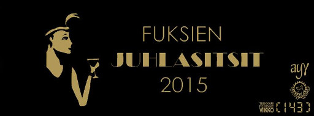

Title: Juhlasitsit, toimihenkilöhaku, fuksipisteitä
Date: 2015-10-24 07:00
Category: Fuksit
Meta: Viikkotiedote
Tags: fuksit, juhlasitsit, hallitus, fuksipisteet
Status: published

Moikka taas,

Nyt on kaksi sen verran tärkeää asiaa tulossa, että niistä oli pakko tehdä oma postaus. Kyseessä on nimenomaan fuksien juhlasitsit sekä hallitus- ja toimihenkilöhaku. 5 minuuttia tenttiinlukemisesta voi uhrata näiden asioiden silmäilylle. Normaalin viikkotiedotteen copypasten sijaan haluan kertoa näistä omin sanoin teille, joten lukekaa huolella, se on muuten uutta tekstiä! :p 

Lisäksi juttua fuksipisteistä ja siitä mistä niitä saa (lisää). :)  

_<3 ultsi_

<h2>
&nbsp;
Sisällysluettelo (hui ku on pitkä!)</h2>

1. <a href="#tarkeaa">Tärkeää</a>
    1. Fuksien juhlasitsit ti 3.11.
    2. Hallitus- ja toimihenkilöhaku
    3. Fuksipisteet

<h2>
&nbsp;
TÄRKEÄÄ</h2>

<h4>
&nbsp;
1. Fuksien juhlasitsit 3.11.</h4>

FB-tapahtuma: <https://www.facebook.com/events/1840569566169340/>

Melkein jokainen teistä kävi fuksisitseillä syyskuussa. Muistatte niistä ehkä hyvän ruoan, raikaavat laulut sekä mahtavat esitykset. Ja ehkä myös illan kiltatoverit, jotka pitivät seuraa pöydässä sitsien ajan.

Kun on jo kerennyt tutustua kiltalaisiin, on nyt aika tutustua muihin kiltoihin. Luvassa on poikkitieteellinen pöytäseura sekä sellaiset sitsit, joita ei missään nimessä halua missata. <strong>Tarkoitan tätä.</strong> Juhlasitsit ovat yksi sellainen juttu Otaniemessä, joita ei fuksivuotenaan halua jättää väliin - niille ei nimittäin fuksivuotensa jälkeen enää pääse osallistumaan.

<strong>Illan kulku</strong>

Ennen sitsejä järjestetään klo 18:00 cocktail-tilaisuus Polyteekkarimuseolla, joka on Suomen ainoa virallinen opiskelijakulttuuria esittelevä museo. Pääsette käymään museolla myöhemminkin, mutta tilaisuutta juoda cocktail-juomia museolla hienossa ilta-asussa ei toiste tule.

Itse juhlasitsit järjestetään Smökissä, jonka monet varmaan muistavat Otasuunnistuksen jatkoilta sekä Kaukkareilta. Smökki tyylitellään hienommaksi kuin koskaan 1920-luvun menon mukaan ja sinne katetaan täysi kolmen ruokalajin illallinen, joka nautitaan laulujen, esityksien sekä hyvien ruokajuomien kera. Juhlavat menot jatkuvat jatkoineen aina yömyöhään asti!

<strong>Ilmoittautuminen</strong>

Sitseille on kutsuttu kaikki Otaniemen fuksit ja sinne mahtuu 200 ensimmäistä ilmoittautunutta. Ilmoittautuminen tapahtuu maanantaina 26.10. jonotuksella Kandidaattikeskuksen (Otakaari 1) Alvarinaukion (ostarin) puoleisella ovella. Viime vuosina jo useampi fuksi on aloittanut jonotuksen jo aamuyöllä varmistaakseen paikkansa. Itse ilmoittautuminen aukeaa klo 8:00 alkaen jonon mukaisessa järjestyksessä.

Toivon näkeväni paljon TiKkiläisiä telttojen kanssa jonottamassa ensi sunnuntain ja maanantain välisenä yönä! Haalarit, lämmin mehu ja poppikoneet auttavat pitämään mielen virkeänä jonotuksen ajan. Mitä aiemmin on jonottamassa, sitä varmemmin saa sitsipaikan itselleen! :)

Nähdään ilmoittautumisen jälkeen juhlasitseillä hienosti tummaan pukuun/cocktail-mekkoon asustautuneena ja moikataan. Siitä hyvästä saatte ainutlaatuisen pisteet/teekkarikulttuuri - Fuksien juhlasitsit leiman.

UNIIKKI LEIMA - tätä et saa muualta: pisteet/teekkarikulttuuri - Fuksien juhlasitsit

 

<h4>
&nbsp;
2. Hallitus- ja toimihenkilöhaku</h4>

<em>Nykyinen hallitus, nämä tyypit tekee oikeasti jotain!</em>

<strong>Mikä ihmeen hallitus?</strong>

Tietokillan hallituksessa toimii tällä hetkellä 11 jäsentä, joiden virkojen kuvaukset voit lukea täältä: <http://tietokilta.fi/kilta/hallinto/hallitusvirkojen-esittely/>

Fuksina voit hakea kaikkiin virkoihin paitsi fuksiwaariksi! Lisäksi juuri ylimääräisessä kiltakokouksessa hyväksyttiin hallitukseen uusi virka, eli tiedottaja. Tiedottaja tulee hoitamaan kaiken killan tiedottamisen sosiaalisen median, sähköpostin ja muiden viestintäkanavien avulla. Fuksina on helpoin lähteä sihteeriksi, tiedottajaksi, rahastonhoitajaksi, varapuheenjohtajaksi tai opintomestariksi. Kahteen viimeisimpään auttaa vuoden oleskelu ja taustatieto Otaniemestä, mutta ovat myös ilman sitä mahdollista hoitaa.

Hallitukseen kannattaa ehdottomasti hakea, jos siltä vähänkään tuntuu. Hallituksessa pääsee nopeasti mukaan Otaniemen kiltojen väliseen toimintaan sekä löytää tekemisen kautta monia uusia ystäviä, joihin ei välttämättä koulutöiden kautta olisi päässyt törmäämään. En ole kuullut yhdestäkään tyypistä, joka olisi hallitukseen lähtemistä katunut. Kannattaa kuitenkin muistaa, että hallituksessa oleminen vaatii joka viikko ainakin 2-4h työtä sen eteen.

<strong>Toimihenkilöt</strong>

Killalla on lisäksi useita toimikuntia ja niiden alaisuudessa toimivia toimihenkilöitä. 

<strong>Lukkaritoimikunta:</strong> toimihenkilö <em>herkkukurkku</em>. Johdattaa laulua sitseillä ja keksii paskoja aasinsiltoja. Suunnittelee myös huikeat laululäsyt sitseille.  
<strong>Sisätoimikunta:</strong> lyhyemmin sisis, toimii IE:n alaisuudessa ja auttaa sitsien ym. tapahtumien järjestämisessä. Pitää omaa ilmaista hauskaa välillä.
<strong>Phuksitoimikunta:</strong> suunnittelee fuksitapahtumat, toimihenkilöt ISOja ja muita killan jäseniä. Vain toisesta vuodesta eteenpäin!  
<strong>M0-toimikunta:</strong> suunnittelee ja järjestää Tietokillan vuosijuhlan, Muistinnollauksen eli tuttavallisemmin M0:n. Ensi vuosi on juhlavuosi ja toimikunta on iso!  
<strong>Ulkotoimikunta:</strong> suunnittelee yhdessä ulkomestarin kanssa killan ulkoexcursioita eli reissuja pääkaupunkiseudun ulkopuolelle. Tunnettu mm. Lenskin excusta.  
<strong>Säätötoimikunta:</strong> säätää kaikkea hölmöä tilpehööriä killalle ja kiltahuoneelle, kuten TiKplayn. Koodaavat paljon asioita. 

Siinä on vain muutama toimikunta ja täten vain kapea katsaus kiltatoiminnan tarjontaan. Kannattaa muistaa, että voit myös perustaa oman toimihenkilönimikkeen tai jopa toimikunnan! Esimerkiksi Super Smash Bros-toimikunta on vielä perustamista vailla.

Jos mielenkiinto heräsi, niin tule ihmeessä lauantaina klo 13:00 tutustumaan hallituksen hommiin tarkemmin kiltahuoneella! Sen jälkeen on luvassa ilmaiset sitsit AK:n majalla, jonne pitää ilmota perjantai klo 12:00 mennessä seuraavassa osoitteessa: <https://tietokilta.fi/tapahtumat/ilmot/powerk%C3%A4hmyt15>. Powerkähmyille kannattaa ottaa yöpymiskamat ja omaa juomaa sekä purtavaa mukaan!

Mistä tahansa virkaan lähtemisestä leima kohtaan pisteet/kilta - Killan toimija! Ja hallitusvirasta saa lisä-/valinnaispisteen! :)

 

<h4>
&nbsp;
3. Fuksipisteet</h4>

Nyt on aika kaivaa fuksipistekortti esille ja miettiä mistä niitä pisteitä oikein saikaan. Tule ihmeessä kyselemään, se on nopein tapa saada puuttuvat pisteet itsellesi, mutta lukaise tämä ensin niin tiedät mistä niitä voi myös tulevaisuudessa saada (ja ettet missaa tärkeitä tapahtumia!).

Tiedotan saatavista fuksipisteistä aina blogissa sekä sähköpostissa ja pisteitä voi aina hakea takautuvasti, jos ei tapahtumasta leimaa saanut! Esimerkiksi allaolevan mukaisesti:

Jos näet blogissa tällaisen logon, se tarkoittaa, että tapahtumasta/jutusta saa leiman korttiin tämän logon kategoriaan. Esim. pisteet/kilta - Fuksisitsit!

 

Lisäksi tässä on selvennystä muutamiin pisteisiin, joita useat ovat jo minulta kyselleet:

<strong>pisteet/master - Laulukoe</strong> - voi suorittaa laulusaunassa tai muuna ajankohtana minulle. Laulettava N+1 punaisen laulukirjan teekkarilaulua, joista yhden oltava teekkarihymni. N tarkoittaa ryhmässä laulavien määrää.   
<strong>pisteet/master - Fuksiopinnot</strong> - mahdolliseen Wappuun 2016 mennessä on oltava 8 op kasassa, eli noin kaksi kurssia. Helppoa!  
<strong>pisteet/master - Fuksiwaariin tutustuminen</strong> - myös nimellä waarin wartti! Jutellaan n. 15min kahdenkesken, pääpointtina tutustua paremmin sen 15min ja jutella fiiliksestä koulun suhteen.  
<strong>pisteet/master - Teekkarimuseo</strong> - syksyllä ja keväällä järjestetään museokierros, jolle pitää osallistua saadakseen leiman tähän. Lisätietoa myöhemmin.

<strong>pisteet/vapaa - KY-piste</strong> - Käy KY:n järjestämässä tapahtumassa, tutustu siellä KY:läisiin. Poikkitieteellisyys on aina plussaa!  
<strong>pisteet/vapaa - KV-piste</strong> - KV = KansainVälinen. Käy KV-opiskelijoille järjestetyssä tapahtumassa tutustumassa ulkkareihin. Esim. ESN Aalto järjestää tapahtumia KV-opiskelijoille.  
<strong>pisteet/vapaa - Ruotsin koe</strong> - <em>Käy</em> ruotsin kokeessa.  
<strong>pisteet/vapaa - Oma projekti</strong> - Näytä oma koodausprojekti, jonka olet harrastukseksesi tehnyt. Esim. omat nettisivut, joku yksinkertainen botti. Oma-aloitteisuudesta periaatteessa vapaa piste!

<strong>pisteet/kilta/tyo</strong> - näitä pitää olla vähintään kaksi ja yhden niistä täytyy olla 'suuri' työ. Mikä tahansa nakki Muistinnollauksessa lasketaan suureksi työksi. Jokainen lakin ansainnut on fuksina tehnyt talkootöitä killan eteen ja talkootyössä näkee oikeasti teekkarien tekemistä.    

Kysy ihmeessä, jos jokin vielä ihmetyttää, ja tsekkaa tiedotteista aina seuraavat logot niin pysyt saatavista pisteistä kärryillä:

pisteet/kilta

pisteet/vapaa

pisteet/master

pisteet/kilta/tyo

pisteet/teekkarikulttuuri

pisteet/teekkarikulttuuri/suunnistus

pisteet/teekkarikulttuuri/bileet

 

Huhhuh, siinäpä oli taas infoa. Muistakaa tulla jonottamaan juhlasitseille, hakekaa kiltahommiin ja kyselkää multa pisteitä! :)

<em>&lt;3 ultsi</em>