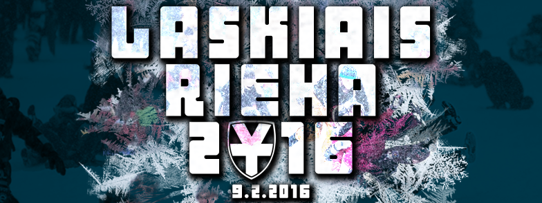
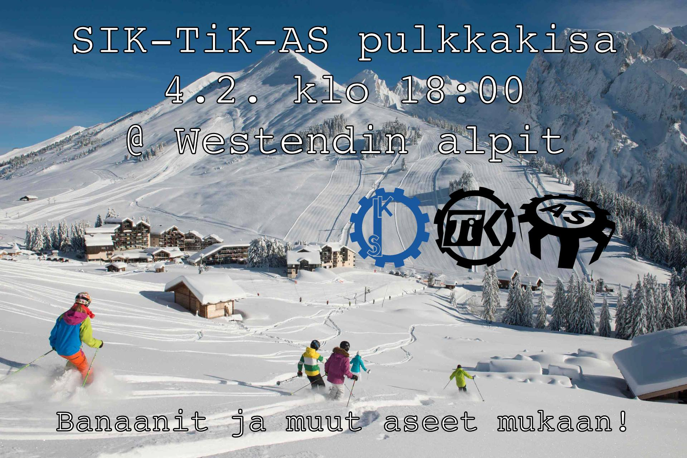

Title: Museokäynnit & Laskiaisriehan laskuväline
Date: 2016-01-21 15:00
Category: Fuksit
Meta: Viikkotiedote
Tags: fuksit, museo, laskiaisrieha
Status: published

Moikka!

Ensi viikolla alkavat kaksi asiaa: käynnit Polyteekkarimuseolla ja Laskiaisriehan laskuvälineen rakennus! Lukekaas läpi.

Lisäksi yksi tapahtumalisäys viikkomailiin, nimittäin SIK+TiK+AS-pulkkakisa!

<em>&lt;3 ultsi</em>

<h2>
&nbsp;
Sisällysluettelo</h2>

1. <a href="#tarkeaa">Tärkeää</a>
    1. Polyteekkarimuseovierailut - ma 25.1. ja 1.2.
    2. Laskiaisriehan laskuväline
    3. SIK+TiK+AS pulkkakisa!

<h2>
&nbsp;
Tärkeää</h2>

<h4>
&nbsp;
1. Polyteekkarimuseovierailut</h4>

Maanantaina 25.1. ja 1.2. ovat ensimmäiset vierailut Polyteekkarimuseolla! Osoitteessa Jämeräntaival 3 sijaitseva Polyteekkarimuseo on Suomen ainoa opiskelijakulttuuria esittelevä museo, ja siellä ohjatun kierroksen käyminen on yksi pakollinen osa lakinsaantia. Museovierailulla pääset kuulemaan teekkarien yli 140 vuotiaasta historiasta ja näkemään mm. teekkarilakin yli 110-vuotisen kehityksen. Teekkarin on hyvä tietää historiansa, ja museo on mitä parhain paikka sen opetteluun.

Jotta kierros voidaan järjestää, täytyy sinne ilmoittautua etukäteen, jotta opas ei tule turhaan paikalle. Molemmilla kierroksilla on vapaana 15 paikkaa. Kierros kestää noin tunnin ja siellä on hyvä olla paikalla noin 5 minuuttia etukäteen. Ilmoittaudu nyt!

Ajat:  
Ma 25.1. klo 16:00 - <http://tietokilta.fi/tapahtumat/ilmot/museokierros1>  
Ma 1.2. klo 18:00 - <http://tietokilta.fi/tapahtumat/ilmot/museokierros2>

Käymällä Polyteekkarimuseossa saat pakollisen pisteen pisteet/master - Museokierros!

 

<h4>
&nbsp;
2. Laskiaisriehan laskuväline</h4>

Tiistaina 26.1. aloitetaan Laskiaisriehan laskuvälineen rakennus täyttä vauhtia! Aloitetaan suunnittelu nopealla kokouksella kiltiksellä klo 16:00, jonka jälkeen käydään raivaamassa Otaniemen roskalavat ja varmaan myös oma Otatarhan ajokki sopivien osien varalta. Ajokin kasaaminen tapahtuu Gorsulla, jossa on myös ruokaa ja juomaa asentajille. Laskuvälinettä voidaan testata Rantasaunan mäessä.

Tehdään heti alusta lähtien isosti & asenteella ja voitetaan koko kisa, eiks vain?

Facebook: <https://www.facebook.com/events/891389037634920/>

Laskiaisriehan ajokin rakentelusta leima kohtaan pisteet/kilta/tyo - Muu työ!

Laskiaisriehan tapahtumaan (9.2.) osallistumisesta pisteet/teekkarikulttuuri - Otatarhan ajot/Laskiaisrieha!

 

<h4>
&nbsp;
3. SIK+TiK+AS pulkkakisa!</h4>

Tämä ei aivan viikkomailiin kerennyt, tässäpä siis erikseen!

On aika kaivaa jo pölyttyneet laskuvälineet esiin varastosta ja syödä sieniä, sillä tämä on pulkkailua á la Mario Kart! Torstaina 4.2. SIK, TiK ja AS mittelöivät hurjassa alamäkitaistossa, jossa vain parhaiten banaaneilla, ohjautuvilla kilvillä sekä muilla pommeilla varustettu kilpailija voi voittaa. Kilpailu tulee olemaan raakaa. Mukaan saa ja kannattaa myös tulla vain laskemaan!

Kisan jälkeen pääsemme parantelemaan kilpailussa syntyneitä haavoja ja mustelmia Rantasaunan paljun lämpöön sekä syömään ja juomaan hyvin.

Eli nappaa laskuväline ja pommisi mukaan torstaina 4.2. ja saavu klo 18:00 paikalle Westendin alpeille (Westendintie 100) kisaamaan vuoden Mario Sled -tittelistä!

Facebook: <https://www.facebook.com/events/678296662272888/>

Luvassa leima pisteet/kilta - Liikunta!

 
